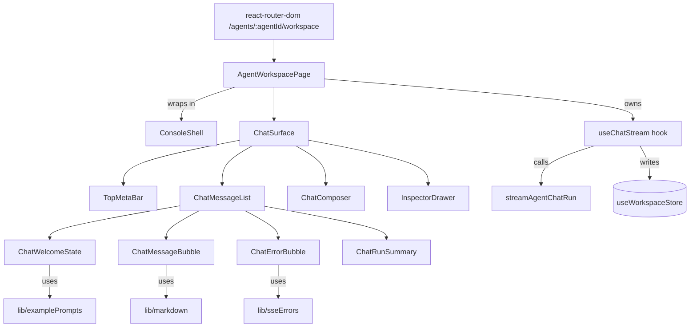
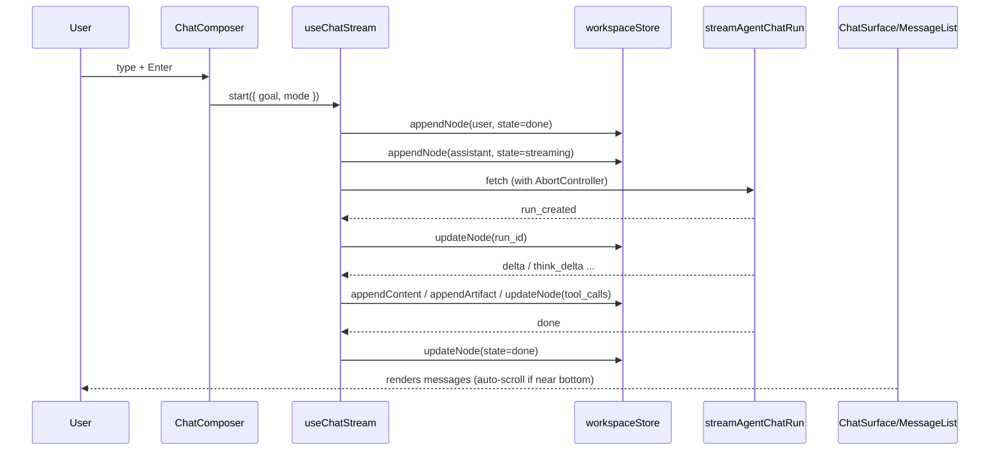
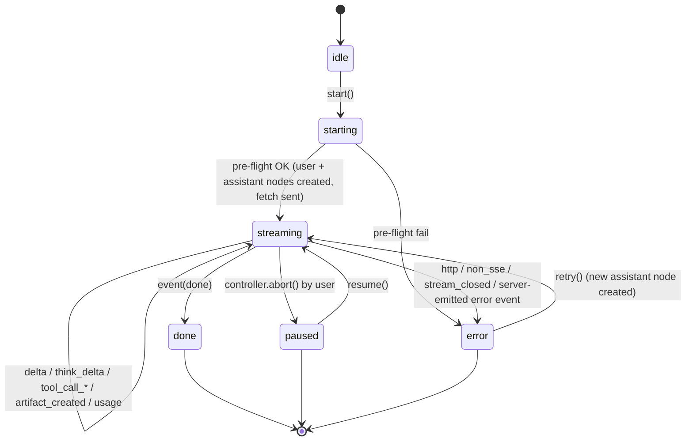

# Design Document

## Overview

This design turns `apps/agent-console/src/features/agents/pages/AgentWorkspacePage.tsx` (currently "Agent Workspace Pro") into a focused chat surface modelled after Claude Code / Codex UI. The user facing goal is "this page is where I talk to the agent" — everything that is not the conversation is demoted to either an on-demand `InspectorDrawer`, a link to `Run Detail`, or removed from this route entirely.

The design also closes the two observed defects:

1. **Enter does not submit.** The current composer only reacts to `Cmd/Ctrl+Enter`. We replace the ad-hoc `onKeyDown` with an explicit keyboard state machine that respects IME composition, Shift+Enter (newline), and plain Enter (submit).
2. **SSE errors are swallowed.** The current `streamAgentChatRun` branch only produces `error.message` strings from thrown `Error`s and never differentiates HTTP status, non-SSE responses, network failure, or stream-closed. We introduce a `useChatStream` hook that wraps `streamAgentChatRun` and normalises every failure into a `ConversationErrorMeta` object that the UI renders as a `ChatErrorBubble` with a retry action.

No backend contract changes. No new frontend dependencies. The existing `useWorkspaceStore`, `AgentChatStreamEvent`, `streamAgentChatRun` signature, and `AgentRunWorkspace` shape are preserved.

### Scope summary

| Kept as-is | Refactored in place | Removed from default Workspace visual surface |
| --- | --- | --- |
| `ConsoleShell`, `workspaceStore` shape, `streamAgentChatRun`, `AgentChatStreamEvent`, `AgentRunWorkspace`, routes in `apps/agent-console/src/app/routes.tsx` | `AgentWorkspacePage` (becomes a thin host), Composer keyboard semantics, SSE error path, inspector drawer, mode chooser | Plan DAG, Approvals action row, Model Calls table, full Tool Call runtime table, "Save as Eval Case"/"Run Evals"/"Replay Run" buttons |

## Architecture

### High-level component graph



### Layering

1. **Route shell** — `AgentWorkspacePage.tsx` stays the single route component for `/agents/:agentId/workspace` (wired by `apps/agent-console/src/app/routes.tsx`, which is not modified). It only:
   - reads `agentId` from `useParams`,
   - issues the three queries already present today (`getAgent`, `getModelSettings`, `getToolRegistry`),
   - owns the `useChatStream` controller,
   - renders `<ConsoleShell><ChatSurface …/></ConsoleShell>`.
2. **Chat surface** — `ChatSurface.tsx` owns the vertical layout sticky-header / scrollable middle / sticky-composer (Req 1.1). It reads `useWorkspaceStore` directly for `activePath`, `draft`, `activeStream`, etc., so the host page does not have to forward dozens of props.
3. **Leaf components** — stateless presentational components (`ChatMessageBubble`, `ChatErrorBubble`, `ChatRunSummary`, `ChatWelcomeState`, `ChatComposer`). They receive props and call back into the hook/store.
4. **Inspector drawer** — `InspectorDrawer.tsx` stays a sibling of the chat surface, controlled by a local `inspectorSection: "metadata" | "artifacts" | "runtime" | null` state on `AgentWorkspacePage`. It loses the Approvals action row and the full Model/Tool Calls tables and gains a jump-to-Run-Detail link group.
5. **Hooks and libs** — pure TypeScript modules (`useChatStream`, `sseErrors`, `markdown`, `examplePrompts`). These contain the testable logic (keyboard state machine helper, error kind classification, markdown tokenizer).

### State ownership

- **Zustand (`useWorkspaceStore`)** — `nodesById`, `rootNodeId`, `activeLeafId`, `pinnedNodeIds`, `activeStream`, `draft`, `contextWindowTurns`. Existing shape preserved; only additive changes inside `ConversationNode.metadata.error` (see Data Structures).
- **React local state on `AgentWorkspacePage`** — `activeRunId: string | null`, `workspaceMode: "chat" | "codex_plan" | "plan"`, `inspectorSection: InspectorSection | null`, `planConfirm: { open: boolean; pendingGoal: string | null }`. These are route-local and do not belong in the store.
- **React Query** — agent/model/tool registry queries; `AgentRunWorkspace` still fetched for Inspector Drawer only when it is open and `activeRunId` is non-null (requirement 10.5 — do not block first paint on these queries).
- **Controller** — the `AbortController` lives inside `useChatStream` and is mirrored into `workspaceStore.activeStream` (keeps current contract that pause buttons rely on).

### Data flow per message cycle



Error paths join the same sequence but the hook ends with `updateNode(assistantId, { state: "error", metadata: { error } })` instead of `done`.

## Module Layout

All paths below are relative to the repo root. Existing files stay where they are unless marked (moved). Only new files are added to `apps/agent-console/src/features/agents/…`.

### New files

#### `apps/agent-console/src/features/agents/components/ChatSurface.tsx`

Owns the three-row layout (Req 1.1). It coordinates the message list, welcome state, composer, mode hint banner, and inspector drawer trigger buttons.

```ts
export type ChatSurfaceProps = {
  agentId: string;
  agentName: string;            // falls back to agentId when getAgent fails (Req 8.4)
  modelLabel: string;
  modelLabelIsFallback: boolean; // renders "模型设置不可用" badge (Req 8.5)
  workspaceMode: WorkspaceMode;
  onWorkspaceModeChange: (mode: WorkspaceMode) => void;
  activeRunId: string | null;
  onOpenInspector: (section: InspectorSection) => void;
  stream: ChatStreamController;  // returned by useChatStream
};

export function ChatSurface(props: ChatSurfaceProps): JSX.Element;
```

Responsibilities:
- Layout: `<header/><scrollable section/><footer/>` with flex and `min-h-0` so the middle area is the only scroller (Req 1.1).
- Auto-scroll heuristic: on every `activePath` mutation, if `scrollTop + clientHeight >= scrollHeight - 50px`, scroll to bottom; otherwise leave position (Req 1.8, 1.10). Implemented as a `useEffect` dependency on `activePath.length + last node content length`.
- Renders `<ChatModeBanner/>` when mode ≠ `chat` (Req 6.3).

#### `apps/agent-console/src/features/agents/components/ChatComposer.tsx`

Stateless composer. Owns the keyboard state machine via a pure helper `composerShouldSubmit(event)` from the same file.

```ts
export type ChatComposerProps = {
  draft: string;
  onDraftChange: (next: string) => void;
  onSubmit: () => void;     // parent routes to stream.start or planConfirm
  onPause: () => void;
  onResume: () => void;
  isStreaming: boolean;
  canResume: boolean;       // true iff activePath has a paused node with run_id (Req 5.3)
  mode: WorkspaceMode;
  onChangeMode: (m: WorkspaceMode) => void;
  placeholder: string;
};

export function ChatComposer(props: ChatComposerProps): JSX.Element;

/** Pure; exported for unit test. */
export function composerShouldSubmit(event: KeyboardEvent, draft: string, isStreaming: boolean): boolean;
```

The helper encodes the state machine documented in §6 (Composer Keyboard).

#### `apps/agent-console/src/features/agents/components/ChatMessageList.tsx`

```ts
export type ChatMessageListProps = {
  activePath: ConversationNode[];
  onRetry: (nodeId: string) => void;
  onJumpRunDetail: (runId: string) => void;
  onOpenInspector: (section: InspectorSection, nodeId?: string) => void;
  scrollAnchorRef: React.MutableRefObject<HTMLDivElement | null>;
};
```

Maps `activePath` to either `<ChatWelcomeState>` (when empty) or a list of `<ChatMessageBubble>` / `<ChatErrorBubble>` / trailing `<ChatRunSummary>`.

#### `apps/agent-console/src/features/agents/components/ChatMessageBubble.tsx`

```ts
export type ChatMessageBubbleProps = {
  node: ConversationNode;      // role ∈ {user, assistant, tool}
  onOpenInspector: (section: InspectorSection, nodeId: string) => void;
};
```

- Renders markdown via `renderMarkdown(node.content)` (§9).
- Shows `<ThinkBlock>` (collapsible) for `<think>…</think>` content (Req 3.4).
- Shows tool call chip list — name + status badge, opens drawer on click (Req 7.7).
- Shows artifact chips — name + type + open button (Req 7.7).
- Streaming node: attaches `role="status"` `aria-live="polite"` and a blinking cursor square (Req 3.2, 3.7, 9 a11y).

#### `apps/agent-console/src/features/agents/components/ChatErrorBubble.tsx`

```ts
export type ChatErrorBubbleProps = {
  node: ConversationNode;         // state === "error"
  error: ConversationErrorMeta;   // always present when state === "error"
  onRetry: () => void;            // Req 4.5, 4.6
};
```

- Uses `formatErrorMessage(error, text)` from `lib/sseErrors.ts`.
- Renders `role="alert"`.
- Body preview shown inside a `<pre>` with `max-h-24 overflow-auto` when `error.body_preview` is set (Req 4.3).

#### `apps/agent-console/src/features/agents/components/ChatWelcomeState.tsx`

```ts
export type ChatWelcomeStateProps = {
  agentName: string;
  modelLabel: string;
  onPickPrompt: (prompt: string) => void;   // parent fills draft, focuses composer (Req 8.3)
};
```

Displays `agentName`, `modelLabel`, a ≤3-line intro, and 3–5 prompts from `examplePrompts.ts` (Req 8.2).

#### `apps/agent-console/src/features/agents/components/ChatRunSummary.tsx`

```ts
export type ChatRunSummaryProps = {
  runId: string;
  runStatus?: string;     // from workspace.data?.run.status when loaded
};
```

Renders below the last assistant bubble once that node reaches `state=done` and has a `run_id` (Req 7.5). Contains short hash + status badge + `<Link to={`/runs/${runId}`}/>`.

#### `apps/agent-console/src/features/agents/components/InspectorDrawer.tsx`

Extracted from the current `WorkspaceInspectorDrawer` inside `AgentWorkspacePage.tsx`. Kept in the same directory convention.

```ts
export type InspectorSection = "metadata" | "artifacts" | "runtime";

export type InspectorDrawerProps = {
  section: InspectorSection | null;
  workspace?: AgentRunWorkspace;           // may be undefined until Run Detail fetches
  artifacts: ConversationArtifact[];       // already capped to most-recent 10 by parent
  usage: UsageSummary;
  activeRunId: string | null;
  pendingApprovalCount: number;            // drives the Runtime banner (Req 7.7)
  onClose: () => void;
};
```

Three sections:
- **Metadata** — `SmallMetric` grid (unchanged content).
- **Artifacts** — most-recent 10 cards. Clicking an item reveals read-only `<ArtifactPreview>`.
- **Runtime** — only a pending-approvals banner + a deep-link button group (`Approvals`, `Plan`, `Model Calls`, `Tool Runtime`) that jump to `/runs/:runId` sub-anchors. No Approve/Reject/Modify controls (Req 7.1).

#### `apps/agent-console/src/features/agents/hooks/useChatStream.ts`

The single source of truth for driving a chat stream. Exposes a narrow controller and accepts the agentId plus `workspaceStore` actions (injected so it stays trivially testable).

```ts
type UseChatStreamArgs = {
  agentId: string;
  workspaceMode: WorkspaceMode;
  onRunCreated?: (runId: string) => void;
  fetchImpl?: typeof fetch; // default = global fetch, overridable for tests
};

export type ChatStreamController = {
  isStreaming: boolean;
  start(input: { goal: string; mode: WorkspaceMode }): Promise<void>;
  pause(): void;
  resume(pausedNodeId: string): Promise<void>;
  retry(errorNodeId: string): Promise<void>;
};

export function useChatStream(args: UseChatStreamArgs): ChatStreamController;
```

Internal invariants (see §4):
- Never throws to caller. All failure states land in `updateNode(assistantNodeId, { state: "error", metadata: { error } })`.
- Owns an in-flight `AbortController` that is mirrored into the store via `setActiveStream` so existing `workspaceStore.activeStream` consumers keep working.
- Creates the user + assistant pair atomically at `start()` time so the UI never shows "a user message without a pending assistant" (Req 3.1).

#### `apps/agent-console/src/features/agents/lib/sseErrors.ts`

```ts
export type SseErrorKind =
  | "http"
  | "network"
  | "non_sse"
  | "stream_closed"
  | "auth"
  | "not_found"
  | "server";

export type ConversationErrorMeta = {
  kind: SseErrorKind;
  status?: number;
  detail?: string;
  body_preview?: string;
  happened_at: string;
};

export function classifyHttpStatus(status: number): SseErrorKind;
export function classifyFetchError(err: unknown): SseErrorKind;

export async function readBodyPreview(res: Response, maxBytes?: number): Promise<string>;
export function isSseContentType(value: string | null): boolean;

/**
 * i18n formatting — produces { title, description } pairs that ChatErrorBubble renders.
 * Uses useI18n().text at call site; this function receives the resolver.
 */
export function formatErrorMessage(
  error: ConversationErrorMeta,
  text: (zh: string, en: string) => string,
  context: { apiBaseUrl: string },
): { title: string; description: string };

export const ERROR_COPY_KEYS = {
  HTTP_PREFIX: ["HTTP 错误", "HTTP error"],
  NETWORK_UNREACHABLE: ["无法连接 Harness 后端", "Cannot reach Harness backend"],
  NON_SSE: ["响应不是 SSE 流", "Response is not an SSE stream"],
  STREAM_CLOSED: ["SSE 流意外中断", "SSE stream closed unexpectedly"],
  AUTH: ["鉴权失败，请重新登录", "Authentication failed. Please sign in again."],
  NOT_FOUND: ["目标 Agent 不存在", "Target agent not found"],
  SERVER: ["后端内部错误", "Backend internal error"],
  RETRY: ["重试", "Retry"],
} as const;
```

Mapping rules:
- `401 | 403` → `"auth"`
- `404` → `"not_found"`
- `>= 500` → `"server"`
- any other non-2xx → `"http"`
- `fetch` throws `TypeError` / DOMException `NetworkError` → `"network"`
- response OK but `Content-Type` does not include `text/event-stream` → `"non_sse"` (body preview ≤ 256 bytes)
- reader ends without `done` event (tracked by the hook) → `"stream_closed"`

#### `apps/agent-console/src/features/agents/lib/markdown.ts`

Zero-dependency markdown tokenizer. Supports only the subset required by Req 1.6: fenced code / bulleted and numbered list / blockquote / headings h1–h6 / inline code / link. No raw HTML, no images, no tables.

```ts
export type MdToken =
  | { type: "heading"; level: 1 | 2 | 3 | 4 | 5 | 6; inline: InlineToken[] }
  | { type: "paragraph"; inline: InlineToken[] }
  | { type: "code_block"; language: string; body: string }
  | { type: "blockquote"; children: MdToken[] }
  | { type: "list"; ordered: boolean; items: MdToken[][] }
  | { type: "hr" };

export type InlineToken =
  | { type: "text"; value: string }
  | { type: "code"; value: string }
  | { type: "link"; href: string; label: string }
  | { type: "linebreak" };

export function tokenizeMarkdown(source: string): MdToken[];

/**
 * React renderer — returns a ReactNode tree. Pure; calls no hooks.
 * Any URL is validated against SAFE_URL_PROTOCOLS (http, https, mailto).
 * Unsafe links are rendered as plain text.
 */
export function renderMarkdown(source: string): JSX.Element;

export const SAFE_URL_PROTOCOLS: readonly string[];
```

#### `apps/agent-console/src/features/agents/lib/examplePrompts.ts`

```ts
export type ExamplePrompt = { id: string; zh: string; en: string };

export const EXAMPLE_PROMPTS: readonly ExamplePrompt[];
```

3–5 entries, localised. Keys referenced by `ChatWelcomeState`.

### Modified files

#### `apps/agent-console/src/features/agents/pages/AgentWorkspacePage.tsx`

Rewritten as a thin host:

```ts
export function AgentWorkspacePage(): JSX.Element {
  const { agentId = "default" } = useParams();
  const [workspaceMode, setWorkspaceMode] = useState<WorkspaceMode>("chat");
  const [inspectorSection, setInspectorSection] = useState<InspectorSection | null>(null);

  const agent = useQuery(...);
  const settings = useQuery(...);
  const tools = useQuery(...);

  const stream = useChatStream({ agentId, workspaceMode, onRunCreated: setActiveRunId });

  return (
    <ConsoleShell title={text("Agent 工作台", "Agent Workspace")}>
      <ChatSurface
        agentId={agentId}
        agentName={agent.data?.name ?? agentId}
        modelLabel={...}
        workspaceMode={workspaceMode}
        onWorkspaceModeChange={setWorkspaceMode}
        activeRunId={activeRunId}
        onOpenInspector={setInspectorSection}
        stream={stream}
      />
      <InspectorDrawer section={inspectorSection} ... onClose={() => setInspectorSection(null)} />
    </ConsoleShell>
  );
}
```

Line count target: ≤ 120 (currently ~1245). The old `Explorer` sidebar, approval flow, metrics panel, etc. are removed from this file. Shared helpers (`extractThinkBlocks`, `serializeMessages`, `summarizeUsage`, `collectArtifacts`, `modeLabel`) move into `useChatStream` or `workspaceArtifacts.ts` as appropriate.

#### `apps/agent-console/src/stores/workspaceStore.ts`

Only an additive widening of `ConversationNode["metadata"]`:

```ts
metadata: {
  // existing fields unchanged
  input_tokens?: number;
  output_tokens?: number;
  cost_usd?: string | null;
  cost_unavailable?: boolean;
  ttfb_ms?: number;
  duration_ms?: number;
  model_call_id?: string | null;
  active_branch_id?: string | null;
  workspace_mode?: "chat" | "codex_plan" | "plan";
  // additive (Req 10.4)
  error?: ConversationErrorMeta;
};
```

`ConversationErrorMeta` is imported from `features/agents/lib/sseErrors.ts`. The store file itself does not depend on that module at runtime; the type is a `import type` so there is no circular import.

No fields are removed or renamed. The existing `tool_calls: Array<Record<string, unknown>>` stays as-is to avoid changing the shape used by `mergeToolCallEvent`.

### Routes (unchanged)

`apps/agent-console/src/app/routes.tsx` keeps its `/agents/:agentId/workspace → AgentWorkspacePage` mapping. No new routes, no redirects.

## Data Structures

### `ConversationErrorMeta`

```ts
type ConversationErrorMeta = {
  /** How the failure was produced; maps to formatted copy in sseErrors.ts */
  kind: "http" | "network" | "non_sse" | "stream_closed" | "auth" | "not_found" | "server";
  /** HTTP status code when the response reached us (http|auth|not_found|server). */
  status?: number;
  /** Backend-provided `detail` field when parseable as JSON. */
  detail?: string;
  /** First ≤256 bytes of the body when Content-Type was not text/event-stream. */
  body_preview?: string;
  /** ISO-8601 timestamp captured at the moment the error was classified. */
  happened_at: string;
};
```

Invariants:
- `status` is only set for `kind ∈ {"http", "auth", "not_found", "server"}`.
- `body_preview.length <= 256`.
- Once written, `ConversationErrorMeta` is never mutated — only replaced wholesale via `updateNode`.

### `WorkspaceMode` (type-level rename, same values)

```ts
export type WorkspaceMode = "chat" | "codex_plan" | "plan";
```

Canonical label table (used by `ChatModeBanner` and mode chooser):

| mode | zh label | en label |
| --- | --- | --- |
| `chat` | 聊天 | Chat |
| `codex_plan` | Plan (markdown) | Plan (markdown) |
| `plan` | Plan-Act Run | Plan-Act Run |

### `InspectorSection`

```ts
type InspectorSection = "metadata" | "artifacts" | "runtime";
```

Narrower than the current `"metrics" | "artifacts" | "runtime"` — we rename `metrics → metadata` to match the product copy in the requirements. The prior "metrics" key is not persisted anywhere, so this is a code-only rename.

### `UsageSummary` (reused)

Kept identical to the existing declaration in `AgentWorkspacePage.tsx` but moved into `useChatStream.ts` as a local helper so `AgentWorkspacePage` no longer depends on the aggregation logic.

### Active path invariants (no shape change)

- `activeLeafId` is always a valid key in `nodesById` or equals `rootNodeId`.
- `activePath()` excludes the synthetic root node, matching current behaviour.
- Any node with `role === "assistant"` and `state === "error"` **must** carry `metadata.error` (enforced by `useChatStream`). Absence is a bug.

## useChatStream Hook

This is the only component that calls `streamAgentChatRun`. It encapsulates:

1. Pre-flight node creation (user + assistant).
2. `fetch` wrapping with connection timeout.
3. HTTP status → `SseErrorKind` classification.
4. Content-Type assertion.
5. Event dispatch to the store.
6. Abort / paused / error post-conditions.

### State machine



### Pre-flight

```ts
// inside start()
const goal = input.goal.trim();
if (!goal || controllerRef.current) return; // Req 2.4, 2.5

const userNodeId = appendNode({
  parent_id: null,
  role: "user",
  content: goal,
  state: "done",
  metadata: {},
  tool_calls: [],
  artifacts: [],
});

const assistantNodeId = appendNode({
  parent_id: userNodeId,
  role: "assistant",
  content: "",
  state: "streaming",
  metadata: { workspace_mode: input.mode },
  tool_calls: [],
  artifacts: [],
});

const abort = new AbortController();
controllerRef.current = abort;
setActiveStream({ node_id: assistantNodeId, controller: abort, started_at: performance.now() });
```

### Connection timeout

The SSE contract has no handshake — `fetch` resolves when headers arrive. We install a 10-second watchdog to guarantee we never stay in `streaming` waiting for the server to send *anything*:

```ts
const CONNECTION_TIMEOUT_MS = 10_000;
const watchdog = setTimeout(() => abort.abort(new DOMException("connection timeout", "AbortError")), CONNECTION_TIMEOUT_MS);

// inside handleStreamEvent: first delta / think_delta / run_created clears the watchdog.
```

If the watchdog fires before any event arrives and the error is not HTTP-bound, it is classified as `"network"`.

### Wrapping streamAgentChatRun

Today `streamAgentChatRun` does `fetch` then throws on non-2xx. We intercept that by supplying a custom `fetchImpl` to a local helper so the hook can inspect headers *before* the stream parser starts:

```ts
async function runStream(args: RunStreamArgs): Promise<void> {
  const { agentId, payload, signal, onEvent } = args;
  const response = await args.fetchImpl(`${API_BASE_URL}/api/agents/${agentId}/runs/chat/stream`, {
    method: "POST",
    headers: { "Content-Type": "application/json", ...authHeaders() },
    body: JSON.stringify(payload),
    signal,
  });

  if (!response.ok) {
    const kind = classifyHttpStatus(response.status);
    const detail = await tryParseDetail(response);
    throw new SseError({ kind, status: response.status, detail });
  }

  if (!isSseContentType(response.headers.get("content-type"))) {
    const body_preview = await readBodyPreview(response, 256);
    throw new SseError({ kind: "non_sse", body_preview });
  }

  // delegate the SSE frame loop to the existing parser; keep an onDone flag
  let sawDone = false;
  const reader = response.body!.getReader();
  await pumpSse(reader, (ev) => {
    if (ev.type === "done") sawDone = true;
    onEvent(ev);
  });

  if (!sawDone) {
    throw new SseError({ kind: "stream_closed" });
  }
}
```

The existing `streamAgentChatRun` is not modified. Instead, `useChatStream` calls `runStream` locally and pushes the same `AgentChatStreamEvent` union into the store. The function body of `pumpSse` mirrors the current SSE frame loop from `api.ts` (`buffer.split("\n\n")` and `parseChatSseFrame`). We re-export `parseChatSseFrame` from `features/tasks/api.ts` (already present internally) by adding `export` to that helper — a tiny additive change that does not affect the public function.

### Error routing

All thrown `SseError`s and `fetch` exceptions land in a single `catch` block:

```ts
} catch (err) {
  if (abort.signal.aborted && !(err instanceof SseError && err.kind !== "stream_closed")) {
    // User paused (Req 4.7) — only fall back to paused when the error *was* an abort,
    // not when a server error happened concurrently (Req 4.8).
    updateNode(assistantNodeId, { state: "paused" });
    return;
  }
  const error: ConversationErrorMeta =
    err instanceof SseError
      ? err.toMeta()
      : { kind: classifyFetchError(err), happened_at: new Date().toISOString() };
  updateNode(assistantNodeId, { state: "error", metadata: mergeErrorMeta(getCurrentNode().metadata, error) });
}
```

`classifyFetchError` considers `err.name === "AbortError"` and the watchdog case:

- user-initiated abort (abort was called via `pause()`): never reaches this branch — the earlier `if` above returns.
- watchdog abort → treated as `"network"`.
- `TypeError: Failed to fetch` → `"network"`.
- everything else → `"server"` (defensive default; still surfaces as a visible error bubble).

Req 4.8 is enforced by: if the catch branch has already written `state=error`, a subsequent `pause()` in-flight is a no-op because the controller has been detached. This is guarded by `if (controllerRef.current !== abort) return;` at every store mutation point inside the catch block.

### Pause

```ts
function pause(): void {
  const current = controllerRef.current;
  if (!current) return;
  current.abort();
  // Leave the "streaming → paused" transition to the catch branch above so that
  // if an error reached us first the node stays in "error" (Req 4.8).
}
```

### Resume

```ts
async function resume(pausedNodeId: string): Promise<void> {
  const paused = getNode(pausedNodeId);
  if (!paused || paused.state !== "paused") return;
  if (!paused.run_id) {
    updateNode(pausedNodeId, {
      state: "error",
      metadata: mergeErrorMeta(paused.metadata, {
        kind: "server",
        detail: text("Run 尚未创建，无法继续", "Run has not been created; cannot resume."),
        happened_at: new Date().toISOString(),
      }),
    });
    return; // Req 5.5
  }
  const prevUser = findPrevUser(activePath(), pausedNodeId);
  if (!prevUser) return;
  updateNode(pausedNodeId, { state: "streaming" });
  await driveStream({
    assistantNodeId: pausedNodeId,
    goal: prevUser.content,
    runId: paused.run_id,
    continueFromNodeId: pausedNodeId,
    partialContent: paused.content,
    mode: paused.metadata.workspace_mode ?? "chat",
  });
}
```

### Retry

```ts
async function retry(errorNodeId: string): Promise<void> {
  const errorNode = getNode(errorNodeId);
  if (!errorNode || errorNode.state !== "error") return;
  const prevUser = findPrevUser(activePath(), errorNodeId);
  if (!prevUser) return;
  // Req 4.6 — reuse the original user goal, append a fresh assistant node.
  await start({ goal: prevUser.content, mode: errorNode.metadata.workspace_mode ?? "chat" });
}
```

### `isStreaming` boolean

```ts
const isStreaming = useWorkspaceStore((s) => Boolean(s.activeStream));
```

Exposed on the controller so the composer can disable send without subscribing to the store directly.

## SSE Parsing

### Frame loop (kept)

Reused from `apps/agent-console/src/features/tasks/api.ts`:

```ts
let buffer = "";
while (true) {
  const { done, value } = await reader.read();
  if (done) break;
  buffer += decoder.decode(value, { stream: true });
  const frames = buffer.split("\n\n");
  buffer = frames.pop() ?? "";
  for (const frame of frames) {
    const event = parseChatSseFrame(frame);
    if (event) dispatchEvent(event);
  }
}
const tail = parseChatSseFrame(buffer);
if (tail) dispatchEvent(tail);
```

### Event ordering & ttfb

```ts
const startedAtMs = performance.now();
let firstDeltaAt: number | null = null;

function dispatchEvent(event: AgentChatStreamEvent) {
  if (event.type === "run_created") {
    setActiveRunId(event.run_id);
    updateNode(assistantNodeId, { run_id: event.run_id });
    return;
  }

  if (event.type === "delta" || event.type === "think_delta") {
    if (firstDeltaAt == null) firstDeltaAt = performance.now();
    if (event.type === "think_delta") {
      appendContent(assistantNodeId, `<think>${event.content}</think>`);
    } else {
      appendContent(assistantNodeId, event.content);
    }
    clearWatchdog();
    return;
  }

  if (event.type === "tool_call_requested" || event.type === "tool_call_result") {
    const currentToolCalls = getNode(assistantNodeId)?.tool_calls ?? [];
    updateNode(assistantNodeId, { tool_calls: mergeToolCallEvent(currentToolCalls, event) });
    return;
  }

  if (event.type === "artifact_created") {
    appendArtifact(assistantNodeId, {
      id: `${assistantNodeId}-${event.name}`,
      name: event.name,
      artifact_type: event.artifact_type,
      status: event.status,
      content: event.content,
      run_id: event.run_id,
    });
    return;
  }

  if (event.type === "usage") {
    updateNode(assistantNodeId, {
      metadata: {
        input_tokens: event.input_tokens,
        output_tokens: event.output_tokens,
        cost_usd: event.cost_usd,
        cost_unavailable: event.cost_unavailable,
        // Req 3.5 refinement — the server-sent ttfb_ms wins; otherwise derive from our observation.
        ttfb_ms: event.ttfb_ms || (firstDeltaAt ? Math.round(firstDeltaAt - startedAtMs) : 0),
        duration_ms: event.duration_ms || Math.round(performance.now() - startedAtMs),
        model_call_id: event.model_call_id,
      },
    });
    return;
  }

  if (event.type === "done") {
    updateNode(assistantNodeId, { state: "done", run_id: event.run_id });
    return;
  }

  if (event.type === "error") {
    // Server sent a structured error event mid-stream (Req 4).
    updateNode(assistantNodeId, {
      state: "error",
      metadata: mergeErrorMeta(getNode(assistantNodeId)!.metadata, {
        kind: "server",
        detail: event.message,
        happened_at: new Date().toISOString(),
      }),
    });
  }
}
```

Tool-call rendering in the main viewport stays minimal: `ChatMessageBubble` shows one chip per `tool_calls[i]` with name + status badge. Clicking a chip opens the Inspector Drawer on the Runtime section and scrolls to the matching call (Req 5 removed full table, Req 7.7 — on-demand only).

### Artifacts in the bubble

Artifacts are rendered under the bubble as compact rows (name + type + "open" button → Inspector Drawer, artifacts section). We cap to the most recent 10 per bubble — anything beyond that is reachable only via the drawer. This cap also matches the "Artifacts 最近 10 条" requirement in §8 of this design.

## Composer Keyboard

### Pure state machine

```ts
// apps/agent-console/src/features/agents/components/ChatComposer.tsx
export function composerShouldSubmit(
  event: KeyboardEvent,
  draft: string,
  isStreaming: boolean,
): boolean {
  if (event.isComposing || event.keyCode === 229) return false;       // IME
  if (event.key !== "Enter") return false;
  if (event.shiftKey) return false;                                    // newline
  if (!draft.trim()) return false;                                     // Req 2.4
  if (isStreaming) return false;                                       // Req 2.5 / P6
  return true; // Enter OR Cmd/Ctrl+Enter both submit (Req 2.1, 2.3)
}
```

Pseudocode describing the event path:

```
on keydown(event):
  if event.isComposing -> return                 # do nothing, let IME handle it
  if event.key === 'Enter':
    if event.shiftKey:
      # default <textarea> behaviour inserts a newline; do not preventDefault.
      return
    if composerShouldSubmit(event, draft, isStreaming):
      event.preventDefault()
      onSubmit()
    else:
      event.preventDefault()                     # disabled send path: swallow so we don't insert a newline
```

### After-submit behaviour

```ts
function handleSubmit() {
  onSubmit();                  // parent: stream.start or planConfirm
  setDraft("");                // Req 2.6
  textareaRef.current?.focus();// Req 2.6
}
```

Draft is cleared *after* the parent has created the user/assistant pair. If the parent decides to show a plan-mode confirm dialog, it delays clearing until the dialog resolves.

### Disabled state (Req 2.8, P6)

```ts
const canSubmit = draft.trim().length >= 1 && !isStreaming;
<Button type="submit" disabled={!canSubmit}>…</Button>
```

The user can still type while `isStreaming` is true; only the submit path is blocked. This is enforced by `composerShouldSubmit` returning false while the Composer never sets `disabled` on the textarea itself.

### Hint copy

```tsx
<p className="mt-1 text-[11px] text-slate-400">
  {text("Enter 发送 · Shift+Enter 换行", "Enter to send · Shift+Enter for newline")}
</p>
```

### Esc behaviour

The current Workspace opens a `MentionTray` inline. We remove `MentionTray` from the default surface (the tool mention affordance is demoted to the Inspector Drawer). `Esc` on the textarea will simply blur the field; since Req 9.4 only requires closing the mention tray when it is open, and we no longer show the tray on the default surface, the requirement is trivially satisfied. The draft is never cleared by Esc.

## Mode Handling

### Mode state

Lives on `AgentWorkspacePage` as `useState<WorkspaceMode>("chat")` (Req 6.1).

### Banner placement

When `workspaceMode !== "chat"`, `ChatSurface` renders a `<ChatModeBanner/>` immediately above the composer:

```tsx
{workspaceMode !== "chat" && (
  <ChatModeBanner
    mode={workspaceMode}
    onSwitchToChat={() => setWorkspaceMode("chat")}
    onOpenCreateRun={() => navigate(`/runs/new?mode=${workspaceMode}&from=${agentId}`)}
  />
)}
```

Banner copy:

| mode | banner |
| --- | --- |
| `codex_plan` | 当前是 **Plan (markdown)** 模式，不执行工具。切回 Chat 或去创建 Plan-Act Run。 |
| `plan` | 当前是 **Plan-Act Run** 模式，提交会创建可执行 Run。切回 Chat 或确认创建。 |

(English equivalents via `useI18n().text`.)

### Plan-mode submit confirmation

For `mode = "plan"` we intercept submit through a lightweight confirm UI to avoid accidental Run creation (Req 6.3 phrasing: "明显的提示条" + create Run 入口; we strengthen this with an explicit confirm step). Implementation: a minimal `ConfirmDialog` component rendered inline via `createPortal` to `document.body`, **not** a new dependency — pure React + Tailwind. If implementation complexity is a concern we may fall back to `window.confirm()` during first iteration; the design accommodates either. The confirm dialog is not rendered for `chat` or `codex_plan`.

```ts
async function submitFromComposer() {
  if (workspaceMode !== "plan") {
    await stream.start({ goal: draft, mode: workspaceMode });
    return;
  }
  const ok = await planConfirm.prompt({
    title: text("确认创建 Plan-Act Run", "Create Plan-Act Run?"),
    description: text("这会创建一个可执行 Run。", "This will create an executable Run."),
  });
  if (ok) await stream.start({ goal: draft, mode: "plan" });
}
```

### Mode switch preservation (Req 6.4, 6.5, P5)

`setWorkspaceMode` only replaces the local state; it never calls `reset`, `appendNode`, or `setDraft`. Because `activePath`, `nodesById`, and `draft` live in the Zustand store, a mode switch is a no-op for those. This is the invariant exercised by P5.

### Mode surface (Req 6.2, 7.1–7.4, P4)

The `ChatSurface` never renders:
- `<PlanDagCanvas>` (does not exist in this design),
- `<ApprovalsActionRow>` (absent — approvals live in Inspector Drawer runtime section, and only as a banner link),
- `<ModelCallsTable>` (absent),
- `<ToolCallRuntimeTable>` (absent),
- `"Save as Eval Case"` / `"Run Evals"` / `"Replay Run"` buttons (absent).

The absence is enforced by simple component non-inclusion — there is no conditional path that can cause them to appear on the Workspace surface.

## Inspector Drawer

### Structure

The Drawer has three sections; a user opens one at a time via the top meta-bar buttons (Metadata / Artifacts / Runtime).

```mermaid
flowchart LR
    Btn[Top meta-bar: Metadata|Artifacts|Runtime] --> Drawer
    Drawer --> MetaSection
    Drawer --> ArtifactSection
    Drawer --> RuntimeSection
    MetaSection --> SM[usage summary 6 tiles]
    ArtifactSection --> List[most recent 10 artifacts]
    ArtifactSection --> Preview[selected artifact preview]
    RuntimeSection --> ApBan[Pending approvals banner]
    RuntimeSection --> Links[Jump buttons → /runs/:runId]
```

### Artifact cap

```ts
function mostRecentArtifacts(all: ConversationArtifact[]): ConversationArtifact[] {
  return all.slice(-10); // ordered by arrival; newest-10 wins
}
```

### Runtime section contents

```tsx
<RuntimeSection>
  {pendingApprovalCount > 0 && (
    <Banner tone="amber">
      {text(
        `有 ${pendingApprovalCount} 个待审批操作，请前往 Run 详情处理。`,
        `${pendingApprovalCount} approvals pending; please handle them in Run Detail.`,
      )}
    </Banner>
  )}
  <LinkGroup runId={activeRunId}>
    <Link to={`/runs/${activeRunId}#approvals`}>Approvals</Link>
    <Link to={`/runs/${activeRunId}#plan`}>Plan</Link>
    <Link to={`/runs/${activeRunId}#model-calls`}>Model Calls</Link>
    <Link to={`/runs/${activeRunId}#tool-runtime`}>Tool Runtime</Link>
    <Link to="/observability">Observability</Link>
    <Link to="/evals">Evals</Link>
  </LinkGroup>
</RuntimeSection>
```

No action buttons — only jump links (Req 7.1, 7.8).

### When `activeRunId === null`

Runtime section shows a gentle empty state: "Run 尚未创建 / Run not created yet" plus a Welcome hint. Approve/Reject/Modify controls do not exist in this file.

## Markdown Rendering

### Grammar supported (Req 1.6)

| Block | Markdown | Produces |
| --- | --- | --- |
| Heading | `#` – `######` | `<h1>`–`<h6>` with tailwind text size |
| Paragraph | any text between blank lines | `<p>` |
| Fenced code | <code>``` lang</code> …  <code>```</code> | `<pre><code class="font-mono">` |
| Blockquote | lines starting with `>` | `<blockquote>` |
| Unordered list | `- item` or `* item` | `<ul><li>` |
| Ordered list | `1. item` | `<ol><li>` |
| Inline code | `` `x` `` | `<code>` |
| Link | `[label](href)` | `<a>` with URL allow-list |
| Line break | trailing two spaces | `<br>` |

Not supported: images, tables, HTML passthrough, autolinks `<http://…>`, footnotes, setext headings, reference links, task lists. Unsupported syntax is rendered as literal text.

### Tokenizer (pseudocode)

```
function tokenizeMarkdown(source):
  lines = source.split("\n")
  tokens = []
  i = 0
  while i < lines.length:
    line = lines[i]
    if line.startsWith("```"):
      lang = line.slice(3).trim()
      body_lines = []
      i += 1
      while i < lines.length and not lines[i].startsWith("```"):
        body_lines.push(lines[i])
        i += 1
      i += 1  # consume closing fence; tolerate EOF
      tokens.push({ type: "code_block", language: lang || "text", body: body_lines.join("\n") })
      continue
    if matches /^#{1,6}\s+/ (line):
      level = count leading '#'
      tokens.push({ type: "heading", level, inline: tokenizeInline(line.slice(level + 1)) })
      i += 1
      continue
    if matches /^>\s?/ (line):
      quote_body = []
      while i < lines.length and matches /^>\s?/ (lines[i]):
        quote_body.push(lines[i].replace(/^>\s?/, ""))
        i += 1
      tokens.push({ type: "blockquote", children: tokenizeMarkdown(quote_body.join("\n")) })
      continue
    if matches /^(\s*)([-*]|\d+\.)\s+/ (line):
      (list, consumed) = collectList(lines, i)
      tokens.push(list)
      i += consumed
      continue
    if line.trim() === "":
      i += 1
      continue
    # paragraph: consume until blank line or block-starter
    para_lines = []
    while i < lines.length and not isBlockStart(lines[i]) and lines[i].trim() !== "":
      para_lines.push(lines[i])
      i += 1
    tokens.push({ type: "paragraph", inline: tokenizeInline(para_lines.join("\n")) })
  return tokens
```

`tokenizeInline` uses a single left-to-right scanner that recognises three patterns in order: backtick code spans (`` `x` ``), links (`[label](href)`), and everything else (plain text with optional `"  \n"` → linebreak). No regex backtracking on user input.

### Safety

```ts
export const SAFE_URL_PROTOCOLS = ["http:", "https:", "mailto:"] as const;

function isSafeUrl(href: string): boolean {
  try {
    const u = new URL(href, "https://placeholder.local/");
    return SAFE_URL_PROTOCOLS.includes(u.protocol);
  } catch {
    return false;
  }
}
```

- Links whose protocol is not in `SAFE_URL_PROTOCOLS` render as plain text (`label`).
- External `<a>` elements are emitted with `target="_blank" rel="noopener noreferrer"`.
- No `dangerouslySetInnerHTML`. Raw HTML (`<script>`, ``, arbitrary tags) is escaped as text because tokens are produced by line scanning, not HTML parsing.

### Rendering

`renderMarkdown(source)` returns a `React.Fragment` of elements built directly from tokens. Because it is a pure function (no hooks, no state), it is safe to call inside `useMemo(() => renderMarkdown(node.content), [node.content])` inside `ChatMessageBubble`.

### Code blocks

```tsx
<pre className="mt-2 overflow-x-auto rounded-lg bg-slate-950 p-3 font-mono text-xs leading-5 text-slate-100">
  <code data-language={language}>{body}</code>
</pre>
```

`data-language` is a placeholder for future syntax highlighting — we do not ship highlight.js (Req 10.2).

## Accessibility & i18n

### ARIA roles

- Streaming assistant bubble: `role="status"` `aria-live="polite"`, plus the textual "思考中" / "正在生成…" cue when content is empty (Req 3.2). The blinking cursor is marked `aria-hidden="true"` so it does not pollute screen readers.
- Error bubble: `role="alert"` — announced immediately when it appears.
- Inspector drawer: backdrop is `<button aria-label="Close inspector">`, drawer panel uses `role="dialog"` `aria-modal="true"` `aria-labelledby="inspector-title"`.
- Retry action: regular `<button type="button">` with visible text "重试 / Retry".

### Focus management

- Composer textarea has `ref`. After submit, the component calls `textareaRef.current.focus()` (Req 2.6, 8.3).
- Composer hint is `<p id="composer-hint">`; textarea uses `aria-describedby="composer-hint"`.
- Drawer open moves focus to the close button. Closing returns focus to the button that opened it (tracked with `lastTriggerRef`). `Esc` key on the drawer closes it.
- All interactive elements keep the Tailwind `focus-visible:ring` utility classes (Req 9.3).

### Icon-only buttons aria-label table

| Button | `aria-label` (zh) | `aria-label` (en) |
| --- | --- | --- |
| Pause during stream | 暂停生成 | Pause generation |
| Resume from paused node | 继续生成 | Resume generation |
| Retry on error bubble | 重试发送 | Retry sending |
| Open Metadata drawer | 查看元数据 | Open metadata |
| Open Artifacts drawer | 查看产物 | Open artifacts |
| Open Runtime drawer | 查看运行时 | Open runtime |
| Close inspector | 关闭面板 | Close inspector |
| Jump to Run Detail | 查看 Run 详情 | Open run detail |
| Copy message text | 复制消息 | Copy message |
| Switch mode | 切换模式 | Switch mode |
| Expand think trace | 展开思考记录 | Expand thinking trace |

(Labels that are paired with visible text reuse the visible text and do not need an `aria-label`.)

### i18n

All user-visible strings pass through `useI18n().text(zh, en)`. Three kinds of strings are collected in modules:

- `ERROR_COPY_KEYS` in `sseErrors.ts` — every SSE failure copy.
- `EXAMPLE_PROMPTS` in `examplePrompts.ts` — welcome prompts.
- Inline `text(...)` calls in components — labels, buttons, banners.

Components never hard-code Chinese or English. The one exception is the existing `ConsoleShell` header (unchanged in this feature).

### Locale-specific layout

`lang` attribute and text direction are already set by `ConsoleShell` (`lang={isChinese ? "zh-CN" : "en-US"}`). The chat surface does not override this.

## Error Handling

### Error surfaces

| Error condition | Detection point | ConversationErrorMeta.kind | UI surface |
| --- | --- | --- | --- |
| HTTP 400 / 409 / 418 etc. (non-2xx not otherwise classified) | `!response.ok` and status not in {401,403,404,>=500} | `http` | `ChatErrorBubble` with "HTTP 4xx" + `detail` |
| HTTP 401 / 403 | same branch | `auth` | "鉴权失败…" + `detail` + Retry |
| HTTP 404 | same branch | `not_found` | "目标 Agent 不存在" + Retry |
| HTTP 5xx | same branch | `server` | "后端内部错误 HTTP 5xx" + `detail` + Retry |
| `fetch` throws `TypeError`/DOMException NetworkError | hook's `catch` | `network` | "无法连接 Harness 后端 ({API_BASE_URL})" + Retry |
| Content-Type ≠ `text/event-stream` | hook's pre-flight | `non_sse` | "响应不是 SSE 流" + body_preview + Retry |
| Reader ends without a `done` event | hook post-condition | `stream_closed` | "SSE 流意外中断" + Retry |
| Server emits `{type:"error", message}` event | event dispatch | `server` | "后端内部错误" + event.message + Retry |
| Watchdog timeout (no frame in 10s) | watchdog abort + `classifyFetchError` | `network` | same as network case |

### Guarantees (cross-checked with Req 4.9 and P3)

1. Every `start()` / `resume()` / `retry()` call terminates the assistant node in exactly one of `done | paused | error`.
2. `error` never falls back to a user-initiated `paused` (Req 4.8) because the catch branch inspects `abort.signal.aborted` only at the top of the block, and the subsequent node-mutation is guarded by "no prior write in this turn".
3. No error path calls `console.error` only. Every error writes to `ConversationNode.metadata.error` and causes a visible `<ChatErrorBubble>` (Req 4.9).

### Retry semantics

`retry(errorNodeId)` creates a *new* user node (copy of the previous user content) and a *new* assistant node. The previous error node remains in history so the user can see what failed. Branching is handled transparently by `appendNode`, which uses the current `activeLeafId` as the parent — so if the user taps Retry on an old error, the new nodes attach as a sibling branch exactly like "Edit & Resend" does today.

### Abort semantics during `start()`

If `pause()` is called before the server emits its first event, the catch branch runs with `abort.signal.aborted === true`, and we write `state=paused`. `run_id` may or may not exist; `resume()` handles the "no run_id" case with a readable error bubble (Req 5.5).

### `continue_from_node_id` correctness

For `resume()`, the payload includes `continue_from_node_id: pausedNodeId`, `partial_assistant_content: paused.content`, `run_id: paused.run_id`. The server contract in `AgentChatStreamPayload` already supports all three fields (no backend changes).

## Testing Strategy

### PBT applicability

Most of this feature is UI orchestration. However, three self-contained pure modules are excellent candidates for property-based testing:

1. **`sseErrors.ts`** — HTTP status / exception → kind classification, body preview truncation, content-type detection.
2. **`markdown.ts`** — tokenizer & renderer: "for any source string, `tokenizeMarkdown` is total and produces tokens whose serialised textual content is a subset of the input"; URL safety allow-list.
3. **`useChatStream` controller** — the small finite state machine ("starting → streaming → done/paused/error") modelled as a pure reducer, exercised with random event sequences.
4. **`composerShouldSubmit`** — pure function over synthetic keyboard events and drafts.

Other concerns are better tested with example-based unit tests or integration checks:

- **Layout / auto-scroll** — React component tests with jsdom or Playwright; property testing adds little.
- **Route wiring** — `apps/agent-console/src/app/routes.tsx` is unchanged; covered by existing smoke tests.
- **`InspectorDrawer` presence/absence of controls** — example test asserting absence of `"Approve" | "Save as Eval Case" | "Plan DAG"` labels on the Chat surface (matches Req 7, P4).

### Test frameworks

- Unit + property tests: use the repo-standard runner (Vitest if available; otherwise the existing `tsc --noEmit` lint plus a minimal Vitest adoption discussion captured in tasks).
- Property-based testing library: `fast-check` (commonly bundled with Vitest; adding it is a dev-only addition, to be confirmed at tasks phase — the requirements explicitly forbid new *runtime* dependencies only; `package.json` already covers devDependencies via the same manifest, so confirmation is required in tasks).
- All property tests run ≥ 100 iterations.

### Tags

Every property-based test carries a comment:

```
// Feature: agent-workspace-chat-refine, Property {N}: {property text}
```

to make the mapping auditable in CI logs.

## Correctness Properties

*A property is a characteristic or behavior that should hold true across all valid executions of a system — essentially, a formal statement about what the system should do. Properties serve as the bridge between human-readable specifications and machine-verifiable correctness guarantees.*

The following universal properties were derived from the prework analysis and consolidated to remove redundancy. Each property is implementable as a single property-based test in the pure module it targets.

### Property 1: Markdown rendering safety and text preservation

*For any* string `s`, `tokenizeMarkdown(s)` must terminate without throwing, and `renderMarkdown(s)` must:

1. produce a React element tree whose serialised `textContent` contains every non-syntax plain-text substring of `s` (i.e. no dropped user content), and
2. emit exactly zero `<a>` elements whose `href` attribute begins with a protocol outside `SAFE_URL_PROTOCOLS`; any unsafe link in the source is rendered as the literal label text.

**Validates: Requirements 1.6, 10.6**

### Property 2: Auto-scroll predicate correctness

*For any* scroll state `(scrollTop, clientHeight, scrollHeight)` with `0 <= scrollTop <= scrollHeight` and `clientHeight <= scrollHeight`, the helper `shouldAutoScroll(state)` returns `true` if and only if `scrollHeight - scrollTop - clientHeight <= 50`.

**Validates: Requirements 1.8, 1.10**

### Property 3: Composer submit truth table

*For any* synthetic keyboard event `e` (with fields `key, shiftKey, metaKey, ctrlKey, isComposing`), any `draft: string`, and any `isStreaming: boolean`, the helper `composerShouldSubmit(e, draft, isStreaming)` returns `true` if and only if all of the following hold:

- `e.isComposing === false`,
- `e.key === "Enter"`,
- `e.shiftKey === false`,
- `draft.trim().length >= 1`,
- `isStreaming === false`.

Corollary (P6 / UI surface): `canSubmit(draft, isStreaming) === (draft.trim().length >= 1 && !isStreaming)`. This is validated by the same test.

**Validates: Requirements 2.1, 2.2, 2.3, 2.4, 2.5, 2.8, 11.1, 11.6**

### Property 4: Initial node structure on submit

*For any* non-empty `draft: string` and any `mode: WorkspaceMode`, the pure pre-flight `planInitialNodes(draft, mode)` returns exactly two node patches `[userPatch, assistantPatch]` such that:

- `userPatch.role === "user"` and `userPatch.state === "done"` and `userPatch.content === draft`,
- `assistantPatch.role === "assistant"` and `assistantPatch.state === "streaming"` and `assistantPatch.content === ""`,
- `assistantPatch.parent_id` points at the id assigned to `userPatch` once stored (i.e. ordering of `appendNode` calls guarantees the parent–child link).

**Validates: Requirements 3.1, 11.2**

### Property 5: Chat event reducer invariants

*For any* well-formed event sequence `E = [e_1, …, e_n]` drawn from `AgentChatStreamEvent ∪ {abort, http_error, network_error, non_sse, stream_closed}`, let `node = applyChatEvents(initialAssistantNode, E)`. The reducer `applyChatEvents` must satisfy all of the following simultaneously:

1. **Content order preservation** — `node.content` contains the textual `delta.content` fragments in arrival order, interleaved with `<think>…</think>` wrappers for each `think_delta`.
2. **Terminal uniqueness (P2)** — at any prefix `E_k`, `applyChatEvents(init, E_k).state ∈ {"streaming", "paused", "done", "error"}`; once the state is `"done" | "paused" | "error"` (terminal), applying the remaining suffix never mutates it back to `"streaming"`.
3. **Usage metadata** — if any `usage` event appears in `E`, the final node's `metadata` carries its `input_tokens`, `output_tokens`, `cost_usd`, `ttfb_ms`, `duration_ms`, `model_call_id` (with ttfb_ms falling back to the observed first-delta offset when the event's `ttfb_ms` is falsy).
4. **Done seals the run** — if `done` appears in `E`, the final node has `state === "done"` and `run_id === done.run_id` (unless a prior event in the reducer contract promoted the node to `error`, per (5)).
5. **Error precedence over abort (P3, Req 4.8)** — if both a classified error (`http_error | network_error | non_sse | stream_closed | server event of type=error`) and an `abort` appear in `E`, the final state is `"error"` and `node.metadata.error` is a non-null `ConversationErrorMeta` whose `kind` matches the first-encountered error; `abort` alone transitions to `paused`.
6. **No silent failure (Req 4.9)** — if `E` contains any error event, the final node satisfies `state === "error" && metadata.error != null`.

**Validates: Requirements 3.3, 3.4, 3.5, 3.6, 4.1, 4.2, 4.3, 4.4, 4.7, 4.8, 4.9, 11.2, 11.3**

### Property 6: SSE error classification and body preview bound

*For any* HTTP status code `n ∈ [100, 599]`, any `Content-Type` header string `ct`, any response body byte-sequence `b`, and any thrown value `err` drawn from `{TypeError("Failed to fetch"), DOMException("NetworkError"), unknown}`, the classifiers satisfy:

1. `classifyHttpStatus(n) = "auth"` iff `n ∈ {401, 403}`; `"not_found"` iff `n = 404`; `"server"` iff `n >= 500`; `"http"` iff `n ∈ [400, 499] ∖ {401, 403, 404}`; and is called only when `n` is non-2xx (contract).
2. `isSseContentType(ct) = true` iff `ct` (case-insensitive) contains the substring `"text/event-stream"`.
3. `classifyFetchError(err) ∈ {"network", "server"}` and returns `"network"` for `TypeError` / `DOMException("NetworkError")` / watchdog `AbortError`.
4. `readBodyPreview(res, 256)` produces a string whose encoded length in bytes is `<= 256` for any body `b`, and whose prefix matches `b` when `b.length <= 256`.

**Validates: Requirements 4.1, 4.2, 4.3, 4.4, 11.3**

### Property 7: Active-path query-function correctness

*For any* `activePath: ConversationNode[]` and any target node id `t`, the query helpers in `useChatStream` satisfy:

1. **`findPrevUser(activePath, t)`** — returns the node `u` with the greatest index `< index(t)` in `activePath` such that `u.role === "user"`, or `undefined` when no such node exists. (Retry uses this to locate the goal, Req 4.6.)
2. **`canResume(activePath)`** — returns `true` if and only if there exists at least one node `n ∈ activePath` with `n.role === "assistant" && n.state === "paused" && typeof n.run_id === "string" && n.run_id.length > 0`. (Req 5.3, 5.5.)
3. **`shouldShowRunSummary(node)`** — returns `true` if and only if `node.role === "assistant" && node.state === "done" && typeof node.run_id === "string" && node.run_id.length > 0`. (Req 7.5.)

**Validates: Requirements 4.5, 4.6, 5.2, 5.3, 5.4, 5.5, 7.5**

### Property 8: Mode-switch preserves active path and draft

*For any* sequence of store mutations (append / update / setDraft) and *for any* pair of modes `(m_1, m_2) ∈ WorkspaceMode × WorkspaceMode`, switching `workspaceMode` from `m_1` to `m_2` (via the React local `setWorkspaceMode`) leaves the following snapshot invariants unchanged:

- `nodesById` — identical mapping (same ids, same `content`, same `state`, same `metadata`),
- `activeLeafId` — unchanged,
- `activePath()` — identical as an ordered list,
- `draft` — unchanged as a string (including trailing whitespace).

**Validates: Requirements 6.4, 6.5, 11.5**

## Correctness-to-Design Matrix

The matrix below cross-maps every functional requirement (Req 1 … Req 11) to the design sections that realise it, the correctness property (if any) that guards it, and the testing entry-point that will be materialised during the tasks phase.

| Req | Summary | Realised in design section(s) | Correctness property | Test entry-point (tasks phase) |
| --- | --- | --- | --- | --- |
| 1.1 | Three-row layout | Architecture → Layering; Module Layout → `ChatSurface` | — | Component test: `ChatSurface.layout.test.tsx` |
| 1.2 | Existing design tokens | Architecture; Module Layout (no new deps) | — | Lint/visual review |
| 1.3 | Top meta bar content | `ChatSurface` props; Mode Handling | — | Component test |
| 1.4 | User bubble styling | Module Layout → `ChatMessageBubble` | — | Component test |
| 1.5 | Assistant bubble styling | Module Layout → `ChatMessageBubble` | — | Component test |
| 1.6 | Markdown subset rendering | Markdown Rendering | **Property 1** | `markdown.property.test.ts` |
| 1.7 | Chat surface excludes runtime panels | Mode Handling; Inspector Drawer; Module Layout | — (negative) | Component test: absence-of-selector |
| 1.8 / 1.10 | Auto-scroll threshold | Architecture → `ChatSurface`; `shouldAutoScroll` helper | **Property 2** | `shouldAutoScroll.property.test.ts` |
| 1.9 | Streaming badge | `ChatSurface` top meta bar | — | Component test |
| 2.1–2.5 | Enter / Shift+Enter / Cmd+Enter / empty / streaming | Composer Keyboard → `composerShouldSubmit` | **Property 3** | `composerShouldSubmit.property.test.ts` |
| 2.6 | Clear draft and refocus | Composer Keyboard → `handleSubmit` | — | Component test |
| 2.7 | Hint copy | Module Layout → `ChatComposer` | — | i18n snapshot |
| 2.8 | Send button disabled state | Composer Keyboard | **Property 3 (corollary)** | same test |
| 3.1 | Create user + assistant on submit | useChatStream Hook → Pre-flight; `planInitialNodes` | **Property 4** | `planInitialNodes.property.test.ts` |
| 3.2 / 3.7 | Thinking indicator / blinking cursor | Module Layout → `ChatMessageBubble` | — | Component test |
| 3.3 / 3.4 / 3.5 / 3.6 | delta / think_delta / usage / done handling | SSE Parsing → `dispatchEvent` reducer | **Property 5** | `applyChatEvents.property.test.ts` |
| 3.8 / P2 | Terminal state uniqueness | useChatStream Hook → State machine | **Property 5 (clause 2)** | same test |
| 4.1 / 4.2 / 4.3 / 4.4 | HTTP / network / non-SSE / stream_closed visibility | useChatStream Hook → Connection + Error routing; `sseErrors.ts` | **Property 5 (clauses 5, 6)** + **Property 6** | `sseErrors.property.test.ts`, `applyChatEvents.property.test.ts` |
| 4.5 / 4.6 | Retry button and goal reuse | Module Layout → `ChatErrorBubble`; useChatStream Hook → Retry | **Property 7 (clause 1)** | `activePathQueries.property.test.ts` |
| 4.7 / 4.8 | Pause vs error precedence | useChatStream Hook → Error routing | **Property 5 (clause 5)** | same reducer test |
| 4.9 / P3 | No silent failures | Error Handling; useChatStream Hook | **Property 5 (clause 6)** | same reducer test |
| 5.1 / 5.3 / 5.6 | Pause / resume button placement | Module Layout → `ChatComposer` | — | Component test |
| 5.2 / 5.4 / 5.5 | Pause/Resume logic and missing run_id | useChatStream Hook → Pause / Resume; `canResume` | **Property 7 (clause 2)** | `activePathQueries.property.test.ts` |
| 6.1 / 6.2 / 6.3 / 6.6 | Mode defaults and banner | Mode Handling → Banner placement | — | Component test |
| 6.4 / 6.5 / P5 | Mode switch preserves path and draft | Mode Handling → Mode switch preservation | **Property 8** | `modeSwitch.property.test.ts` |
| 6.7 | Optional secondary menu | Mode Handling | — | Design allowance, no test |
| 7.1–7.4 / P4 | Scope invariant (no Approvals actions / Plan DAG / Model Calls table / Save Eval) | Mode Handling → Mode surface; Inspector Drawer | — (negative) | Component test: absence-of-selectors |
| 7.5 | Run summary card on done | Module Layout → `ChatRunSummary`; Inspector Drawer | **Property 7 (clause 3)** | `activePathQueries.property.test.ts` |
| 7.6 | Run Detail header link | `ChatSurface` top meta bar | — | Component test |
| 7.7 | Inspector default collapsed | Inspector Drawer → Structure | — | Component test |
| 7.8 | Deep-link buttons to `/runs`, `/evals`, etc. | Inspector Drawer → Runtime section contents | — | Component test |
| 8.1 / 8.2 | Welcome visibility and content | Module Layout → `ChatWelcomeState`; `examplePrompts.ts` | — | Component test |
| 8.3 | Pick prompt fills draft | Module Layout → `ChatWelcomeState` | — | Component test |
| 8.4 / 8.5 / 8.6 | Degradation when metadata queries fail | `AgentWorkspacePage` query error branches | — | Component test per query |
| 9.1 / 9.2 | i18n parity | Accessibility & i18n → i18n | — | i18n snapshot for zh-CN + en-US |
| 9.3 | Keyboard focus order | Accessibility & i18n → Focus management | — | a11y audit / component test |
| 9.4 | Esc behaviour | Composer Keyboard → Esc behaviour | — | Component test |
| 9.5 | aria-label on icon-only buttons | Accessibility & i18n → Icon-only table | — | a11y audit |
| 10.1 | ConsoleShell preserved | `AgentWorkspacePage` host | — | Compile check |
| 10.2 | No new dependencies | Module Layout; Markdown Rendering (zero-dep) | — | `package.json` diff in PR |
| 10.3 | Backend contract unchanged | useChatStream Hook → Wrapping `streamAgentChatRun` | — | Type-level test |
| 10.4 | `workspaceStore` backward compatible | Data Structures → `ConversationErrorMeta` additive | — | Type-level test |
| 10.5 | First paint < 1s | `AgentWorkspacePage` lazy inspector data fetch | — | Manual perf audit |
| 10.6 | TS strict, no `any` / `ts-ignore` | Module Layout (TS signatures) | — | `tsc --noEmit` lint |

## Iteration Notes

- The prework tool was used to classify each acceptance criterion before consolidating overlapping properties. The 8 consolidated correctness properties target the 4 pure modules (`markdown`, `shouldAutoScroll`, `composerShouldSubmit`, `applyChatEvents`/`sseErrors`/`activePathQueries`/mode-switch snapshot) where PBT provides genuine leverage; remaining UI behaviour is covered by example-based component tests listed in the matrix.
- `fast-check` adoption (dev dependency) is assumed as the PBT library and will be confirmed during the tasks phase; if unavailable, the properties can be implemented with a hand-rolled generator over the same state vectors — this fallback keeps Req 10.2 (no new runtime dependencies) intact since fast-check would live under `devDependencies`.
- If during implementation the `streamAgentChatRun` helper in `apps/agent-console/src/features/tasks/api.ts` proves too tightly coupled for `useChatStream` to wrap cleanly, we will extract the shared SSE frame loop into `apps/agent-console/src/features/agents/lib/sseFrameLoop.ts` (additive, not a behaviour change). This decision is deferred to tasks.

