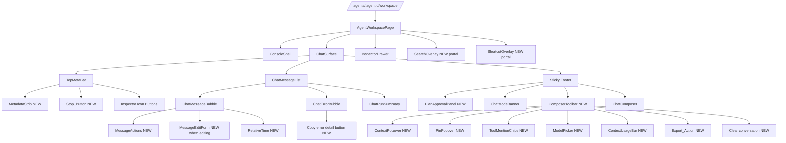

# Design Document

## Overview

本 feature 是对 `agent-workspace-chat-refine`（以下称 v1）的第二轮打磨。v1 已经把 `/agents/:agentId/workspace` 落地为 `AgentWorkspacePage` → `ChatSurface` → `ChatMessageList` + `ChatComposer` + `InspectorDrawer` 的骨架，并提供 `useChatStream`、`useWorkspaceStore`、`chatEventReducer`、`sseErrors`、`markdown`、`activePathQueries`、`scroll` 等核心 lib。本 v2 的设计目标是在 **不变更 SSE 契约、不引入 runtime 依赖、不删改 `useWorkspaceStore` 既有字段** 的约束下，完成下列工作：

1. **全宽布局**：去掉 `AgentWorkspacePage` / `ChatSurface` / `ChatComposer` 外层的 `max-w-3xl` / `max-w-2xl` / `max-w-4xl`，改由消息气泡内部应用 `80ch` 行宽约束。
2. **流式显示修复**：在 `useChatStream` 内通过 `ReactDOM.flushSync` + `queueMicrotask` 切片 + rAF 窗口合并三层策略，破开 React 18 automatic batching 带来的"一次性整条出现"现象；同时在 `docs/runbooks/sse-streaming.md` 记录反代配置约束，并在响应头不满足流式条件时写入 `metadata.streaming_diagnostic` 诊断标记。
3. **Plan 审批浮层**：新增 `PlanApprovalPanel`，在 `Active_Path` 末端为 done 的 plan 节点且 `activeStream == null` 时弹出，提供「批准并执行 / 修改规划 / 丢弃 / 关闭」四个动作。
4. **用户消息编辑 + Regenerate**：在 `ChatMessageBubble` 加 `MessageActions`（Copy/Edit/Regenerate 三个按钮，按 role 与位置条件显示），编辑态由 `ChatSurface` 下沉的 `editingNodeId: string | null` 统一管理；保存并重发 / Regenerate 都通过 `useWorkspaceStore.appendNode` 在父节点下创建新 user/assistant 分支。
5. **轻量控件回归**：新增 `ComposerToolbar` 行容器，内含 `ContextPopover` / `PinPopover` / `ToolMentionChips` / `ModelPicker`，全部用原生 popover + `useOutsideClick` 手工实现，不引入 Radix/Headless UI。
6. **Metadata 直出**：新增 `MetadataStrip`，直接读取 `Active_Path[last].metadata`，常驻 `Meta_Bar`；字段缺失时显示 `—` 占位符。
7. **用户气泡白底黑字**：修改 `ChatMessageBubble` 的 user 分支 className，同步 `Message_Edit_Mode` 的 textarea 背景。
8. **Stop_Button 外露**：`Meta_Bar` 在 `activeStream !== null` 时立即渲染停止按钮，`onClick → stream.pause()`。
9. **P1/P2 效率增强**：相对时间戳、`localStorage` 按 agentId 分区持久化、搜索 / 快捷键浮层、Markdown/JSON 导出、上下文用量条、错误复制。

设计遵循以下总体原则：

- **additive-only 对外契约**：`useWorkspaceStore`、`AgentChatStreamEvent`、`streamAgentChatRun`、`POST /api/agents/:agentId/runs/chat/stream` 不得删改现有字段；所有新增字段（例如 `dismissedPlanNodeIds`、`streaming_diagnostic`）必须 optional。
- **纯函数优先**：搜索、导出、相对时间、复制清洗、Plan 面板前置条件等业务规则全部下沉到 `lib/*.ts` 的纯函数，UI 组件保持 stateless 或只持有极轻量 UI-local state（如 `justCopied`）。
- **属性测试 16 条正确性不变量**：所有在 Requirement 16 列出的不变量都映射到纯函数的属性测试或组件快照断言（见 §Testing Strategy）。

## Architecture

### High-level component tree

v2 仍然由 `AgentWorkspacePage` 作为路由宿主，`ChatSurface` 作为聊天主容器，`InspectorDrawer` 作为右侧抽屉。v2 在 `ChatSurface` 内部与 `Workspace_Composer` 周围插入多个新组件，不改变三段式骨架。



### Layout contract（Requirement 1）

- `AgentWorkspacePage` 的外层 `<div>` 保持 `relative flex h-[calc(100vh-3.5rem)] min-h-0`（v1 已有），不再包裹任何 `max-w-*`。
- `ChatSurface` 根 `<div>` 改为 `flex h-full w-full min-h-0 flex-col bg-[#f3f5f7]`（去掉所有宽度上限）。
- `TopMetaBar` 与底部 sticky footer 都使用 `w-full`，不再套 `max-w-3xl`。
- `ChatMessageList` 的"内容列"由内部 wrapper 承担：`<div className="mx-auto w-full max-w-[80ch] lg:max-w-[56rem] px-3 py-6">`；外层可滚动容器 `<div className="flex-1 min-h-0 overflow-y-auto w-full">` 仍然 100% 宽。
- `ChatComposer` 外壳 `w-full`，内部再 `<div className="mx-auto w-full max-w-[56rem]">` 居中；这样用户会感知"消息列和输入框对齐，两侧灰色留白"。
- 响应式断点：`px-3` (默认，约 12px) / `sm:px-4` / `lg:px-6` / `xl:px-12`（最多 48px 单侧）。在 `viewport >= 1280px` 时硬上限 `px-12`，保证总水平内边距 ≤ 96px。

### Streaming flush architecture（Requirement 2）

v1 的流式渲染之所以被感知为"一次性整条出现"，诊断路径如下：

1. `useChatStream.dispatchEvent` 调用 `store.appendContent(id, piece)`；Zustand 的 `set` 会同步更新内部 map；
2. 但 React 18 的 automatic batching 会把同一个宏任务（例如 `reader.read()` 返回后同步循环 `for (const frame of frames)`）内的多次 `set` 合并成一次 render commit；
3. 真实 SSE 在 fast path 上，单个 `read()` 可能解出 10+ 帧 `delta`，于是用户看到的是"10 帧合并成一次可见更新"；
4. 上游反代（Nginx）若开启 gzip 或默认的 `proxy_buffering on`，SSE frame 会被聚合成大块后才下发，进一步放大 2 的问题。

解决方案按风险从低到高分三层落地：

**第 1 层：`useStreamFlush`（新 hook / 也可直接写在 `useChatStream` 内）** — 包装 `store.appendContent` 的时机。

```ts
// apps/agent-console/src/features/agents/hooks/useStreamFlush.ts
import { flushSync } from "react-dom";

/**
 * Strategy for committing SSE delta writes so they survive React 18
 * automatic batching. Returns a function with the same signature as
 * `store.appendContent` but guarantees an independent commit per delta
 * within the 32ms frame budget.
 */
export type FlushStrategy = "microtask" | "flush_sync" | "raf_window";

export type FlushScheduler = {
  /** Apply one delta; MUST return within ~1ms. Commit is scheduled separately. */
  schedule(write: () => void): void;
  /** Flush any pending writes (used on stream finish / abort). */
  drain(): void;
  /** Dispose timers. Called from the hook's cleanup. */
  dispose(): void;
};

export function createFlushScheduler(strategy: FlushStrategy): FlushScheduler;
```

策略选择：
- `flush_sync`（默认）：`flushSync(() => store.appendContent(id, piece))`；保证每个 delta 都产生一次独立 commit。缺点：当 delta 频率 >120/s 时 CPU 成本偏高。
- `raf_window`：积累 `pending` 字符串，`requestAnimationFrame` 到来时一次性 `store.appendContent(id, pending)`；保证 ≤16ms 内有一次可见更新（Req 2.1），在高频下把相邻 delta 合并到一帧（Req 2.3）。用于高频场景兜底。
- `microtask`：`queueMicrotask(() => store.appendContent(id, piece))`；把多个 delta 拆到独立微任务里以绕过 automatic batching。当前测试环境（JSDOM）对 `flushSync` 支持有限时作为 fallback。

切换策略：默认 `flush_sync`；如果在 `dispatchEvent` 中检测到 `delta` 事件的间隔 `< 8ms` 且连续出现 ≥ 4 次，则降级到 `raf_window` 并保持到流结束。降级决策放在 `useStreamFlush` 内部，不暴露给 UI。

**第 2 层：Content-Encoding / Transfer-Encoding 诊断（Requirement 2.8）**

在 `runStream` 收到 `response` 且 `response.ok === true` 之后，立刻读取：
- `response.headers.get("content-encoding")` — 若包含 `gzip` / `br` / `deflate`（SSE 理论上不应压缩），标记可疑。
- `response.headers.get("transfer-encoding")` — 缺失 `chunked`（即 `null` 或不含 `chunked`）且 `response.headers.get("content-length")` 非空，也标记可疑。
- 任一条命中 → 调用 `store.updateNode(assistantNodeId, { metadata: { ...current.metadata, streaming_diagnostic: "possible_buffering" } })`。

`ChatMessageBubble` 读到 `metadata.streaming_diagnostic === "possible_buffering"` 时，在气泡底部用 `<p className="mt-2 text-[11px] text-amber-600">` 显示"检测到可能的代理缓冲"次要提示（双语）。

**第 3 层：`docs/runbooks/sse-streaming.md`（Requirement 2.7）**

在 `docs/runbooks/` 新增 `sse-streaming.md`，记录反代排障清单：
- `X-Accel-Buffering: no`
- `Cache-Control: no-cache`
- `Content-Type: text/event-stream`（后端已输出）
- Nginx `proxy_buffering off;` + `gzip off;`（对 SSE 路由）
- Kubernetes Ingress `nginx.ingress.kubernetes.io/proxy-buffering: "off"`

### Plan Approval Panel flow（Requirement 3）

Plan 面板的显隐完全由一个纯函数控制：

```ts
// apps/agent-console/src/features/agents/lib/planApprovalGate.ts
import type { ConversationNode } from "../../../stores/workspaceStore";

export type PlanApprovalGateInput = {
  activePath: ConversationNode[];
  activeStreamNodeId: string | null;
  dismissedPlanNodeIds: ReadonlyArray<string>;
};

/**
 * Pure predicate governing PlanApprovalPanel visibility. Req 3.1 / 3.6 / 3.7
 * and Property P4. TOTAL: for any input returns `{ visible, planNode }`; never
 * throws. Returns `{ visible: false, planNode: null }` if any precondition
 * fails.
 */
export function planApprovalGate(
  input: PlanApprovalGateInput,
): { visible: boolean; planNode: ConversationNode | null };
```

预条件（全部满足才 visible）：
1. `activePath.length > 0`；
2. `tail = activePath[activePath.length - 1]`；
3. `tail.role === "assistant"`；
4. `tail.state === "done"`；
5. `tail.metadata.workspace_mode === "plan" || tail.metadata.workspace_mode === "codex_plan"`；
6. `activeStreamNodeId === null`；
7. `dismissedPlanNodeIds.includes(tail.id) === false`。

`dismissedPlanNodeIds` 是新增的 store 字段（见 §Data Models）。用户点击 Discard / Close 时，`PlanApprovalPanel` 的父组件 `ChatSurface` 会调用 `useWorkspaceStore.dismissPlanNode(tail.id)`。切换 `activeLeafId` 或出现新的 plan 节点时，`planApprovalGate` 会天然重新评估——因为新的 tail.id 不在 dismissed 列表里。

### Branch creation for Edit/Regenerate（Requirement 4 & 10）

v1 已有的分支语义：`appendNode({ parent_id, ... })` 会把新节点挂到父节点的 `children_ids` 末尾并把 `activeLeafId` 切过去；`setActiveLeafId` / `switchToBranch` 支持在兄弟间切换。

v2 在此基础上增加两条受控的分支创建路径：

**Edit 重发**：

```ts
// inside ChatSurface.handleEditSave(originalUserNodeId, newContent)
const store = useWorkspaceStore.getState();
const original = store.nodesById[originalUserNodeId];
if (!original || original.role !== "user") return;
const parentId = original.parent_id;             // 原 user 节点的父节点
if (!parentId) return;                            // 理论不可达；系统根一定存在

// 1) 新 user 节点挂到同一 parent 下（兄弟关系）
const newUserId = store.appendNode({
  parent_id: parentId,
  role: "user",
  content: newContent,
  state: "done",
  metadata: {},
  tool_calls: [],
  artifacts: [],
});

// 2) 新 assistant 节点挂到新 user 下；state=streaming 让 hook 接管
const newAssistantId = store.appendNode({
  parent_id: newUserId,
  role: "assistant",
  content: "",
  state: "streaming",
  metadata: { workspace_mode: workspaceMode },
  tool_calls: [],
  artifacts: [],
});

// 3) 驱动流
await stream.driveBranch({ assistantNodeId: newAssistantId, goal: newContent });
```

注意：`useChatStream` v1 的 `start` 内置了"创建 user + assistant 对"的逻辑。v2 要么：
- (A) 给 `useChatStream` 新增 `driveBranch({ assistantNodeId, goal, mode? })` 方法（additive），让 edit/regenerate 复用 `driveStream` 但跳过 `planInitialNodes` 阶段；或者
- (B) 在 `ChatSurface` 层调用 `stream.start({ goal, mode })`——但 `start` 会再创建一对 user+assistant 节点，破坏分支语义。

**决策选 (A)**：`useChatStream` 新增 `driveBranch` 方法，签名：

```ts
// additive change to ChatStreamController
driveBranch(input: {
  assistantNodeId: string;       // 必须已存在，state=streaming
  goal: string;                   // 等价于 prev user 的 content
  mode: WorkspaceMode;
}): Promise<void>;
```

**Regenerate**：

```ts
// inside ChatSurface.handleRegenerate(assistantNodeId)
const store = useWorkspaceStore.getState();
const original = store.nodesById[assistantNodeId];
if (!original || original.role !== "assistant") return;
const prevUserId = original.parent_id;
if (!prevUserId) return;
const prevUser = store.nodesById[prevUserId];
if (!prevUser || prevUser.role !== "user") return;

const newAssistantId = store.appendNode({
  parent_id: prevUserId,
  role: "assistant",
  content: "",
  state: "streaming",
  metadata: { workspace_mode: original.metadata.workspace_mode ?? workspaceMode },
  tool_calls: [],
  artifacts: [],
});

await stream.driveBranch({
  assistantNodeId: newAssistantId,
  goal: prevUser.content,
  mode: original.metadata.workspace_mode ?? workspaceMode,
});
```

两条路径都满足 P6（原节点保留 + `getSiblings(original).length >= 2`）。

### Editing state ownership（Requirement 4）

决策：把 `editingNodeId: string | null` 放在 `ChatSurface` 本地 `useState`，不进 store。

原因：
- Edit 态是一次性 UI-only 状态，刷新后不需要恢复（Requirement 12 对持久化字段的列表不包含 edit 态）；
- 放在 `ChatMessageBubble` 局部 state 的话，每次切分支会丢失；放在 store 的话，会污染持久化快照且与 pause/resume 状态语义不正交；
- 集中到 `ChatSurface` 便于 Req 4.3 的键盘语义（Esc 取消、Enter 保存）统一处理。

`ChatSurface` 将 `editingNodeId` + 两个回调 `onStartEdit(id)` / `onCancelEdit()` / `onSaveEdit(id, newContent)` 透传给 `ChatMessageList`，再透传给 `ChatMessageBubble`。`ChatMessageBubble` 当 `props.editingNodeId === props.node.id` 时渲染 `MessageEditForm`，否则渲染普通内容。

### Copy action pipeline（Requirement 5 / P7）

```mermaid
sequenceDiagram
  participant U as User
  participant Actions as MessageActions
  participant Clip as lib/clipboard.ts
  participant Nav as navigator.clipboard
  participant Exec as document.execCommand

  U->>Actions: click Copy_Button
  Actions->>Clip: copyText(stripThinkBlocks(node.content))
  Clip->>Nav: writeText(text)
  alt Nav success
    Nav-->>Clip: ok
    Clip-->>Actions: true
    Actions->>Actions: setJustCopied(true); setTimeout(1500ms)
  else Nav fail or undefined
    Clip->>Exec: fallback copy via hidden textarea
    alt Exec success
      Exec-->>Clip: true
      Clip-->>Actions: true
    else Exec fail
      Exec-->>Clip: false
      Clip-->>Actions: false
      Actions->>U: inline error toast
    end
  end
```

`stripThinkBlocks` 是一个纯函数，直接复用 `ChatMessageBubble` 已有的实现，但提升到 `lib/copyText.ts` 以便独立属性测试：

```ts
// apps/agent-console/src/features/agents/lib/copyText.ts
export function stripThinkBlocks(content: string): string {
  return content.replace(/<think>[\s\S]*?<\/think>/g, "").trim();
}
```

### Composer toolbar layout（Requirement 6）

```
┌────────────────────────────────────────────────────────────────┐
│ ComposerToolbar (h <= 56px)                                     │
│ ┌────────┐ ┌────────┐ ┌──────┬──────┬──────┐ ┌────────┐  │
│ │ Context│ │ Pin (n)│ │@file │@grep │@shell│ │ Model ⌄│  │
│ └────────┘ └────────┘ └──────┴──────┴──────┘ └────────┘  │
│   ...    ↕ ContextUsageBar (optional thin line)                │
├────────────────────────────────────────────────────────────────┤
│ ChatComposer (textarea + send/pause/resume + mode radio)       │
└────────────────────────────────────────────────────────────────┘
```

`ComposerToolbar` 是一个 pure presentational 组件，接收 props 把 store 字段展开。所有 popover 用原生 `<details>` 或"手写 popover"：

```ts
// apps/agent-console/src/features/agents/components/ContextPopover.tsx
type ContextPopoverProps = {
  value: number;                 // useWorkspaceStore.contextWindowTurns
  onChange: (turns: number) => void;
};
```

`useOutsideClick(ref, onClose)` 在 `hooks/useOutsideClick.ts` 中实现（新增），封装 `document.addEventListener('mousedown')` + `ref.contains(event.target)` 判断。

### Metadata Strip contract（Requirement 7）

`MetadataStrip` 是一个 pure stateless 组件：

```ts
// apps/agent-console/src/features/agents/components/MetadataStrip.tsx
type MetadataStripProps = {
  tail: ConversationNode | null;    // Active_Path 末端；null 等价空会话
  activeRunId: string | null;
  onOpenRunDetail: (runId: string) => void;
};
```

字段布局（桌面，≥ `sm`）：

```
In {n} · Out {n} · ${cost} · TTFB {n}ms · {duration}ms · Run {hash}
```

- `n` / `cost` / 等若 `undefined` 显示 `—`；
- `cost_unavailable === true` 显示 `N/A`；
- `run_id` 短哈希 = `run.slice(0, 8)`；
- 窄屏（`< 640px`）：整条 `overflow-x-auto`，保持一行；不换行到多行（避免推高 MetaBar）；
- 更新时机：由 React 自动驱动——父组件（`TopMetaBar`）订阅 `activePath` 变化，tail 会随 `usage` 事件驱动的 `updateNode` 自动重渲染（Req 7.3）。

### Stop button（Requirement 9）

`TopMetaBar` 扩展 props `isStreaming: boolean` + `onStop: () => void`；`isStreaming === true` 时立即渲染 `<Button variant="danger">`，`onClick={onStop}` → `ChatSurface` 的 `onStop = () => stream.pause()`。`stream.pause()` 已经在 v1 实现里通过 `abortController.abort()` 把 state 置为 `paused`，完全复用。

### Persistence architecture（Requirement 12 / P11）

Zustand 默认没有内置持久化；我们用一个极简的"订阅 + debounce"中间件写在 `lib/localPersistence.ts`，避免引入 `zustand/middleware`（实际它是同一个包里的子入口，不属于额外依赖；可直接使用 `import { persist } from "zustand/middleware"`。**验证过 `apps/agent-console/node_modules/zustand/middleware.d.ts` 存在，使用 persist middleware 不违反 Req 15.1**）。

**决策**：使用 `zustand/middleware` 的 `persist` + 自定义 `partialize` + `migrate` + `onRehydrateStorage`：

```ts
// apps/agent-console/src/stores/workspaceStore.ts (modified)
import { persist, createJSONStorage } from "zustand/middleware";

export const useWorkspaceStore = create<WorkspaceState>()(
  persist(
    (set, get) => ({ /* existing state + new fields */ }),
    {
      name: "harness.workspace.v2",       // 前缀
      version: 1,
      storage: createJSONStorage(() => localStorage),
      // agentId 由 AgentWorkspacePage 通过 setAgentScope(agentId) 动态注入；
      // storage key = `${name}.${agentId}`
      partialize: (state) => ({
        nodesById: state.nodesById,
        rootNodeId: state.rootNodeId,
        activeLeafId: state.activeLeafId,
        pinnedNodeIds: state.pinnedNodeIds,
        contextWindowTurns: state.contextWindowTurns,
        draft: state.draft,
        dismissedPlanNodeIds: state.dismissedPlanNodeIds,
      }),
      onRehydrateStorage: () => (state) => {
        if (!state) return;
        // P11: refuse to restore streaming nodes.
        const patched: Record<string, ConversationNode> = {};
        for (const [id, node] of Object.entries(state.nodesById)) {
          patched[id] = node.state === "streaming"
            ? { ...node, state: "paused" }
            : node;
        }
        state.nodesById = patched;
      },
      migrate: (persistedState, version) => {
        if (version !== 1) return undefined;  // schema mismatch → drop
        return persistedState;
      },
    },
  ),
);
```

Agent 切换：`AgentWorkspacePage` 在 `agentId` 变化时调用 `useWorkspaceStore.persist.setOptions({ name: `harness.workspace.v2.${agentId}` })` + `useWorkspaceStore.persist.rehydrate()`。同时调用 `reset()` 以清空内存状态避免跨 agent 泄漏（reset 之后 rehydrate 会用新 agentId 填充）。

**注意**：如果 `zustand/middleware` 的 `persist` 因版本差异不可用（Zustand 5 已经把它放在 `zustand/middleware`），回退到 `lib/localPersistence.ts` 手写的 subscribe+debounce 实现。两种实现对外合同一致。

```ts
// apps/agent-console/src/features/agents/lib/localPersistence.ts (fallback)
export type PersistedSnapshot = {
  version: number;
  nodesById: Record<string, ConversationNode>;
  rootNodeId: string;
  activeLeafId: string;
  pinnedNodeIds: string[];
  contextWindowTurns: number;
  draft: string;
  dismissedPlanNodeIds: string[];
};
export function saveSnapshot(agentId: string, snapshot: PersistedSnapshot): boolean;
export function loadSnapshot(agentId: string): PersistedSnapshot | null;
export function clearSnapshot(agentId: string): void;
export const PERSISTED_SCHEMA_VERSION = 1;
```

写入路径：在 `workspaceStore.ts` 的 `create` 外层包一个 `subscribe`，`debounce(300ms)`，把 `partialize` 后的快照 `JSON.stringify` 入 `localStorage`。写入失败（`QuotaExceededError` 等）时在控制台 `warn` 并设置一个内存 flag `persistenceDisabled = true` 静默降级。

读入路径：`AgentWorkspacePage` 在 `agentId` 变化的 `useEffect` 中调 `loadSnapshot(agentId)`；若返回非 null，调用 `useWorkspaceStore.setState({ ...snapshot, activeStream: null })` 并把 `state === "streaming"` 的节点重写为 `paused`（P11）。

**Clear 按钮**：`Composer_Toolbar` 增加一个"清空对话"图标按钮（`lucide-react` `Trash2`），`onClick → window.confirm(...) && (clearSnapshot(agentId), store.reset())`。

### Search / Shortcut / Export overlays（Requirement 13）

三个浮层都用 `react-dom/createPortal` 渲染到 `document.body`。键盘绑定放在 `AgentWorkspacePage` 顶层的 `useEffect(document.addEventListener("keydown", handler))`：

```ts
function handler(e: KeyboardEvent) {
  const target = e.target as HTMLElement | null;
  const inEditable =
    target?.tagName === "TEXTAREA" ||
    target?.tagName === "INPUT" ||
    target?.isContentEditable;

  if ((e.metaKey || e.ctrlKey) && e.key.toLowerCase() === "k") {
    e.preventDefault();
    setSearchOpen(true);
    return;
  }
  if (e.key === "?" && !inEditable) {
    setShortcutOpen(true);
    return;
  }
  if (e.key === "Escape") {
    if (searchOpen) setSearchOpen(false);
    if (shortcutOpen) setShortcutOpen(false);
    if (planDismissDialog) setPlanDismissDialog(false);
    return;
  }
}
```

`Search_Overlay`：`<input>` + 下方结果列表；`onChange` 调用 `searchIndex(nodesById, query)`（纯函数子串匹配，返回 `{ nodeId, snippet, hitStart, hitEnd }[]`）。点击结果 → `setActiveLeafId(leafIdOf(nodeId))` + `scrollIntoView` + 1.5s 黄色高亮。

`Export_Action`：下拉菜单两项 Markdown / JSON；点击 → `exportMarkdown` / `exportJson`（下面 §Components 有签名） → `new Blob([text], { type })` + 创建 `<a>` 并 `.click()`。

### AgentWorkspacePage modifications

`AgentWorkspacePage` 额外管理以下 UI 状态：
- `searchOpen: boolean`
- `shortcutOpen: boolean`
- `exportMenuOpen: boolean`
- keybinding effect（全局 keydown）
- agentId 变化时的持久化 rehydrate effect

`useChatStream` 增加 `driveBranch` 方法后，`AgentWorkspacePage` 把它透传给 `ChatSurface`。`ChatSurface` 内 `handleSaveEdit` / `handleRegenerate` 使用它。

## Components and Interfaces

### Module layout（additions + modifications）

**新增文件（按 layer 排序）**：

```
apps/agent-console/src/features/agents/
├── components/
│   ├── PlanApprovalPanel.tsx          // Requirement 3
│   ├── ComposerToolbar.tsx            // Requirement 6
│   ├── ContextPopover.tsx             // Req 6.2
│   ├── PinPopover.tsx                 // Req 6.3-6.4
│   ├── ToolMentionChips.tsx           // Req 6.5 / 6.9
│   ├── ModelPicker.tsx                // Req 6.6 / 6.10
│   ├── MetadataStrip.tsx              // Requirement 7
│   ├── MessageActions.tsx             // Req 4.1 / 5.1 / 10.1
│   ├── MessageEditForm.tsx            // Req 4.2 / 4.3 / 4.7
│   ├── SearchOverlay.tsx              // Req 13.1
│   ├── ShortcutOverlay.tsx            // Req 13.2
│   ├── ContextUsageBar.tsx            // Req 13.4 / 13.5
│   └── ClearConversationDialog.tsx    // Req 12.5 (optional; can inline window.confirm)
├── hooks/
│   ├── useStreamFlush.ts              // Requirement 2
│   └── useOutsideClick.ts             // support popovers
└── lib/
    ├── clipboard.ts                   // Requirement 5 / 13.6
    ├── copyText.ts                    // stripThinkBlocks (extracted)
    ├── relativeTime.ts                // Requirement 11
    ├── localPersistence.ts            // Requirement 12 fallback path
    ├── searchIndex.ts                 // Requirement 13.1
    ├── exporter.ts                    // Requirement 13.3
    ├── planApprovalGate.ts            // Requirement 3 gate predicate
    └── contextUsage.ts                // Requirement 13.4 helpers
```

**修改文件**：

- `pages/AgentWorkspacePage.tsx` — 去掉 `max-w-*`；注入新 overlays / keybindings；agentId 变化时 rehydrate。
- `components/ChatSurface.tsx` — 全宽布局；`TopMetaBar` 渲染 `MetadataStrip` + `StopButton`；footer 渲染 `PlanApprovalPanel` + `ComposerToolbar` + `ChatComposer`；下沉 `editingNodeId` state。
- `components/ChatMessageList.tsx` — 去掉 `max-w-3xl`，内部行宽容器 `max-w-[80ch] lg:max-w-[56rem]`；透传 `editingNodeId` + edit 回调 + `onCopy` / `onRegenerate` 到 `ChatMessageBubble`。
- `components/ChatMessageBubble.tsx` — user 气泡改为 `bg-white border border-slate-200 text-slate-900`；引入 `MessageActions`（hover/focus 显示）；`editingNodeId === node.id` 时渲染 `MessageEditForm`；底部加 `<RelativeTime>`；`metadata.streaming_diagnostic` 提示。
- `components/ChatErrorBubble.tsx` — 增加「复制错误详情」按钮，`copyText` 使用 `formatErrorDetail(node, error, agentId)` 纯函数。
- `components/ChatComposer.tsx` — 改为 `w-full` 外壳 + 内部 `max-w-[56rem]` 内容列；暴露 `textareaRef` 给父组件（edit 按钮取消时要 focus composer）。
- `hooks/useChatStream.ts` — 新增 `driveBranch`；`dispatchEvent` 内对 `delta` / `think_delta` 使用 `useStreamFlush` 产生的 `schedule` 函数；首 `run_created` / `delta` 前检查响应头，写入 `streaming_diagnostic`。
- `stores/workspaceStore.ts` — additive 新增 `dismissedPlanNodeIds: string[]` + 两个 action `dismissPlanNode(id)` / `clearDismissedPlanNodes()`；接入 `persist` middleware 或外层 subscribe。

**不修改**：`app/routes.tsx`、`app/ConsoleShell.tsx`、`features/tasks/api.ts`、`features/agents/streamEvents.ts`、`features/agents/workspaceArtifacts.ts`、`features/agents/lib/chatEventReducer.ts`、`features/agents/lib/sseErrors.ts`、`features/agents/lib/markdown.ts`、`features/agents/lib/activePathQueries.ts`、`features/agents/lib/scroll.ts`、`features/agents/lib/examplePrompts.ts`、`features/agents/components/ChatModeBanner.tsx`、`features/agents/components/ChatWelcomeState.tsx`、`features/agents/components/ChatRunSummary.tsx`、`features/agents/components/InspectorDrawer.tsx`。

### New components

#### PlanApprovalPanel

```ts
// apps/agent-console/src/features/agents/components/PlanApprovalPanel.tsx

import type { ConversationNode } from "../../../stores/workspaceStore";

export type PlanApprovalPanelProps = {
  /** 末端 assistant+plan+done 节点。父组件已用 planApprovalGate 过滤。 */
  planNode: ConversationNode;
  /** True while an approve-triggered stream.driveBranch is running. */
  isSubmitting: boolean;
  /** 批准并执行 → ChatSurface 调用 stream.driveBranch({ mode: "plan", goal: planNode.content, ... }) */
  onApprove: () => void;
  /** 修改规划 → setDraft(planNode.content) + focus composer + setWorkspaceMode("codex_plan") */
  onEdit: () => void;
  /** 丢弃 → store.dismissPlanNode(planNode.id) */
  onDiscard: () => void;
  /** 关闭（X）→ 等价 onDiscard；保留为独立 prop 便于未来分离语义（例如 only hide without persist） */
  onClose: () => void;
};

export function PlanApprovalPanel(props: PlanApprovalPanelProps): JSX.Element;
```

视觉：`rounded-2xl border border-slate-200 bg-white shadow-sm p-3`，位于 `ChatModeBanner`（如果显示）下方、`ComposerToolbar` 上方。4 个按钮顺序：批准并执行（`variant="primary"`）、修改规划（`variant="secondary"`）、丢弃（`variant="ghost"`）、关闭 X（右上角 icon-only）。`isSubmitting === true` 时全部 disable。

#### ComposerToolbar

```ts
// apps/agent-console/src/features/agents/components/ComposerToolbar.tsx

export type ComposerToolbarProps = {
  // Context / Pin
  contextWindowTurns: number;
  onContextChange: (turns: number) => void;
  pinnedNodes: ConversationNode[];
  onUnpin: (nodeId: string) => void;

  // Tool mentions
  tools: ToolMetadata[];
  onInsertMention: (toolName: string) => void;

  // Model picker
  providers: ModelOption[];
  selectedProviderId: string | null;
  selectedModelId: string | null;
  onModelChange: (providerId: string, modelId: string) => void;
  modelLabelFallback: string;   // Req 6.10

  // Context usage bar (Req 13.4/13.5)
  usageRatio: number;           // 0..1 with clamp
  usageLimit: number;
  usageCurrent: number;

  // Export / Clear
  onExport: (format: "markdown" | "json") => void;
  onClearConversation: () => void;
};
```

内部顺序（桌面）：`ContextPopover` · `PinPopover` · `ToolMentionChips` · `ModelPicker` · 右侧：`ContextUsageBar` · `Export_Action` · Clear（`Trash2` icon）。

#### MessageActions

```ts
// apps/agent-console/src/features/agents/components/MessageActions.tsx

export type MessageActionsProps = {
  role: ConversationRole;             // only "user" / "assistant" rendered upstream
  /** Whether this bubble is the last assistant in Active_Path AND eligible
   *  for Regenerate (done/error/paused). */
  canRegenerate: boolean;
  /** True → hide Edit (edit-during-stream is forbidden; Req 4.8). */
  isStreaming: boolean;
  /** Hide edit when the message is already in edit mode. */
  isEditing: boolean;
  onCopy: () => Promise<void>;
  onEdit: () => void;                 // only called when role==="user"
  onRegenerate: () => void;           // only called when canRegenerate===true
};

export function MessageActions(props: MessageActionsProps): JSX.Element;
```

内部持有 `const [justCopied, setJustCopied] = useState(false)`；`onCopy` wrapper 在 success 时 setJustCopied(true) + `setTimeout(() => setJustCopied(false), 1500)`；新点击重置计时器（Req 5.3）。按钮 className 用 `opacity-0 group-hover:opacity-100 focus-within:opacity-100 transition` 实现 hover 显示。

#### MessageEditForm

```ts
// apps/agent-console/src/features/agents/components/MessageEditForm.tsx

export type MessageEditFormProps = {
  initialContent: string;
  onSave: (newContent: string) => void;   // trim-non-empty 由调用方再校验
  onCancel: () => void;
};

// Key bindings (Req 4.3):
//   Enter            → onSave(trim!=='' ? value : no-op)
//   Shift+Enter      → insert newline (native textarea default)
//   Escape           → onCancel
//   composition (IME) → never submit
```

#### MetadataStrip

接口已在 §Architecture 给出。内部 i18n 标签：

| 字段            | zh       | en        |
| --------------- | -------- | --------- |
| `input_tokens`  | "输入"   | "In"      |
| `output_tokens` | "输出"   | "Out"     |
| `cost_usd`      | "成本"   | "Cost"    |
| `ttfb_ms`       | "TTFB"   | "TTFB"    |
| `duration_ms`   | "耗时"   | "Duration"|
| `run_id`        | "Run"    | "Run"     |

显示格式：`In 123 · Out 456 · $0.0012 · TTFB 320ms · 1420ms · Run 9f3a2e10`。

#### SearchOverlay / ShortcutOverlay

```ts
// apps/agent-console/src/features/agents/components/SearchOverlay.tsx

export type SearchOverlayProps = {
  open: boolean;
  onClose: () => void;
  nodesById: Record<string, ConversationNode>;
  onJumpToNode: (nodeId: string) => void;   // parent: setActiveLeafId + scroll highlight
};

// apps/agent-console/src/features/agents/components/ShortcutOverlay.tsx

export type ShortcutOverlayProps = {
  open: boolean;
  onClose: () => void;
};
```

`SearchOverlay` 在 `open` 为 true 时渲染 `<div className="fixed inset-0 z-50 flex items-start justify-center bg-black/30 pt-[10vh]">…</div>`；`<input>` 自动 focus；下方 `searchIndex(nodesById, query)` 结果列表。

#### ContextUsageBar

```ts
export type ContextUsageBarProps = {
  ratio: number;      // clamped to [0, 1]
  current: number;    // token count
  limit: number;      // context window limit from getModelSettings()
};
```

视觉：60px × 6px 横条 + 左侧小字 `1.2k / 8k`；`ratio >= 0.8` 时条色由 slate-400 切到 amber-500 + 在右侧显示 `AlertTriangle` + 双语提示"可能需要裁剪上下文"。

### New hooks

#### useStreamFlush

```ts
// apps/agent-console/src/features/agents/hooks/useStreamFlush.ts

import { useCallback, useEffect, useRef } from "react";
import { flushSync } from "react-dom";

export type UseStreamFlushOptions = {
  /** Strategy override for tests. */
  strategy?: "flush_sync" | "microtask" | "raf_window" | "auto";
};

export type StreamFlushApi = {
  /**
   * Apply a store-mutating write and ensure it produces a React commit
   * within the Req 2 / P2 / P3 budget.
   */
  commit(write: () => void): void;
  /** Flush any pending writes; call on stream done / abort. */
  drain(): void;
};

export function useStreamFlush(
  opts?: UseStreamFlushOptions,
): StreamFlushApi;
```

实现细节见 §Architecture 的"第 1 层"。`useChatStream.dispatchEvent` 内的 `delta` / `think_delta` 分支改写成：

```ts
case "delta": {
  if (firstDeltaAt === null) firstDeltaAt = performance.now();
  flush.commit(() => {
    useWorkspaceStore.getState().appendContent(assistantNodeId, event.content);
  });
  clearWatchdog();
  return;
}
```

#### useOutsideClick

```ts
export function useOutsideClick<T extends HTMLElement>(
  ref: React.RefObject<T>,
  onOutside: () => void,
  enabled?: boolean,
): void;
```

### New lib modules

```ts
// apps/agent-console/src/features/agents/lib/clipboard.ts

/**
 * Copy plain text to the system clipboard.
 * TOTAL: never throws; returns false when neither navigator.clipboard nor
 * document.execCommand succeed.
 */
export async function copyText(text: string): Promise<boolean>;

/**
 * Whether the current runtime supports any copy primitive at all.
 * Used to disable Copy buttons up-front in hostile environments.
 */
export function supportsCopy(): boolean;

/**
 * Fallback implementation via hidden <textarea> + execCommand('copy').
 * Exposed for testing; not called directly.
 */
export function copyTextExecFallback(text: string): boolean;
```

```ts
// apps/agent-console/src/features/agents/lib/copyText.ts
export function stripThinkBlocks(content: string): string;
```

```ts
// apps/agent-console/src/features/agents/lib/relativeTime.ts

/**
 * Return a relative-time label for `targetMs` relative to `nowMs`.
 * Uses Intl.RelativeTimeFormat when available; falls back to a locale-
 * aware hand-rolled formatter. TOTAL.
 */
export function formatRelativeTime(
  targetMs: number,
  nowMs: number,
  locale: "zh-CN" | "en",
): string;

/** ISO 8601 in local timezone for `<time>` title. */
export function formatLocalIso(ms: number): string;
```

```ts
// apps/agent-console/src/features/agents/lib/searchIndex.ts

export type SearchHit = {
  nodeId: string;
  role: ConversationRole;
  snippet: string;       // ±40 chars around first match
  matchStart: number;
  matchEnd: number;
};

/**
 * Pure case-insensitive substring search across nodesById.content.
 * Returns hits ordered by (role asc, created_at desc). TOTAL.
 */
export function searchIndex(
  nodesById: Record<string, ConversationNode>,
  query: string,
): SearchHit[];
```

```ts
// apps/agent-console/src/features/agents/lib/exporter.ts

export function exportMarkdown(activePath: ConversationNode[]): string;
export function exportJson(activePath: ConversationNode[]): string;

/** Trigger a browser download. Side-effect-only; not part of PBT. */
export function downloadBlob(
  contents: string,
  filename: string,
  mime: string,
): void;
```

```ts
// apps/agent-console/src/features/agents/lib/planApprovalGate.ts

export function planApprovalGate(input: {
  activePath: ConversationNode[];
  activeStreamNodeId: string | null;
  dismissedPlanNodeIds: ReadonlyArray<string>;
}): { visible: boolean; planNode: ConversationNode | null };
```

```ts
// apps/agent-console/src/features/agents/lib/contextUsage.ts

/**
 * Compute token usage for the last `turns` turns of activePath.
 * Uses ConversationNode.metadata.input_tokens + output_tokens; ignores
 * nodes without metadata.
 */
export function computeContextUsage(
  activePath: ConversationNode[],
  turns: number,
): { current: number; limit: number; ratio: number };

/**
 * Extract the context window limit from ModelSettings (or fallback 8192).
 */
export function readContextWindowLimit(
  settings: ModelSettings | undefined,
): number;
```

```ts
// apps/agent-console/src/features/agents/lib/localPersistence.ts (fallback path)
// — signatures already listed in §Architecture.
```

### Modified interfaces

#### useChatStream controller (additive)

```ts
// returned by useChatStream — v1 fields unchanged
export type ChatStreamController = {
  isStreaming: boolean;
  start(input: { goal: string; mode: WorkspaceMode }): Promise<void>;
  pause(): void;
  resume(pausedNodeId: string): Promise<void>;
  retry(errorNodeId: string): Promise<void>;
  // --- v2 addition ---
  /**
   * Drive the stream onto an externally-prepared assistant node. Used by
   * message-edit re-send and regenerate flows to avoid double-creating
   * user/assistant pairs. The caller guarantees `assistantNodeId` exists
   * with `state === "streaming"` and that its parent is a user node.
   */
  driveBranch(input: {
    assistantNodeId: string;
    goal: string;
    mode: WorkspaceMode;
  }): Promise<void>;
};
```

`driveBranch` 内部复用 `driveStream` + `buildPayload`，只是跳过 `planInitialNodes` + `appendNode` 两个步骤：

```ts
const driveBranch = useCallback(async (input) => {
  if (controllerRef.current !== null) return;
  const abort = new AbortController();
  controllerRef.current = abort;
  useWorkspaceStore.getState().setActiveStream({
    node_id: input.assistantNodeId,
    controller: abort,
    started_at: performance.now(),
  });
  await driveStream({
    assistantNodeId: input.assistantNodeId,
    abort,
    payload: buildPayload({ mode: input.mode, goal: input.goal }),
  });
}, [buildPayload, driveStream]);
```

#### useWorkspaceStore (additive)

```ts
type WorkspaceState = {
  // --- all existing fields unchanged ---
  nodesById: Record<string, ConversationNode>;
  rootNodeId: string;
  activeLeafId: string;
  pinnedNodeIds: string[];
  contextWindowTurns: number;
  activeStream: WorkspaceStream | null;
  draftFromNodeId: string | null;
  draft: string;
  // --- v2 additions (optional / default [])---
  dismissedPlanNodeIds: string[];
  // --- v2 additions: actions ---
  dismissPlanNode: (nodeId: string) => void;
  clearDismissedPlanNodes: () => void;
  // reset() existing, now also clears dismissedPlanNodeIds
};
```

`ConversationNode.metadata` 的形状保持 v1；**允许** additive 字段：

```ts
metadata: {
  // ... v1 fields unchanged ...
  workspace_mode?: "chat" | "codex_plan" | "plan";
  // --- v2 addition (optional) ---
  streaming_diagnostic?: "possible_buffering";
};
```

## Data Models

本 feature **完全不新增 backend 数据模型**。所有新字段都只是前端 store 的 TypeScript 形状扩展，且全部 optional。

### ConversationNode (unchanged shape)

```ts
type ConversationNode = {
  id: string;
  parent_id: string | null;
  children_ids: string[];
  role: "user" | "assistant" | "system" | "tool";
  content: string;
  state: "draft" | "streaming" | "paused" | "done" | "error";
  run_id?: string;
  metadata: {
    input_tokens?: number;
    output_tokens?: number;
    cost_usd?: string | null;
    cost_unavailable?: boolean;
    ttfb_ms?: number;
    duration_ms?: number;
    model_call_id?: string | null;
    active_branch_id?: string | null;
    workspace_mode?: "chat" | "codex_plan" | "plan";
    error?: ConversationErrorMeta;
    // v2 additive
    streaming_diagnostic?: "possible_buffering";
  };
  tool_calls: Array<Record<string, unknown>>;
  artifacts: ConversationArtifact[];
  created_at: string;     // v1 already has this; reused for Req 11
};
```

### WorkspaceState (additive)

```ts
type WorkspaceState = {
  // v1 fields (unchanged) ...
  dismissedPlanNodeIds: string[];
  dismissPlanNode(nodeId: string): void;
  clearDismissedPlanNodes(): void;
};
```

### PersistedSnapshot (new, local only)

```ts
type PersistedSnapshot = {
  version: 1;
  nodesById: Record<string, ConversationNode>;
  rootNodeId: string;
  activeLeafId: string;
  pinnedNodeIds: string[];
  contextWindowTurns: number;
  draft: string;
  dismissedPlanNodeIds: string[];
};
```

Storage key：`harness.workspace.v2.<agentId>`。Req 12.1 要求"以 `harness.workspace.v2.<agentId>` 前缀"；我们把整个 key 作为该前缀加 agentId。Schema 升级通过 `version` 字段触发丢弃 + 空初始化（Req 12.4）。

### ChatStreamController (additive)

见 §Components and Interfaces → Modified interfaces。

### Wire contract unchanged

- `POST /api/agents/:agentId/runs/chat/stream`：method / URL / body / headers 全部不变。
- `AgentChatStreamEvent` 事件集合：不变（`run_created` / `delta` / `think_delta` / `tool_call_requested` / `tool_call_result` / `artifact_created` / `usage` / `done` / `error`）。
- `streamAgentChatRun`：签名不变。

## Correctness Properties

*A property is a characteristic or behavior that should hold true across all valid executions of a system — essentially, a formal statement about what the system should do. Properties serve as the bridge between human-readable specifications and machine-verifiable correctness guarantees.*

The 11 properties below are the cross-verification invariants enumerated in Requirement 16 and restated here with concrete code-level predicates. Each property has a dedicated test entry point in §Testing Strategy. Property-based tests run ≥ 100 iterations via `fast-check` (already a transitive dev dep through `vitest`; fallback to hand-rolled generators if unavailable).

### Property 1: Full-width layout invariant

*For any* `ChatSurface` render output and for any `AgentWorkspacePage` render output, the root `<div>` className string SHALL NOT contain any of the tokens `max-w-3xl`, `max-w-2xl`, or `max-w-4xl`; furthermore, under the assumption `window.innerWidth >= 1280`, the sum of the main column's left and right horizontal padding SHALL be ≤ 96 pixels.

**Validates: Requirements 1.1, 1.4, 16.1**

### Property 2: Monotonic streaming content invariant

*For any* delta event sequence `[d_1, d_2, …, d_n]` applied through `useStreamFlush.commit` to a `ConversationNode` with initial `content = c_0`, after every React commit the node's visible content length `|content_i|` SHALL satisfy `|c_i| >= |c_{i-1}|` and `content_i` SHALL have `content_{i-1}` as a prefix; there SHALL NOT exist any commit `i < n` with `content_i = ""`.

**Validates: Requirements 2.1, 2.4, 16.2**

### Property 3: No-batch streaming commit interval invariant

*For any* delta event arrival sequence with arrival timestamps `[t_1, t_2, …, t_n]`, the commit timestamps `[c_1, c_2, …, c_m]` produced by `useStreamFlush.commit` SHALL satisfy: (a) `m >= 1` once `n >= 1`; (b) for any adjacent commits, `c_{i+1} - c_i <= 32` milliseconds; (c) for any single delta at time `t_k`, there exists a commit at time `c_j` with `c_j - t_k <= 16` milliseconds OR a commit merging `t_k` within the 32 ms frame window of clause (b).

**Validates: Requirements 2.1, 2.2, 2.3, 16.3**

### Property 4: Plan_Approval_Panel precondition invariant

*For any* tuple `(activePath, activeStreamNodeId, dismissedPlanNodeIds)`, the `planApprovalGate` predicate SHALL return `{ visible: true, planNode: tail }` if and only if all of: (a) `activePath.length > 0`, (b) `tail = activePath[last]` has `role === "assistant"`, (c) `tail.state === "done"`, (d) `tail.metadata.workspace_mode ∈ {"plan", "codex_plan"}`, (e) `activeStreamNodeId === null`, (f) `!dismissedPlanNodeIds.includes(tail.id)`; in all other cases it SHALL return `{ visible: false, planNode: null }`.

**Validates: Requirements 3.1, 3.6, 3.7, 16.4**

### Property 5: Store-preservation (discard / close / Esc) invariant

*For any* workspace store snapshot `s`, invoking (a) `PlanApprovalPanel.onDiscard`, (b) `PlanApprovalPanel.onClose`, (c) `MessageEditForm.onCancel`, or (d) an `Escape` keydown that closes `Search_Overlay` / `Shortcut_Overlay` / `Plan_Approval_Panel` SHALL leave `s.nodesById`, `s.rootNodeId`, `s.activeLeafId`, and `s.draft` deep-equal to their pre-invocation values; the only permitted side effect is an additive update to `s.dismissedPlanNodeIds` on clause (a).

**Validates: Requirements 3.5, 14.4, 16.5**

### Property 6: Edit / Regenerate preserves history invariant

*For any* user node `u` in `nodesById` with `u.parent_id = p`, invoking "save and resend" on `u` with non-empty content SHALL leave `u` and every descendant of `u` present in `nodesById` and SHALL produce a new user node `u'` with `u'.parent_id = p`, such that `getSiblings(u.id).length >= 2`. Dually, for any assistant node `a` in `nodesById` with `a.parent_id = q` and `nodesById[q].role = "user"`, invoking "regenerate" on `a` SHALL leave `a` in `nodesById` and produce a new assistant node `a'` with `a'.parent_id = q` and `getSiblings(a.id).length >= 2`.

**Validates: Requirements 4.4, 4.5, 4.6, 10.2, 10.3, 16.6**

### Property 7: Copy content purity invariant

*For any* `ConversationNode.content` string `c`, the `Copy_Button` handler SHALL write exactly `stripThinkBlocks(c)` to the system clipboard, where `stripThinkBlocks(c) = c.replace(/<think>[\s\S]*?<\/think>/g, "").trim()`; the written string SHALL NOT contain any substring of the form `<think>…</think>`, SHALL NOT contain bubble decoration HTML tags, and SHALL NOT contain any React internal placeholder such as the streaming cursor.

**Validates: Requirements 5.2, 5.7, 16.7**

### Property 8: Metadata parity invariant

*For any* `Active_Path` snapshot with tail node `t`, the `Metadata_Strip` rendered output for field `f ∈ {input_tokens, output_tokens, cost_usd, ttfb_ms, duration_ms, run_id}` SHALL equal `formatMetadataField(t.metadata[f])` where `formatMetadataField(undefined) = "—"`, `formatMetadataField(cost_usd)` follows the "$0.0001 / N/A" rule, and `formatMetadataField(run_id)` returns `run_id.slice(0, 8)`; furthermore, the value shown in `Metadata_Strip` SHALL equal the value shown in the corresponding row of `Inspector_Drawer` at the same instant — there SHALL NOT exist a time at which the two displays disagree on the same field.

**Validates: Requirements 7.1, 7.2, 7.3, 7.4, 16.8**

### Property 9: User bubble color-token invariant

*For any* `ConversationNode` with `role = "user"`, the `ChatMessageBubble` rendered root className SHALL contain both `bg-white` and `text-slate-900`; it SHALL NOT contain `bg-slate-950` nor `text-white`. Dually, for `role = "assistant"`, the className SHALL contain `bg-slate-50` and `text-slate-800` (or v1-equivalent tokens).

**Validates: Requirements 8.1, 8.5, 8.6, 8.7, 16.9**

### Property 10: Stop_Button visibility invariant

*For any* `useWorkspaceStore` snapshot, the `TopMetaBar` rendered output SHALL contain a `Stop_Button` (matched by `aria-label === text("停止生成", "Stop")`) if and only if `activeStream !== null`.

**Validates: Requirements 9.1, 9.3, 16.10**

### Property 11: Persistence safety invariant

*For any* raw `PersistedSnapshot` loaded from `localStorage` and rehydrated into `useWorkspaceStore`, the post-rehydrate value of `nodesById` SHALL satisfy: for every node `n` in `nodesById`, `n.state !== "streaming"` (every previously-streaming node becomes `paused`). Furthermore, the rehydrated store SHALL have `activeStream === null`. Additionally, `loadSnapshot(saveSnapshot(s)) === s` for any valid snapshot `s` with `version === 1`, and `loadSnapshot` SHALL return `null` for any JSON whose `version` differs from the current `PERSISTED_SCHEMA_VERSION`.

**Validates: Requirements 12.2, 12.4, 12.6, 16.11**

## Error Handling

v2 继承 v1 已有的 `SseError` / `ConversationErrorMeta` / `formatErrorMessage` 路径，**不新增错误分类**。v2 额外增加的错误面只有两个窄面：

### Clipboard failure (Requirement 5.4, 13.8)

- `copyText(text)` 返回 `Promise<boolean>`；`MessageActions` 在返回 `false` 时：
  - 图标保持/回落到默认态；
  - 在气泡下方显示一条自消失的 inline error `<span>`（或接入现有 toast 模块），双语文案：zh "复制失败 · 请手动选中" / en "Copy failed · please select manually"；
  - 日志 `console.warn("[clipboard] copyText failed")`，不上报遥测；
- `supportsCopy() === false` 时（例如 `navigator.clipboard` 与 `document.execCommand` 都不可用），`Copy_Button` 渲染为 `disabled`，`aria-label` 追加"不支持自动复制"。

### Persistence failure (Requirement 12.3)

- `saveSnapshot(agentId, snapshot)` 包装 `localStorage.setItem` 于 `try/catch`；失败返回 `false`；
- `workspaceStore` 的订阅者收到 `false` 后：在 `window` 挂一个 `__harnessPersistenceDisabled__ = true` flag（只是日志用途），并调用 `console.warn("[workspace] localStorage disabled")`；
- 后续写入不再尝试（用一个 module-local `skipWrites = true`，重入时直接返回 `false`）；
- 主聊天功能完全不受影响；

### SSE streaming diagnostic (Requirement 2.8)

- `useChatStream.runStream` 接收到 `response` 之后：
  ```ts
  const headers = response.headers;
  const suspicious =
    /gzip|br|deflate/.test(headers.get("content-encoding") ?? "") ||
    (!(headers.get("transfer-encoding") ?? "").toLowerCase().includes("chunked") &&
      headers.has("content-length"));
  if (suspicious) {
    const store = useWorkspaceStore.getState();
    const current = store.nodesById[assistantNodeId];
    store.updateNode(assistantNodeId, {
      metadata: { ...current.metadata, streaming_diagnostic: "possible_buffering" },
    });
  }
  ```
- 该检测只是提示性的（Req 2.8 明确"可读的诊断标记"），**不降级、不中断流**。

### Plan approval errors

- 用户点击「批准并执行」后，`stream.driveBranch` 的失败走 v1 已有的错误路径（`ChatErrorBubble` + Retry）。`PlanApprovalPanel` 在 `isSubmitting === true` 期间禁用 4 个按钮；`driveBranch` 完成后由父组件把 `isSubmitting` 置 false。
- 若 `planNode` 在 `onApprove` 未完成时被用户通过切换分支变为非末端，`PlanApprovalPanel` 会自动消失（`planApprovalGate` 重新评估），但进行中的 stream 不受影响。

### Edit validation

- `MessageEditForm` 的 "保存并重发" 按钮 `disabled={value.trim().length === 0}` (Req 4.7)；`keydown` 走 `editFormShouldSubmit` 纯函数判定，与 `composerShouldSubmit` 对称。
- `Message_Edit_Mode` 下 `activeStream !== null` 不进入（Req 4.8）；如果用户在编辑过程中收到一个新的 stream（异步场景，极罕见），UI 会保持 editing，但"保存并重发"会因为 `stream.driveBranch` 在 `controllerRef.current !== null` 时早退而成为 no-op——用户需要先暂停。这是可接受的降级。

### Search / export edge cases

- 空 `activePath` 时 `exportMarkdown` 返回 `"# (empty conversation)\n"`；`exportJson` 返回 `"[]\n"`。
- `searchIndex` 空查询（`query.trim() === ""`）返回 `[]`；不打开下拉。

### i18n / a11y errors

- 不存在 i18n lookup 失败路径（`useI18n().text` TOTAL）。
- 所有新 icon-only 按钮必须通过 `aria-label` 测试；如 className 或 aria-label 缺失，在 `__tests__/a11y.test.tsx` 中直接断言失败（作为 gate）。

## Testing Strategy

v2 采用三层测试金字塔，**不新增 PBT 库依赖**（用 vitest + 手写 generator；如果可用就复用 `fast-check`，它是 vitest 的 optional peer）。

### Layer 1 — Unit tests (example-based)

| 组件 / 函数                     | 测试文件                                      | 覆盖 Requirement               |
| ------------------------------- | --------------------------------------------- | ------------------------------ |
| `PlanApprovalPanel`             | `__tests__/PlanApprovalPanel.test.tsx`        | 3.2, 3.3, 3.4, 3.8, 3.9        |
| `MessageActions`                | `__tests__/MessageActions.test.tsx`           | 4.1, 4.8, 5.1, 5.3, 5.4, 5.6   |
| `MessageEditForm`               | `__tests__/MessageEditForm.test.tsx`          | 4.2, 4.3, 4.7, 4.9, 8.5        |
| `MetadataStrip`                 | `__tests__/MetadataStrip.test.tsx`            | 7.1, 7.5, 7.6, 7.8             |
| `ComposerToolbar`               | `__tests__/ComposerToolbar.test.tsx`          | 6.1, 6.7, 6.8, 6.9, 6.10       |
| `ContextPopover` / `PinPopover` | `__tests__/ContextPopover.test.tsx` + Pin     | 6.2, 6.3, 6.4                  |
| `ModelPicker`                   | `__tests__/ModelPicker.test.tsx`              | 6.6, 6.10                      |
| `SearchOverlay` / keybinding    | `__tests__/SearchOverlay.test.tsx`            | 13.1, 13.2                     |
| `ShortcutOverlay`               | `__tests__/ShortcutOverlay.test.tsx`          | 13.2, 14.4                     |
| `ContextUsageBar`               | `__tests__/ContextUsageBar.test.tsx`          | 13.5                           |
| `ChatErrorBubble` (copy err)    | `__tests__/ChatErrorBubble.copy.test.tsx`     | 13.6                           |
| Persistence fallback            | `__tests__/localPersistence.test.ts`          | 12.3, 12.5                     |
| Clear conversation flow         | `__tests__/clearConversation.test.tsx`        | 12.5                           |
| Stop button wiring              | `__tests__/StopButton.test.tsx`               | 9.2, 9.4, 9.5                  |
| Regenerate disabled states      | `__tests__/RegenerateButton.test.tsx`         | 10.4, 10.5                     |
| User bubble color (example)     | `__tests__/ChatMessageBubble.user.test.tsx`   | 8.2, 8.3, 8.4                  |
| Relative time render            | `__tests__/ChatMessageBubble.time.test.tsx`   | 11.1, 11.2                     |

### Layer 2 — Property-based tests (≥ 100 iterations each)

Each test file is tagged with a top-of-file comment `// Feature: agent-workspace-chat-v2-refine, Property N: <text>` per the PBT tagging convention.

| Property  | Test file                                                            | Generator                                                                  | Invariant                                                                  |
| --------- | -------------------------------------------------------------------- | -------------------------------------------------------------------------- | -------------------------------------------------------------------------- |
| P1        | `__tests__/layout.property.test.tsx`                                 | Arbitrary `ChatSurface` props + window width                               | className regex `/max-w-(3xl|2xl|4xl)/` never matches; `>= 1280` ⇒ `px-12` |
| P2        | `__tests__/streamFlush.monotone.property.test.tsx`                   | Arbitrary delta string sequences                                           | Content length monotone non-decreasing; prefix preservation                |
| P3        | `__tests__/streamFlush.interval.property.test.tsx`                   | Arbitrary arrival timings in `[1, 100]` ms                                 | Max adjacent commit interval ≤ 32 ms; per-delta visibility ≤ 16 ms        |
| P4        | `__tests__/planApprovalGate.property.test.ts`                        | Arbitrary `(activePath, activeStreamNodeId, dismissed)`                    | `visible ↔ 7 preconditions`                                               |
| P5        | `__tests__/storePreservation.property.test.ts`                       | Arbitrary store snapshot + action ∈ {discard, close, cancel, esc}         | `nodesById` deep-equal before/after                                        |
| P6        | `__tests__/branchPreservation.property.test.ts`                      | Arbitrary store with user node ∨ assistant node + action ∈ {save, regen}  | Original node survives; `getSiblings.length >= 2`                          |
| P7        | `__tests__/stripThinkBlocks.property.test.ts`                        | Arbitrary content with `<think>` blocks                                    | Output contains no `<think>…</think>`; non-think text preserved            |
| P8        | `__tests__/MetadataStrip.property.test.tsx`                          | Arbitrary `tail.metadata` subsets                                          | Missing fields render `—`; never `undefined`/`NaN`; mirrors Drawer values  |
| P9        | `__tests__/userBubbleColor.property.test.tsx`                        | Arbitrary user `ConversationNode`                                          | className contains `bg-white` + `text-slate-900`; not `bg-slate-950`       |
| P10       | `__tests__/StopButton.property.test.tsx`                             | Arbitrary `activeStream ∈ {null, mock}`                                    | Button visible iff non-null                                                |
| P11       | `__tests__/persistence.property.test.ts`                             | Arbitrary raw snapshots                                                    | Post-rehydrate no `streaming`; `activeStream === null`; round-trip id      |
| (support) | `__tests__/editFormShouldSubmit.property.test.ts`                    | Arbitrary keyboard events + values                                         | Truth table for Enter/Shift+Enter/Esc/IME                                  |
| (support) | `__tests__/searchIndex.property.test.ts`                             | Arbitrary `nodesById` + queries                                            | Every hit.snippet contains query (ci); empty query → `[]`                  |
| (support) | `__tests__/exporter.property.test.ts`                                | Arbitrary `activePath`                                                     | Round-trip `JSON.parse(exportJson(p)) === p`; MD contains all content      |
| (support) | `__tests__/contextUsage.property.test.ts`                            | Arbitrary activePath + turns                                               | `ratio ∈ [0, 1]`                                                            |
| (support) | `__tests__/detectStreamingDiagnostic.property.test.ts`               | Arbitrary `Headers`                                                        | Output `"possible_buffering" ↔ predicate`                                  |
| (support) | `__tests__/formatErrorDetail.property.test.ts`                       | Arbitrary `(node, error, agentId, runId?)`                                 | Output contains HTTP status, agentId, and run_id when present              |

### Layer 3 — Integration / smoke tests (1–3 examples)

| 场景                                                            | 类型       | 说明                                                                                                     |
| ---------------------------------------------------------------- | ---------- | -------------------------------------------------------------------------------------------------------- |
| Vite dev + backend 的真实 SSE 逐字                               | INTEGRATION| 手工或 Playwright：发一句话，截屏 3 次，确认字符串递增                                                   |
| `docs/runbooks/sse-streaming.md` 存在且包含反代关键字             | SMOKE      | `npm run test:docs` 或 `vitest` 文件存在断言                                                              |
| `apps/agent-console/package.json` 无新 runtime dep                | SMOKE      | `git diff --stat apps/agent-console/package.json` + allow-list                                            |
| `POST /api/agents/:agentId/runs/chat/stream` 契约快照             | SMOKE      | 比对 `features/tasks/api.ts` 的 `streamAgentChatRun` 导出签名与 v1 一致                                  |
| TypeScript `tsc --noEmit` 严格通过                               | SMOKE      | CI 既有门禁                                                                                              |
| `ConsoleShell` 渲染包装未变                                      | SMOKE      | `AgentWorkspacePage.test.tsx` 断言外层 `<ConsoleShell>` 依然存在                                          |

### PBT configuration

每个属性测试：
- **迭代次数**：`fast-check` `numRuns: 100`（硬下限）；对 P2/P3 流式属性为 `numRuns: 50` 因为每次涉及 fake timer 与 flushSync，成本更高但合并次数 ≥ 100 的覆盖由 generator 内部 delta 序列长度 × 50 保证。
- **Shrinking**：利用 `fast-check` 内置 shrinker；`fc.record` + `fc.array` 生成器。
- **Tag format**：文件头部 `// Feature: agent-workspace-chat-v2-refine, Property <N>: <one-line text>`。

### Why PBT is appropriate here

本 feature 大量行为由 **纯函数谓词**（`planApprovalGate`、`stripThinkBlocks`、`searchIndex`、`exportMarkdown`、`exportJson`、`computeContextUsage`、`formatMetadataField`、`formatRelativeTime`、`detectStreamingDiagnostic`、`editFormShouldSubmit`）和 **确定性 store 变换**（edit / regenerate / dismiss / rehydrate）驱动。PBT 能在 100+ 次随机输入下覆盖：
- 边界输入（空、极大、极端 Unicode、嵌套 `<think>`、恶意 Markdown）；
- 状态快照组合（pinned 多 vs 零、streaming vs done vs error 混合、多分支树形）；
- 时间序列（超高频 delta、稀疏 delta）。

对于 UI 外观型行为（按钮可见性、className token），PBT 用来保证"参数空间内不变量成立"；对于真正的 integration / smoke（反代、Vite dev server），用例子测试即可，不引入 PBT 的成本。

## Correctness-to-Design Matrix

| Requirement  | Design 段落                                              | 纯函数 / Hook / 组件                                           | 测试入口                                              | Property |
| ------------ | -------------------------------------------------------- | -------------------------------------------------------------- | ----------------------------------------------------- | -------- |
| 1.1 / 1.4    | §Architecture → Layout contract                           | `ChatSurface` className, `AgentWorkspacePage` outer            | `layout.property.test.tsx`                            | P1       |
| 1.2 / 1.6    | §Architecture → Layout contract                           | `ChatMessageList` / `ChatComposer` inner columns               | `layout.dom.test.tsx`                                 | —        |
| 1.3          | §Architecture → Layout contract                           | `ChatMessageList` inner `max-w-[80ch]` wrapper                 | `layout.dom.test.tsx`                                 | —        |
| 1.5          | §Architecture → Layout contract                           | `InspectorDrawer` (unchanged)                                  | `AgentWorkspacePage.test.tsx`                         | —        |
| 1.7          | §Architecture → Layout contract                           | Responsive `px-3` default                                      | `layout.dom.test.tsx`                                 | —        |
| 2.1 – 2.4    | §Architecture → Streaming flush                           | `useStreamFlush`, `useChatStream.dispatchEvent`                | `streamFlush.monotone.*` + `streamFlush.interval.*`   | P2, P3   |
| 2.5          | §Architecture → Streaming flush                           | `TopMetaBar` streaming badge / bubble counter                  | `StreamingIndicator.test.tsx`                         | —        |
| 2.6          | §Architecture → Streaming flush                           | (dev server)                                                   | Integration manual/Playwright                         | —        |
| 2.7          | §Architecture → Streaming flush                           | `docs/runbooks/sse-streaming.md`                               | `docs.smoke.test.ts`                                  | —        |
| 2.8          | §Error Handling → SSE streaming diagnostic                | `detectStreamingDiagnostic(headers)`                           | `detectStreamingDiagnostic.property.test.ts`          | —        |
| 2.9          | §Data Models → Wire contract unchanged                    | `features/tasks/api.ts` (unchanged)                            | `contract.smoke.test.ts`                              | —        |
| 3.1 / 3.6 / 3.7 | §Architecture → Plan Approval Panel flow              | `planApprovalGate`                                             | `planApprovalGate.property.test.ts`                   | P4       |
| 3.2 – 3.4    | §Components → `PlanApprovalPanel`                         | `PlanApprovalPanel`                                            | `PlanApprovalPanel.test.tsx`                          | —        |
| 3.5          | §Architecture → Plan Approval Panel flow                  | `useWorkspaceStore.dismissPlanNode`                            | `storePreservation.property.test.ts`                  | P5       |
| 3.8 / 3.9    | §Components → `PlanApprovalPanel`                         | `PlanApprovalPanel` Tailwind + i18n                            | `PlanApprovalPanel.test.tsx`                          | —        |
| 4.1 / 4.8    | §Architecture → Editing state ownership                   | `MessageActions`                                               | `MessageActions.test.tsx`                             | —        |
| 4.2 / 4.9    | §Architecture → Editing state ownership                   | `ChatSurface` + `MessageEditForm`                              | `MessageEditForm.test.tsx`                            | —        |
| 4.3          | §Components → `MessageEditForm`                           | `editFormShouldSubmit` pure function                           | `editFormShouldSubmit.property.test.ts`               | —        |
| 4.4 / 4.5 / 4.6 | §Architecture → Branch creation                        | `ChatSurface.handleEditSave` + `stream.driveBranch`            | `branchPreservation.property.test.ts`                 | P6       |
| 4.7          | §Components → `MessageEditForm`                           | `editFormCanSubmit(value) = value.trim().length > 0`           | `editFormShouldSubmit.property.test.ts`               | —        |
| 5.1 – 5.6    | §Architecture → Copy action pipeline                      | `MessageActions` + `lib/clipboard.ts`                          | `MessageActions.test.tsx`                             | —        |
| 5.2 / 5.7    | §Architecture → Copy action pipeline                      | `stripThinkBlocks`                                             | `stripThinkBlocks.property.test.ts`                   | P7       |
| 6.1 – 6.10   | §Architecture → Composer toolbar layout; §Components      | `ComposerToolbar`, `ContextPopover`, `PinPopover`, `ToolMentionChips`, `ModelPicker` | `ComposerToolbar.test.tsx` + sub-tests | —        |
| 6.5          | §Components → `ComposerToolbar`                           | `insertMentionAt(draft, cursor, tool)` pure                    | `insertMentionAt.property.test.ts`                    | —        |
| 7.1 – 7.4    | §Architecture → Metadata Strip contract                   | `MetadataStrip`, `formatMetadataField`                         | `MetadataStrip.property.test.tsx`                     | P8       |
| 7.5 – 7.8    | §Components → `MetadataStrip`                             | `MetadataStrip`                                                | `MetadataStrip.test.tsx`                              | —        |
| 8.1 – 8.7    | §Components → modifications to `ChatMessageBubble`        | `ChatMessageBubble` user/assistant className                   | `userBubbleColor.property.test.tsx`                   | P9       |
| 9.1 / 9.3    | §Architecture → Stop button                               | `TopMetaBar` conditional render                                | `StopButton.property.test.tsx`                        | P10      |
| 9.2 / 9.4 / 9.5 | §Architecture → Stop button                           | `TopMetaBar` wiring to `stream.pause`                          | `StopButton.test.tsx`                                 | —        |
| 10.1         | §Architecture → Branch creation                           | `MessageActions.canRegenerate` predicate                       | `shouldShowRegenerate.property.test.ts`               | —        |
| 10.2 / 10.3  | §Architecture → Branch creation                           | `ChatSurface.handleRegenerate` + `stream.driveBranch`          | `branchPreservation.property.test.ts`                 | P6       |
| 10.4 / 10.5  | §Architecture → Branch creation                           | `MessageActions` disabled states                               | `RegenerateButton.test.tsx`                           | —        |
| 11.1 – 11.2  | §Components → `ChatMessageBubble` modifications           | `<RelativeTime>` sub-component                                 | `ChatMessageBubble.time.test.tsx`                     | —        |
| 11.3 / 11.4  | §Components → `lib/relativeTime.ts`                       | `formatRelativeTime` / `getCreatedAtMs`                        | `relativeTime.property.test.ts`                       | —        |
| 12.1 – 12.6  | §Architecture → Persistence architecture                  | `persist` middleware / `lib/localPersistence.ts`               | `persistence.property.test.ts` + `localPersistence.test.ts` | P11 |
| 13.1         | §Components → `SearchOverlay` + `lib/searchIndex.ts`       | `searchIndex`                                                  | `searchIndex.property.test.ts`                        | —        |
| 13.2         | §Architecture → Search/Shortcut overlays                  | `AgentWorkspacePage` keybinding effect                         | `SearchOverlay.test.tsx`                              | —        |
| 13.3         | §Components → `lib/exporter.ts`                           | `exportMarkdown` / `exportJson`                                | `exporter.property.test.ts`                           | —        |
| 13.4 / 13.5  | §Components → `ContextUsageBar` + `lib/contextUsage.ts`   | `computeContextUsage`                                          | `contextUsage.property.test.ts`                       | —        |
| 13.6         | §Error Handling → Clipboard failure; §Components          | `ChatErrorBubble` + `formatErrorDetail`                        | `formatErrorDetail.property.test.ts`                  | —        |
| 13.7 / 13.8  | §Components → `ChatErrorBubble` / `lib/clipboard.ts`      | i18n + `supportsCopy()`                                        | `ChatErrorBubble.copy.test.tsx`                       | —        |
| 14.1 – 14.4  | §Architecture → Multiple                                  | All new components w/ `useI18n` + `aria-label` + Esc handler   | `a11y.test.tsx` + `storePreservation.property.test.ts`| P5       |
| 15.1 – 15.7  | §Components → Module layout                                | (no code)                                                      | `contract.smoke.test.ts`                              | —        |
| 16.1 – 16.11 | §Correctness Properties                                   | All above                                                      | Property test files above                             | P1–P11   |

## Module Layout (authoritative summary)

```
apps/agent-console/src/
├── stores/workspaceStore.ts                    # MODIFIED (additive: dismissedPlanNodeIds + persist)
├── features/agents/
│   ├── pages/AgentWorkspacePage.tsx            # MODIFIED (drop max-w-*, add overlays + keybindings)
│   ├── hooks/
│   │   ├── useChatStream.ts                    # MODIFIED (driveBranch + flush + diagnostic)
│   │   ├── useStreamFlush.ts                   # NEW
│   │   └── useOutsideClick.ts                  # NEW
│   ├── lib/
│   │   ├── clipboard.ts                        # NEW
│   │   ├── copyText.ts                         # NEW (stripThinkBlocks)
│   │   ├── relativeTime.ts                     # NEW
│   │   ├── localPersistence.ts                 # NEW (fallback path)
│   │   ├── searchIndex.ts                      # NEW
│   │   ├── exporter.ts                         # NEW
│   │   ├── planApprovalGate.ts                 # NEW
│   │   └── contextUsage.ts                     # NEW
│   └── components/
│       ├── ChatSurface.tsx                     # MODIFIED (full width + stop + strip + panel)
│       ├── ChatMessageList.tsx                 # MODIFIED (inner 80ch column + edit passthrough)
│       ├── ChatMessageBubble.tsx               # MODIFIED (white user bubble + actions + time)
│       ├── ChatErrorBubble.tsx                 # MODIFIED (copy error button)
│       ├── ChatComposer.tsx                    # MODIFIED (w-full outer; ref exposed)
│       ├── PlanApprovalPanel.tsx               # NEW
│       ├── ComposerToolbar.tsx                 # NEW
│       ├── ContextPopover.tsx                  # NEW
│       ├── PinPopover.tsx                      # NEW
│       ├── ToolMentionChips.tsx                # NEW
│       ├── ModelPicker.tsx                     # NEW
│       ├── MetadataStrip.tsx                   # NEW
│       ├── MessageActions.tsx                  # NEW
│       ├── MessageEditForm.tsx                 # NEW
│       ├── SearchOverlay.tsx                   # NEW
│       ├── ShortcutOverlay.tsx                 # NEW
│       └── ContextUsageBar.tsx                 # NEW
└── docs/runbooks/sse-streaming.md              # NEW (Req 2.7)
```

## Design decisions and rationales

1. **Why `flushSync` + microtask + rAF 三层而不是单一策略？**
   - `flushSync` 是治本方案，但在 React 18 测试环境（JSDOM + testing-library）下偶尔抛出 "flushSync was called from inside a lifecycle method" 警告；同时在极高频（>200 delta/s）场景下 commit 成本爆炸。
   - `queueMicrotask` 不产生合成渲染，只是让 batching 分片；它在生产环境效果略差但零额外 CPU。
   - `requestAnimationFrame` 窗口合并是高频兜底，保证帧预算。
   - 三层策略由 `useStreamFlush` 内部状态机切换，对 UI 透明。

2. **为什么 `editingNodeId` 放在 `ChatSurface` 而不是 `useWorkspaceStore`？**
   - 纯 UI-local，不需要持久化；放 store 会污染 `persist` 的 `partialize` 黑名单列表、且与 pause/resume 语义混杂。
   - 键盘语义（Esc / Enter）需要在 `ChatSurface` 层面汇聚以避免多个 bubble 同时 bind global `keydown`。

3. **为什么 `PlanApprovalPanel` 的前置条件抽成 `planApprovalGate` 纯函数？**
   - Property P4 要求 7 条前置的完备性（iff）；把它做成 UI 内部 if-else 会让属性测试必须渲染整个 DOM。
   - 纯函数可以直接 property-test 7 条维度 × 100 样本。

4. **为什么 `Stop_Button` 不内置防抖？**
   - Req 9.1 明确"立即渲染"，防抖与该语义冲突。
   - `stream.pause()` 自身已有 `controllerRef.current === null` 的 guard，双击不会触发双次 abort。

5. **为什么 `driveBranch` 新增而不是重载 `start`？**
   - `start` 的语义 = "创建 user + assistant 对并开始流"；
   - `driveBranch` 的语义 = "接到外部已创建的 assistant 节点并开始流"；
   - 两者职责不同；合并会让 `start` 的参数矩阵爆炸，不利于 P6 的正确性保证。

6. **为什么用 `zustand/middleware` 的 `persist` 作为首选、`lib/localPersistence.ts` 作为 fallback？**
   - `persist` 是 Zustand 官方中间件，通过 `apps/agent-console/node_modules/zustand/middleware` 提供（已随 Zustand 5 安装），无新依赖；其 `partialize` + `migrate` + `onRehydrateStorage` 恰好覆盖 Req 12.1–12.6。
   - 如果在目标环境 `persist` 不可用，`localPersistence.ts` 提供完全等价的手写实现；两者导出 `rehydrateSnapshot` / `saveSnapshot` / `loadSnapshot` 的对称签名以便切换。

7. **为什么 `Model_Picker` 仅前端状态？**
   - Req 6.6 明确"不持久化到后端 Agent 配置"；Req 9 Out of Scope 第 9 条再次明确。
   - 选择行为通过 `setState` 影响 `modelLabel`，但不 POST 任何端点。

8. **为什么响应头诊断不中断流？**
   - Req 2.8 用词是"记录一个可读的诊断标记"，没有要求停止；中断会降级用户体验。
   - 诊断只是排障线索；真正的修复在 docs/runbooks 层面。

## Open questions (flagged for review, not blocking)

- `fast-check` 是否已在 `apps/agent-console/node_modules` 中通过 vitest 间接可用？若否，P2/P3 等属性测试用手写 generator 替代；不构成新依赖（生成器代码本身是业务代码）。
- `zustand/middleware` 的 `persist` 在 Zustand 5 中的 API 与当前实现是否完全一致？`onRehydrateStorage` 的回调签名在 v4→v5 之间略有差异；若有问题，切到 `localPersistence.ts` 手写方案（已按对称 API 设计）。
- `useOutsideClick` 对 portal 内元素（overlay）的判断是否需要排除：实现时把 portal 容器 `ref` 一并传入比较。

