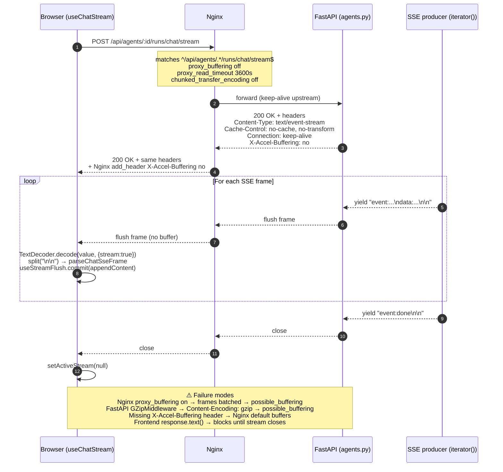
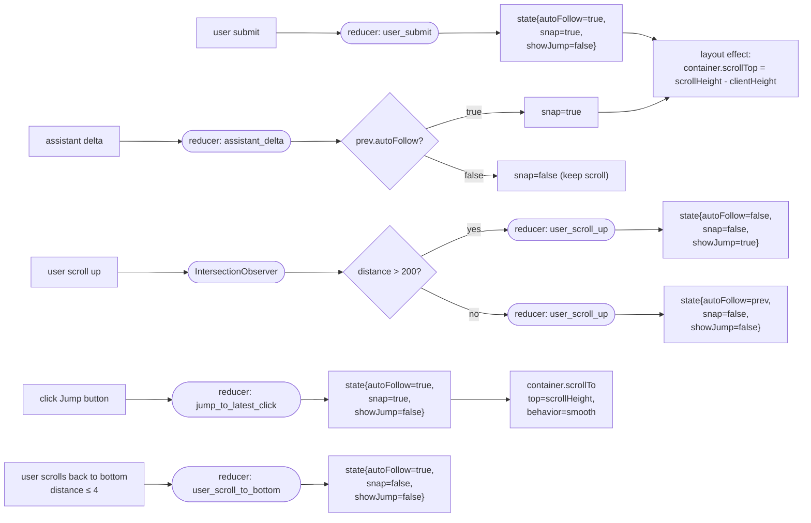

# Design Document: agent-workspace-chat-v4-refine

## Overview

v4 是 `/agents/:agentId/workspace` 聊天页的第四轮 UX 打磨，紧跟已上线的 v1 / v2 / v3。本轮聚焦 7 条用户反馈，全部在 **不改后端 SSE 事件集合、不新增前端 runtime 依赖、`useWorkspaceStore` 仅 additive 扩展、TypeScript 严格模式不倒退** 的硬约束内落地：

1. **Composer 再瘦一半** — `minHeight` 从 v3 的 40px 收到 24px；行高与 padding 同步收窄。
2. **自动跟滚重写** — 把 v3 的 "IntersectionObserver + useLayoutEffect + shouldAutoScroll 临时量" 拆成一条显式纯函数状态机 `reduceAutoFollow(state, event)`，属性测试直接覆盖三条转移。
3. **顶栏 metadata 最终删除** — 从 `Top_Meta_Bar` 去掉 model pill 与 workspace-mode badge；只留 agent name / Stop / streaming badge / Inspector / Run Detail。
4. **Composer 工具栏折叠进 Options popover** — 新增 `ComposerOptionsPopover.tsx`（`role="dialog"` + focus trap + ESC close），合并 Context / Pinned / Tools / Model 四个分区；usage meter + Export + Clear 留在主行。
5. **上下文长度可调整** — store additive 新增 `contextMaxTokens: number` 字段（默认 8192，范围 `[2000, 200000]`，步进 1000）；slider + numeric input 放在 popover 的 Context 分区；持久化到 `harness.workspace.v4.<agentId>.contextMaxTokens`；作为 `context_max_tokens` 附加到 `AgentChatStreamPayload`。
6. **流式返回修复** — 端到端 4 层诊断：FastAPI `StreamingResponse` 响应头（`Cache-Control: no-cache, no-transform`、`Connection: keep-alive`、`X-Accel-Buffering: no`）；Nginx 专用 location block 关闭 `proxy_buffering` / `proxy_cache` / `chunked_transfer_encoding`；前端 `TextDecoder({ stream: true })` 读法保持不动；禁止对 `text/event-stream` 应用 gzip/br `Content-Encoding`。
7. **Agent Workspace 微调** — 代码块 Copy 按钮、流式 caret 光标、同角色消息 group-by-role（3 条）。

v1 / v2 / v3 已交付的 P1–P19 属性测试继续全绿；v4 新增 P20–P24 共 5 条 PBT（`reduceAutoFollow` 的三条状态转移 + `clampContextMaxTokens` 幂等 + `groupByRole` 完备与保序）。

## Architecture

### High-level component tree (v4 增量)

```
<ConsoleShell>
  <div flex h-[calc(100vh-3.5rem)]>
    <ConversationHistoryPanel/>                  {/* v3 保留 */}

    <ChatSurface>
      <TopMetaBar>                               {/* v4 瘦身：agent + streaming + Stop + Inspector + Run Detail */}
      <ChatMessageList>                          {/* v4: reduceAutoFollow reducer + group-by-role 渲染 */}
        {groups.map(group => (
          <MessageGroup role={group.role}>
            {group.nodes.map(node => (
              <ChatMessageBubble>
                {renderMarkdown(...)}
                {/* v4: 每个 <pre> 右上附 <CodeBlockCopyButton/> */}
                {/* v4: assistant + streaming 时 tail 追加 <StreamingCaret/> */}
              </ChatMessageBubble>
            ))}
          </MessageGroup>
        ))}
        {!autoFollow && showJumpButton && <JumpToLatestButton/>}
      </ChatMessageList>
      <footer sticky>
        {planGate.visible && <PlanApprovalPanel/>}
        <MetadataStrip/>                         {/* v3 位置保留 */}
        <ComposerToolbar>                         {/* v4: 收紧 */}
          <ComposerOptionsPopoverTrigger/>        {/* v4 新增：单一入口 */}
          <ContextUsageBar inline/>               {/* 留在主行 */}
          <ExportMenu/> <ClearButton/>
        </ComposerToolbar>
        <ChatComposer minHeight=24/>              {/* v4 收紧 */}
      </footer>
      {/* Popover 渲染在 ChatSurface 的 footer 附近（portal 非必须，absolute 定位即可） */}
      <ComposerOptionsPopover open=... onClose=... anchorRef=...>
        <Section title="上下文 / Context">
          <ContextPopoverContent/>
          <ContextMaxTokensSlider/>               {/* v4 新增 */}
        </Section>
        <Section title="已固定 / Pinned"> <PinPopoverContent/> </Section>
        <Section title="工具 / Tools">   <ToolMentionChips/> </Section>
        <Section title="模型 / Model">   <ModelPicker/> </Section>
      </ComposerOptionsPopover>
    </ChatSurface>

    <InspectorDrawer/>
  </div>
  <SearchOverlay/> <ShortcutOverlay/>
</ConsoleShell>
```

### Auto-follow state-machine architecture (Req 2)

v3 用 `IntersectionObserver` 的 `entry.isIntersecting` 直接写 `setAutoFollow`，再在 `useLayoutEffect` 里以 `autoFollow === true` 为判据贴底。实际运行时出现"滚动容器有微小弹性、sentinel 在贴底时反复 enter/leave"导致的抖动，而且没有区分 `assistant_delta` 和手动滚动，故重写为显式事件驱动。

#### Pure reducer (`lib/autoScrollFollow.ts`)

```typescript
export const AUTO_FOLLOW_BREAK_THRESHOLD_PX = 200;
export const SNAP_TOLERANCE_PX = 4;

export type AutoFollowState = {
  autoFollow: boolean;
  showJumpButton: boolean;
};

export type AutoFollowEvent =
  | { type: "user_submit" }
  | { type: "assistant_delta" }
  | { type: "user_scroll_up"; distanceToBottomPx: number }
  | { type: "user_scroll_to_bottom"; distanceToBottomPx: number }
  | { type: "jump_to_latest_click" };

export type AutoFollowDecision = AutoFollowState & {
  shouldSnapToBottom: boolean;
};

/**
 * TOTAL pure function. Accepts any state + event combination and returns a
 * fully-specified decision. No exceptions. No DOM access.
 *
 * Transition table:
 *   user_submit               → autoFollow=true,  snap=true,  showJump=false
 *   assistant_delta (follow)  → autoFollow=true,  snap=true,  showJump=false
 *   assistant_delta (!follow) → autoFollow=false, snap=false, showJump=prev
 *   user_scroll_up > 200      → autoFollow=false, snap=false, showJump=true
 *   user_scroll_up ≤ 200      → autoFollow=prev,  snap=false, showJump=false
 *   user_scroll_to_bottom ≤ 4 → autoFollow=true,  snap=false, showJump=false
 *   jump_to_latest_click      → autoFollow=true,  snap=true,  showJump=false
 */
export function reduceAutoFollow(
  state: AutoFollowState,
  event: AutoFollowEvent,
): AutoFollowDecision;
```

#### Wiring (`components/ChatMessageList.tsx`)

```
refs:
  containerRef   HTMLDivElement       // 滚动容器
  sentinelRef    HTMLDivElement       // 零高度 tail
state:
  followState    AutoFollowState      // { autoFollow, showJumpButton }
  contentSum     number               // 仅做 layout-effect dep

useEffect(mount):
  if typeof IntersectionObserver !== "undefined":
    new IO(entries => for each:
      const distance = container.scrollHeight - container.scrollTop - container.clientHeight
      if entry.isIntersecting OR distance ≤ SNAP_TOLERANCE_PX:
        dispatch({type: "user_scroll_to_bottom", distanceToBottomPx: distance})
      else:
        dispatch({type: "user_scroll_up", distanceToBottomPx: distance})
    , {root: container, threshold: 0, rootMargin: "0px"}).observe(sentinel)
  else:
    followState = {autoFollow: true, showJumpButton: false}   // JSDOM 降级

// 外部触发：用户提交 / assistant 增量
onUserSubmit():       dispatch({type: "user_submit"})         // ChatSurface 在 handleSubmit 里调用
onAssistantDelta():   dispatch({type: "assistant_delta"})     // useLayoutEffect 探测 contentSum 增量时调用
onJumpClick():        dispatch({type: "jump_to_latest_click"})
                       container.scrollTo({top: scrollHeight, behavior: "smooth"})

useLayoutEffect([contentSum]):
  if prevSum < contentSum: onAssistantDelta()                  // tail 节点 content 增长即 delta
  if decision.shouldSnapToBottom:
    container.scrollTop = container.scrollHeight - container.clientHeight
```

关键：**`useLayoutEffect` 内不直接读 `autoFollow` 做分支；分支完全交给 reducer**。这样属性测试就能只验证 reducer 而不必模拟 DOM。

#### Sequence: user_submit → snap

```
ChatSurface.handleSubmit()
  ↓ (store.appendNode × 2, stream.start)
ChatMessageList.onUserSubmit()         ← 通过 imperative ref 或 prop callback
  ↓
dispatch({type:"user_submit"})
  ↓
reduceAutoFollow(any, user_submit) → {autoFollow:true, snap:true, showJump:false}
  ↓
useLayoutEffect 同步 scrollTop = scrollHeight - clientHeight
```

Imperative bridge：`ChatMessageList` 通过 `forwardRef` + `useImperativeHandle` 暴露 `notifyUserSubmit(): void`，`ChatSurface.handleSubmit` 在 `stream.start` 前调一次。（避免把 followState 上提到 parent。）

### Composer autogrow architecture (Req 1)

v3 常量从 `[40, 200]` 收紧到 `[COMPOSER_MIN_HEIGHT_V4, COMPOSER_MAX_HEIGHT] = [24, 200]`；`lineHeight` 从 `leading-6`（24px）降到 `leading-5`（20px）；`padding-y` 从 `py-2`（8px/8px）降到 `py-0.5`（2px/2px）。24 = 20 + 2 + 2 刚好容纳单行，与 主流对话输入 的起步视觉对齐。

```typescript
// lib/composerAutogrow.ts
export const COMPOSER_MIN_HEIGHT_V4 = 24;
export const COMPOSER_MAX_HEIGHT = 200;

// 兼容别名（让现有测试/调用点无需改）
export const MIN_COMPOSER_HEIGHT = COMPOSER_MIN_HEIGHT_V4;

export function clampAutogrowHeight(scrollHeight: number): number {
  if (typeof scrollHeight !== "number" || !Number.isFinite(scrollHeight)) {
    return COMPOSER_MIN_HEIGHT_V4;
  }
  if (scrollHeight < COMPOSER_MIN_HEIGHT_V4) return COMPOSER_MIN_HEIGHT_V4;
  if (scrollHeight > COMPOSER_MAX_HEIGHT) return COMPOSER_MAX_HEIGHT;
  return scrollHeight;
}
```

`ChatComposer.tsx` 里的 textarea 样式改为：

```tsx
<textarea
  style={{
    minHeight: `${COMPOSER_MIN_HEIGHT_V4}px`,   // 24
    maxHeight: `${COMPOSER_MAX_HEIGHT}px`,      // 200
    lineHeight: "20px",                          // 5
  }}
  className="w-full resize-none overflow-hidden border-0 bg-transparent px-2 py-0.5 text-sm text-slate-800 ..."
  rows={1}
/>
```

注意 `py-0.5` = 2px + 2px 的上下 padding；`line-height: 20px` + 2+2 = 24 精确命中 `Composer_Min_Height_V4`。

Slash menu / 双语提示 / 发送按钮行等全部保留；P12–P14 不受影响。

### Composer Options popover architecture (Req 4)

新组件 `components/ComposerOptionsPopover.tsx`：

```typescript
export type ComposerOptionsPopoverProps = {
  open: boolean;
  onClose: () => void;
  anchorRef: React.RefObject<HTMLButtonElement>;

  // 分区 props（从 ComposerToolbar 下沉）
  contextWindowTurns: number;
  onContextWindowTurnsChange: (turns: number) => void;
  contextMaxTokens: number;
  onContextMaxTokensChange: (value: number) => void;

  pinnedNodes: ConversationNode[];
  onUnpin: (nodeId: string) => void;

  tools: ToolMetadata[];
  onInsertMention: (toolName: string) => void;

  providers: ModelOption[];
  selectedProviderId: string | null;
  selectedModelId: string | null;
  onModelChange: (providerId: string, modelId: string) => void;
  modelLabelFallback: string;
};
```

行为契约：

```
render:
  if (!open) return null;
  absolute-positioned div, role="dialog", aria-modal="false",
    aria-labelledby="composer-options-title"
  children:
    <h2 id="composer-options-title"> {text("选项", "Options")} </h2>
    <Section id="section-context" title={text("上下文", "Context")}>
      <ContextPopoverContent value={contextWindowTurns} onChange={...}/>
      <ContextMaxTokensSlider value={contextMaxTokens} onChange={onContextMaxTokensChange}/>
    </Section>
    <Section id="section-pinned" title={text("已固定", "Pinned")}>
      <PinPopoverContent pinnedNodes={...} onUnpin={...}/>
    </Section>
    <Section id="section-tools" title={text("工具", "Tools")}>
      <ToolMentionChips tools={...} onInsertMention={name => {onInsertMention(name); onClose();}}/>
    </Section>
    <Section id="section-model" title={text("模型", "Model")}>
      <ModelPicker .../>
    </Section>

effect(open):
  if (open):
    previousFocus = document.activeElement
    containerRef.current?.querySelector<HTMLElement>('[data-tabbable="first"]')?.focus()
    document.addEventListener("keydown", trap)
    document.addEventListener("mousedown", outsideClick)
  else:
    cleanup + previousFocus?.focus()   // 交还触发按钮

trap(ev):
  if ev.key === "Escape": ev.preventDefault(); onClose(); return;
  if ev.key === "Tab":
    const focusables = getFocusables(containerRef.current)
    const first = focusables[0], last = focusables[focusables.length - 1]
    if ev.shiftKey && document.activeElement === first: ev.preventDefault(); last.focus()
    if !ev.shiftKey && document.activeElement === last: ev.preventDefault(); first.focus()

outsideClick(ev):
  if containerRef.current && !containerRef.current.contains(ev.target)
     && !anchorRef.current?.contains(ev.target):
    onClose()
```

Trigger 按钮位于 `ComposerToolbar` 主行：

```tsx
<button
  ref={optionsTriggerRef}
  type="button"
  onClick={() => setOptionsOpen(o => !o)}
  aria-haspopup="dialog"
  aria-expanded={optionsOpen}
  aria-label={text("选项", "Options")}
  className="inline-flex items-center gap-1 rounded-full border ... px-2.5 py-1 text-xs"
>
  <SlidersHorizontal className="h-3 w-3" />
  {text("选项", "Options")}
  <ChevronDown className="h-3 w-3" />
</button>
```

状态 `optionsOpen: boolean` 由 `ChatSurface` 的 `useState` 管理；不写进 store（符合 Req 4.12、Req 9.3 中 `optionsPopoverOpen` 为可选而非必需的约定）。

保留在主行的控件：

- `ContextUsageBar`（inline，小字）
- `ExportMenu`（导出 markdown / JSON，一次性动作）
- Trash icon（Clear conversation，破坏性动作）

### Context max tokens architecture (Req 5)

#### 纯函数 (`lib/contextTokens.ts`)

```typescript
export const CONTEXT_MAX_TOKENS_MIN = 2000;
export const CONTEXT_MAX_TOKENS_MAX = 200000;
export const CONTEXT_MAX_TOKENS_STEP = 1000;
export const CONTEXT_MAX_TOKENS_DEFAULT = 8192;

/**
 * TOTAL: any numeric input → a value r such that
 *   CONTEXT_MAX_TOKENS_MIN ≤ r ≤ CONTEXT_MAX_TOKENS_MAX
 *   r % CONTEXT_MAX_TOKENS_STEP === 0
 *   clamp(clamp(x)) === clamp(x)                         // idempotent
 *
 * NaN / ±Infinity / non-number → CONTEXT_MAX_TOKENS_DEFAULT,
 * 然后被步进取整 → 8000（because 8192 / 1000 ≈ 8.192，round → 8，×1000 → 8000）。
 * 出于易用性，默认值单独 short-circuit 返回 8192 本身（不经步进取整），
 * 只有用户主动输入的值才经过 round-to-step。
 */
export function clampContextMaxTokens(value: unknown): number;

/** Usage meter 分母：直接读 store 值。 */
export function computeUsageRatio(current: number, limit: number): number {
  if (!Number.isFinite(limit) || limit <= 0) return 0;
  return Math.max(0, Math.min(1, current / limit));
}
```

实现细节（正式版）：

```typescript
export function clampContextMaxTokens(value: unknown): number {
  if (typeof value !== "number" || !Number.isFinite(value)) {
    return CONTEXT_MAX_TOKENS_DEFAULT;
  }
  // 先 clamp 到区间，再按 step 四舍五入，最后再 clamp 回区间。
  const bounded = Math.min(
    Math.max(value, CONTEXT_MAX_TOKENS_MIN),
    CONTEXT_MAX_TOKENS_MAX,
  );
  const rounded = Math.round(bounded / CONTEXT_MAX_TOKENS_STEP) * CONTEXT_MAX_TOKENS_STEP;
  return Math.min(
    Math.max(rounded, CONTEXT_MAX_TOKENS_MIN),
    CONTEXT_MAX_TOKENS_MAX,
  );
}
```

**关于默认值 8192 的说明**：初始 `store.contextMaxTokens = 8192` 是一个"展示给用户的兼容 v3 数字"，不经 `clampContextMaxTokens` 通道。用户第一次拖动 slider 后值就会落在 1000-倍数上（8000 / 9000…）。P23 的属性仅覆盖 `clampContextMaxTokens`，不要求初始值命中 step。

#### Store 扩展 (`stores/workspaceStore.ts`)

```typescript
// additive fields —— 追加到现有 WorkspaceState 类型，v1/v2/v3 字段不动：
type WorkspaceStateV4Additions = {
  contextMaxTokens: number;                            // default 8192
  setContextMaxTokens: (value: number) => void;        // clamps + rounds + persists
  // NO optionsPopoverOpen —— React local state only.
};

// actions 实现
setContextMaxTokens: (value: number) =>
  set({ contextMaxTokens: clampContextMaxTokens(value) }),
```

初始化：`create()` 的初始对象里追加 `contextMaxTokens: CONTEXT_MAX_TOKENS_DEFAULT`。

#### Persistence (lib/contextTokens.ts 内新增)

```typescript
export const CONTEXT_MAX_TOKENS_STORAGE_VERSION = 1;

export function contextMaxTokensStorageKey(agentId: string): string {
  return `harness.workspace.v4.${agentId}.contextMaxTokens`;
}

export function readContextMaxTokens(agentId: string): number | null {
  try {
    const raw = window.localStorage.getItem(contextMaxTokensStorageKey(agentId));
    if (raw === null) return null;
    const n = Number(raw);
    return Number.isFinite(n) ? clampContextMaxTokens(n) : null;
  } catch {
    return null;
  }
}

export function saveContextMaxTokens(agentId: string, value: number): boolean {
  try {
    window.localStorage.setItem(
      contextMaxTokensStorageKey(agentId),
      String(clampContextMaxTokens(value)),
    );
    return true;
  } catch {
    return false;
  }
}
```

订阅链路：在 `useWorkspaceStore` 的既有 persistence subscribe 里**复用同一个 300ms debounce 计时器**，追加一小段写 tokens 的分支；如果 `contextMaxTokens` 相比上次写的值未变则跳过，避免无谓 IO。

读取时机：`AgentWorkspacePage` 的 agent-scope effect 里（v3 已存在的 `setAgentScope(agentId)` 效应块），**在读取 v3 `conversations` 快照之后**追加：

```typescript
const savedTokens = readContextMaxTokens(agentId);
if (savedTokens !== null) {
  useWorkspaceStore.getState().setContextMaxTokens(savedTokens);
}
```

不存在 / 无效 → 保持默认 8192。

#### Payload wiring (`hooks/useChatStream.ts`)

既有 `buildPayload` 里追加一行：

```typescript
const payload: AgentChatStreamPayload = {
  ...existingFields,
  context_max_tokens: store.contextMaxTokens,   // v4 additive
};
```

在 `features/tasks/api.ts` 的 `AgentChatStreamPayload` 类型里追加 `context_max_tokens?: number`（optional，后端忽略亦 OK）。后端 Pydantic `AgentChatStreamRequest` 设 `model_config = ConfigDict(extra="ignore")` 或（更好）additive 加一个 `context_max_tokens: int | None = None` 字段不读取即可；两种写法都不影响既有行为。

### Group-by-role architecture (Req 7.3)

纯函数 `lib/groupByRole.ts`：

```typescript
export type ConversationNodeGroup = {
  role: ConversationRole;
  nodes: ConversationNode[];
};

/**
 * TOTAL pure function:
 *   - flatMap(groups, g => g.nodes) deep-equals activePath (保序)
 *   - 同一组内所有节点 role 相同
 *   - 任一 state === "error" 节点独占一组（Req 7.3.3）
 *   - 空输入 → 空输出
 */
export function groupByRole(activePath: ConversationNode[]): ConversationNodeGroup[];
```

算法（单次线性扫描）：

```
let groups: ConversationNodeGroup[] = []
let current: ConversationNodeGroup | null = null
for node of activePath:
  isError = node.state === "error"
  canExtend =
    current !== null
    && current.nodes.length > 0
    && current.role === node.role
    && !isError
    && current.nodes[current.nodes.length - 1].state !== "error"
  if canExtend:
    current.nodes.push(node)
  else:
    current = { role: node.role, nodes: [node] }
    groups.push(current)
  if isError:
    current = null   // 下一个节点必开新组
return groups
```

渲染层：`ChatMessageList` 用 `useMemo(() => groupByRole(activePath), [activePath])` 派生 groups；每组外包一个薄 `<section>`，组内仅首条渲染头像 / 角色条，其后节点共享分隔线。**`ConversationNode` 结构不变**；tail = `activePath[activePath.length - 1]` 保持；P8 MetadataStrip 实时绑定不变；Edit / Copy / Regenerate 按钮仍挂在每条 `ChatMessageBubble` 上（Req 7.3.5）。

### Code block Copy button architecture (Req 7.1)

新组件 `components/CodeBlockCopyButton.tsx`：

```tsx
export type CodeBlockCopyButtonProps = {
  getCode: () => string;   // 惰性读取，避免在父 render 时就 stringify
};

export function CodeBlockCopyButton({ getCode }: CodeBlockCopyButtonProps) {
  const { text } = useI18n();
  const [copied, setCopied] = useState(false);

  async function handle() {
    const ok = await copyText(getCode());
    if (ok) {
      setCopied(true);
      setTimeout(() => setCopied(false), 1500);
    }
  }

  return (
    <button
      type="button"
      onClick={handle}
      aria-label={text("复制代码", "Copy code")}
      className="absolute top-2 right-2 opacity-0 group-hover:opacity-100 focus-within:opacity-100 focus-visible:opacity-100 ..."
    >
      {copied ? <Check className="h-3.5 w-3.5"/> : <Copy className="h-3.5 w-3.5"/>}
    </button>
  );
}
```

**挂载点**：`lib/markdown.ts` 的 `renderBlock` 对 `case "code_block"` 的渲染从纯 `<pre><code>` 改为包一层 `group relative`：

```typescript
case "code_block":
  return createElement(
    "pre",
    {
      key,
      className:
        "group relative mt-2 overflow-x-auto rounded-lg bg-slate-950 p-3 font-mono text-xs leading-5 text-slate-100",
    },
    createElement("code", { "data-language": token.language, className: "font-mono" }, token.body),
    createElement(CodeBlockCopyButton, { getCode: () => token.body }),
  );
```

这样每个代码块 DOM 都带一个悬浮按钮，无需遍历 DOM。新增 `lib/markdownCopy.ts` 保留为未来若切到 react-markdown AST 时的提取入口（v4 实际只需 token.body，不需要从 DOM 解析）。

### Streaming caret architecture (Req 7.2)

新组件 `components/StreamingCaret.tsx`：

```tsx
export function StreamingCaret() {
  return (
    <span
      aria-hidden="true"
      className="ml-1 inline-block h-[1em] w-[2px] bg-slate-500 align-middle motion-safe:animate-[blink_1s_steps(2,start)_infinite]"
    />
  );
}

// tailwind 配置侧不动；改用内联 keyframes 最简单：
// 在 src/styles/global.css 或 equivalent 追加：
@keyframes blink { to { visibility: hidden; } }
@media (prefers-reduced-motion: reduce) {
  .motion-safe\:animate-\[blink_1s_steps\(2\,start\)_infinite\] { animation: none !important; }
}
```

挂载点：`ChatMessageBubble.tsx`，替换既有的 `{isNodeStreaming && <span className="... animate-pulse"/>}` 为：

```tsx
{isNodeStreaming && node.role === "assistant" && <StreamingCaret />}
```

user / system / tool 角色气泡永远不渲染 caret（Req 7.2.4）。

### TopMetaBar cleanup (Req 3)

仅从现有 `TopMetaBar` 子组件里删掉这两行：

```diff
-       <span className="truncate text-xs text-slate-500">{modelLabel}</span>
-       {modelLabelIsFallback && (
-         <Badge tone="failed" className="shrink-0">{fallbackLabel}</Badge>
-       )}
-       {showModeBadge && (
-         <Badge tone={workspaceMode === "plan" ? "warning" : "info"} className="shrink-0">
-           {modeLabel}
-         </Badge>
-       )}
```

保留项目：`agentName`、streaming Badge、Stop 按钮、`InspectorMenu`、Run Detail 链接。TopMetaBar 的 `modelLabel` / `modelLabelIsFallback` / `workspaceMode` props 保留在 TypeScript 类型里以保留 v3 对调用方的兼容（向后兼容），只是不再渲染。

### SSE streaming diagnosis & fix (Req 6)

四层诊断与修复依次落地：

#### Layer 1 — FastAPI (`services/api-server/app/api/agents.py`)

```python
_SSE_HEADERS = {
    "Cache-Control": "no-cache, no-transform",
    "Connection": "keep-alive",
    "X-Accel-Buffering": "no",
}

return StreamingResponse(
    iterator(),
    media_type="text/event-stream",
    headers=_SSE_HEADERS,
)
```

对 `/{agent_id}/runs/chat/stream` 和 `/{agent_id}/runs/plan/stream` 两个 endpoint 同步追加；现有 `/api/tasks/.*/events/stream` 可选修正（与 v4 scope 无关，保持为 additive 机会）。

`iterator()` 已是 `yield sse(...)` 逐事件产出，每帧末尾 `\n\n` —— 无需改动。

**GZipMiddleware 检查**：当前 `services/api-server/app/main.py` 仅注册 `CORSMiddleware` + `OpenTelemetryTraceMiddleware`，**未启用 GZip**（已核实），因此 Req 6.3（禁止压缩 event-stream）天然满足。若未来有人添加 `app.add_middleware(GZipMiddleware, ...)`，需要：

```python
# 方案 A：allowlist minimum_size 超大阈值
app.add_middleware(GZipMiddleware, minimum_size=10 ** 9)  # 事实上关掉

# 方案 B：自定义中间件跳过 text/event-stream
class SseSafeGZip:
    def __init__(self, app):
        self._gz = GZipMiddleware(app, minimum_size=500)
        self._app = app
    async def __call__(self, scope, receive, send):
        # 如果 scope["path"] 匹配 SSE 路由，直接走 self._app
        if scope.get("type") == "http" and "/runs/chat/stream" in scope.get("path", ""):
            await self._app(scope, receive, send)
            return
        await self._gz(scope, receive, send)
```

v4 记录该决策但**不实际添加中间件**；只在 `main.py` 上加一条注释提醒未来不要对 SSE 路由启用压缩。

#### Layer 2 — Nginx (`deploy/nginx/agent-harness.conf`)

在现有 `/api/tasks/.*/events/stream` location 之后、`/api/` 通用 location 之前插入：

```nginx
location ~ ^/api/agents/.*/runs/chat/stream$ {
    proxy_pass $agent_api;
    proxy_http_version 1.1;
    proxy_set_header Connection "";
    proxy_set_header Host $http_host;
    proxy_set_header X-Real-IP $remote_addr;
    proxy_set_header X-Forwarded-For $proxy_add_x_forwarded_for;
    proxy_set_header X-Forwarded-Proto $scheme;
    proxy_buffering off;
    proxy_cache off;
    proxy_read_timeout 3600s;
    chunked_transfer_encoding off;
    add_header X-Accel-Buffering no always;
}
```

**位置排序**：Nginx `location ~ <regex>` 按出现先后匹配；把它放在 `location /api/ { ... }` 之前保证 SSE 路径命中专用 block。upstream 变量沿用文件顶部已定义的 `set $agent_api http://api-server:8000;`。

**upstream 不同名的 fallback**：如未来同文件改为 `upstream agent_api { server api-server:8000; }` 的命名 upstream 块，`proxy_pass http://agent_api;` 需要去掉 `$` 前缀；本次遵循**文件现有风格**（`$agent_api` 变量），不改全局。

#### Layer 3 — Frontend (`hooks/useChatStream.ts`)

**当前实现已合规**（`response.body.getReader()` + `TextDecoder("utf-8")` + `{ stream: true }` + `\n\n` 分帧 + 单 delta 不做 batching）。v4 不改 `runStream` 的字节读路；仅在 `buildPayload` 里 additive 附加 `context_max_tokens`。

`streaming_diagnostic: "possible_buffering"` 写入分支（检测 `content-encoding` 压缩或缺 `chunked` 的 `content-length`）也保持不动，作为"即便 Nginx / FastAPI 配置退化也能在 UI 上给出诊断"的安全网。

#### Layer 4 — Content-Encoding

禁止对 `text/event-stream` 应用任何 `Content-Encoding` 压缩 —— 由 Layer 1（FastAPI 不挂 GZip）和 Layer 2（Nginx `gzip off` 默认行为）共同保证。

#### Sequence diagram: streaming end-to-end



### Auto-follow data-flow diagram



## Components and Interfaces

### File manifest

| Path | Status | Purpose |
| ---- | ------ | ------- |
| `src/features/agents/lib/autoScrollFollow.ts` | rewrite | 导出 `reduceAutoFollow` + 常量 `AUTO_FOLLOW_BREAK_THRESHOLD_PX=200` / `SNAP_TOLERANCE_PX=4` / `contentSum`；保留 v3 `isCloseToBottom` / `JUMP_TO_LATEST_THRESHOLD_PX`（别名 = `AUTO_FOLLOW_BREAK_THRESHOLD_PX`）以向后兼容 |
| `src/features/agents/lib/composerAutogrow.ts` | tighten | 导出 `COMPOSER_MIN_HEIGHT_V4 = 24` + `COMPOSER_MAX_HEIGHT = 200`；保留别名 `MIN_COMPOSER_HEIGHT = COMPOSER_MIN_HEIGHT_V4` |
| `src/features/agents/lib/contextTokens.ts` | new | `clampContextMaxTokens` + `computeUsageRatio` + `readContextMaxTokens` / `saveContextMaxTokens` + 常量 |
| `src/features/agents/lib/groupByRole.ts` | new | 纯函数 `groupByRole(activePath)` → `ConversationNodeGroup[]` |
| `src/features/agents/lib/markdownCopy.ts` | new (thin) | `extractCodeBlockText(token)` 纯函数 wrapper（当前只代理 `token.body`；留作未来切 react-markdown AST 的插桩点） |
| `src/features/agents/components/ComposerOptionsPopover.tsx` | new | 4 分区 popover + focus trap + ESC close |
| `src/features/agents/components/CodeBlockCopyButton.tsx` | new | 悬浮按钮，挂在 `<pre>` 右上角 |
| `src/features/agents/components/StreamingCaret.tsx` | new | 2px × 1em blink caret，尊重 `prefers-reduced-motion` |
| `src/features/agents/components/ChatMessageList.tsx` | refactor | reducer 驱动 + group-by-role 渲染 + imperative `notifyUserSubmit` |
| `src/features/agents/components/ChatComposer.tsx` | tighten | min-height 24 / line-height 20 / py-0.5 |
| `src/features/agents/components/ChatMessageBubble.tsx` | modify | streaming caret + 每 `<pre>` 挂 CodeBlockCopyButton（实际 copy 按钮由 `markdown.ts` 的渲染路径插入） |
| `src/features/agents/components/ChatSurface.tsx` | modify | TopMetaBar 去 model/mode pill；Options popover 状态 + handler；`notifyUserSubmit` 触发 |
| `src/features/agents/components/ComposerToolbar.tsx` | modify | 删除 Context/Pin/Tools/Model 四 chip；加 Options trigger；保留 usage / export / clear |
| `src/features/agents/components/ContextPopover.tsx` | refactor (additive) | 抽出无 popover 壳的 `ContextPopoverContent`（保留原 `ContextPopover` 在其他位置用） |
| `src/features/agents/components/PinPopover.tsx` | refactor (additive) | 抽出 `PinPopoverContent` |
| `src/features/agents/components/ContextMaxTokensSlider.tsx` | new | `<input type="range">` + `<input type="number">` 双向绑定 |
| `src/features/agents/components/ContextUsageBar.tsx` | modify | `limit` prop 的来源由 `computeContextUsage` 的 hardcode 改为 `store.contextMaxTokens` |
| `src/features/agents/lib/contextUsage.ts` | modify (additive signature) | `computeContextUsage(activePath, turns, limitOverride?: number)`：第三参数 additive，调用方传入 `store.contextMaxTokens`；未传则继续用 `DEFAULT_CONTEXT_WINDOW = 8192` |
| `src/features/agents/lib/markdown.ts` | modify | `renderBlock` 的 `case "code_block"` 插入 `<CodeBlockCopyButton/>` |
| `src/features/agents/hooks/useChatStream.ts` | modify (additive) | payload 加 `context_max_tokens` |
| `src/stores/workspaceStore.ts` | modify (additive) | `contextMaxTokens` / `setContextMaxTokens`；persistence subscribe 里加 tokens 写出分支 |
| `src/features/agents/pages/AgentWorkspacePage.tsx` | modify (additive) | mount effect 读 `readContextMaxTokens(agentId)` |
| `src/features/tasks/api.ts` | modify (additive) | `AgentChatStreamPayload.context_max_tokens?: number` |
| `services/api-server/app/api/agents.py` | modify (additive) | `_SSE_HEADERS` 常量；两个 SSE endpoint 的 `StreamingResponse(..., headers=_SSE_HEADERS)`；Pydantic `AgentChatStreamRequest` 追加 `context_max_tokens: int \| None = None` |
| `services/api-server/app/main.py` | comment only | 加注释"do not enable GZipMiddleware on SSE routes" |
| `deploy/nginx/agent-harness.conf` | modify (additive) | `^/api/agents/.*/runs/chat/stream$` 新 location block |
| `apps/agent-console/src/features/agents/__tests__/autoScrollFollow.v4.property.test.ts` | new PBT | P20 / P21 / P22 |
| `apps/agent-console/src/features/agents/__tests__/contextTokens.property.test.ts` | new PBT | P23 |
| `apps/agent-console/src/features/agents/__tests__/groupByRole.property.test.ts` | new PBT | P24 |
| `apps/agent-console/src/features/agents/__tests__/ComposerOptionsPopover.test.tsx` | new component test (optional) | focus trap + ESC close |
| `apps/agent-console/README.md` | additive | "Streaming smoke" 小节：Chrome DevTools EventStream 验证步骤 |

### Component interface contracts

#### `reduceAutoFollow`

```typescript
export function reduceAutoFollow(
  state: AutoFollowState,
  event: AutoFollowEvent,
): AutoFollowDecision;
```

签名上 `AutoFollowState`（仅 `autoFollow` + `showJumpButton`）故意不含 `distanceToBottomPx` —— distance 是事件载荷、不是状态。这样属性测试生成器只需随机 state `{boolean, boolean}` 组合 + 事件载荷，状态空间有限。

#### `ComposerOptionsPopover`

签名见 §Composer Options popover architecture。`anchorRef` 必传（用于 outside click 排除触发按钮 + 关闭后归还焦点）。`onClose` 被 ESC、点击外部、选中 Tool 三种路径触发。

#### `CodeBlockCopyButton`

```typescript
export type CodeBlockCopyButtonProps = {
  getCode: () => string;  // 惰性 —— 防止在组件实例化阶段就拷贝一份字符串引用
};
```

#### `StreamingCaret`

无 props。由调用方判断 `isNodeStreaming && node.role === "assistant"` 后再渲染。

#### `ContextMaxTokensSlider`

```typescript
export type ContextMaxTokensSliderProps = {
  value: number;
  onChange: (next: number) => void;
};
```

内部渲染 `<input type="range">` + `<input type="number">`；`onChange` 路径统一 `onChange(clampContextMaxTokens(rawValue))` 所以外部 store 看到的永远是合法值。

#### `groupByRole`

```typescript
export type ConversationNodeGroup = {
  role: ConversationRole;
  nodes: ConversationNode[];   // 至少 1 条
};

export function groupByRole(
  activePath: ConversationNode[],
): ConversationNodeGroup[];
```

#### `useWorkspaceStore` (v4 additive)

```typescript
type WorkspaceState = {
  // ... v1 + v2 + v3 fields unchanged ...

  // v4 additive
  contextMaxTokens: number;                            // default 8192
  setContextMaxTokens: (value: number) => void;         // clamps + rounds + persists
  // NO optionsPopoverOpen — React local state only.
};
```

## Data Models

### `AutoFollowState` / `AutoFollowEvent` / `AutoFollowDecision`

见 §Auto-follow state-machine architecture。

### `ConversationNodeGroup`

```typescript
export type ConversationNodeGroup = {
  role: ConversationRole;       // "user" | "assistant" | "system" | "tool"
  nodes: ConversationNode[];    // ≥1
};
```

不扩展 `ConversationNode`；只在 render 层派生。

### Persisted fields for v4

| Storage key | Shape | Written by |
| ----------- | ----- | ---------- |
| `harness.workspace.v3.<agentId>.conversations` | (v3, 不变) | v3 subscribe |
| `harness.workspace.v3.<agentId>.historyPanelCollapsed` | (v3, 不变) | v3 subscribe |
| `harness.workspace.v4.<agentId>.contextMaxTokens` | `string`（数字的字符串化，读时 `Number()` + `clampContextMaxTokens`） | v4 subscribe（300ms debounce） |

v3 conversations 快照**完全不动**，新 tokens 键独立，Req 10.1 成立。

### `AgentChatStreamPayload` (v4 additive)

```typescript
export type AgentChatStreamPayload = {
  // ... v1–v3 fields unchanged ...
  context_max_tokens?: number;   // v4 additive; backend ignores
};
```

后端 Pydantic 侧：

```python
class AgentChatStreamRequest(BaseModel):
    # ... existing fields ...
    context_max_tokens: int | None = None  # additive, unused by backend
    model_config = ConfigDict(extra="ignore")  # defence-in-depth
```

## Correctness Properties

*A property is a characteristic or behavior that should hold true across all valid executions of a system—essentially, a formal statement about what the system should do. Properties serve as the bridge between human-readable specifications and machine-verifiable correctness guarantees.*

本 feature 适用 PBT：`reduceAutoFollow` / `clampContextMaxTokens` / `groupByRole` 均为纯函数，输入空间广且行为随输入显著变化。SSE 端到端（Req 6）不适合 PBT —— 属于 INTEGRATION；TopMetaBar / popover 的 a11y / 焦点管理属于 EXAMPLE；故共 5 条 PROPERTY，编号 P20–P24。

### Property P20: Auto-follow user_submit snap

*For any* prior `AutoFollowState`（任意 `autoFollow` / `showJumpButton` 组合），当 `Auto_Follow_Event = user_submit` 时，`reduceAutoFollow(state, { type: "user_submit" })` 应返回 `{ autoFollow: true, shouldSnapToBottom: true, showJumpButton: false }`。TOTAL：不抛异常。

**Validates: Requirements 2.2, 12.1**

### Property P21: Auto-follow assistant_delta gated

*For any* prior `AutoFollowState`，当 `Auto_Follow_Event = assistant_delta` 时：

- 若 `state.autoFollow === true`，则 `reduceAutoFollow` 返回 `{ autoFollow: true, shouldSnapToBottom: true, showJumpButton: false }`；
- 若 `state.autoFollow === false`，则 `reduceAutoFollow` 返回 `{ autoFollow: false, shouldSnapToBottom: false, showJumpButton: state.showJumpButton }`（用户已上滚的上下文不被 delta 覆盖）。

**Validates: Requirements 2.3, 2.4, 12.2**

### Property P22: Auto-follow user_scroll_up threshold

*For any* prior `AutoFollowState` 和任意 `distanceToBottomPx: number`（含 `NaN` / `±Infinity` / 负数 / 巨大正数），当 `Auto_Follow_Event = user_scroll_up` 时：

- 若 `distanceToBottomPx > AUTO_FOLLOW_BREAK_THRESHOLD_PX` (200)，则返回 `{ autoFollow: false, shouldSnapToBottom: false, showJumpButton: true }`；
- 若 `distanceToBottomPx ≤ 200`（含 `NaN` → 不大于 200 → 走此分支），则返回 `{ autoFollow: state.autoFollow, shouldSnapToBottom: false, showJumpButton: false }`。

**Validates: Requirements 2.5, 2.6, 12.3**

### Property P23: Context max tokens clamp idempotent

*For any* numeric input `x`（含 `NaN` / `±Infinity` / 负数 / 巨大正数 / 非整数），`clampContextMaxTokens(x)` 返回的 `r` 应满足：

1. `CONTEXT_MAX_TOKENS_MIN ≤ r ≤ CONTEXT_MAX_TOKENS_MAX`（即 `2000 ≤ r ≤ 200000`）；
2. `r % CONTEXT_MAX_TOKENS_STEP === 0`（即能被 1000 整除）；
3. 幂等：`clampContextMaxTokens(clampContextMaxTokens(x)) === clampContextMaxTokens(x)`；
4. TOTAL：对非数字输入（`undefined` / `null` / `"abc"` / 对象）不抛异常，安全返回一个合法值（`CONTEXT_MAX_TOKENS_DEFAULT = 8192` 经步进取整 → 8000）。

**Validates: Requirements 5.2, 12.4**

### Property P24: Group-by-role totality & equivalence

*For any* `activePath: ConversationNode[]`（含空数组），`groupByRole(activePath)` 返回的 `groups: ConversationNodeGroup[]` 应满足：

1. 保序：`groups.flatMap(g => g.nodes)` 按对象身份 / 顺序深等于 `activePath`（不丢不加不重排）；
2. 同组同角色：`∀ g ∈ groups, ∀ node ∈ g.nodes: node.role === g.role`；
3. 错误独占：`∀ node ∈ activePath, node.state === "error"` 的节点在返回的 groups 里独占一个单节点组（它的前后都是新组）；
4. 空输入：`groupByRole([]) === []`；
5. TOTAL：不抛异常；返回类型严格 `ConversationNodeGroup[]`。

**Validates: Requirements 7.3.1, 7.3.2, 7.3.3, 12.5**

## Error Handling

| Scenario | Behaviour |
| -------- | --------- |
| `reduceAutoFollow` 收到形状异常的 event（TypeScript 外部调用）| 闭 discriminated union；default 分支 return state unchanged（防御性）。 |
| `IntersectionObserver` 在 JSDOM 缺失 | `ChatMessageList` fallback 到 `{ autoFollow: true, showJumpButton: false }`；layout effect 继续贴底（Req 2.10）。 |
| `clampContextMaxTokens` 被传 `Symbol` / 非可序列化对象 | `typeof value !== "number"` 分支返回 `CONTEXT_MAX_TOKENS_DEFAULT`，不抛。 |
| localStorage 写 tokens 失败（quota / 禁用） | `saveContextMaxTokens` 返回 false；内存仍正常；与 v3 write-through 行为一致。 |
| localStorage 读 tokens 解析失败（非数字 / JSON 残渣） | `readContextMaxTokens` 返回 null；上游维持默认 8192。 |
| `context_max_tokens` 字段被后端拒绝（Pydantic `extra=forbid`） | 由后端 additive 接受（见 §Data Models）规避；若将来后端收紧，前端 UI 保留不变，仅 SSE 500。 |
| Nginx 误配置（`proxy_buffering on` 被其他 include 引入） | 前端 `streaming_diagnostic: "possible_buffering"` 分支写到 metadata，`ChatMessageBubble` 显示双语提示（v2/v3 已有，v4 保留）。 |
| FastAPI 开启 GZipMiddleware | `Content-Encoding: gzip` 触发同一诊断分支；`main.py` 注释已提醒不要对 SSE 路由压缩。 |
| Options popover 在 textarea 焦点中被 ESC 关闭 | focus 交还触发按钮 —— textarea 不被抢焦点；Req 4.11 成立。 |
| CodeBlockCopyButton 的 `navigator.clipboard` 在非安全上下文缺失 | `copyText` 已降级到 `document.execCommand("copy")`；失败时 `copied` 不翻转到 Check。 |
| Streaming caret 在 `prefers-reduced-motion: reduce` 下 | CSS media query 禁用动画，块保持静态可见。 |
| Group-by-role 对 `activePath` 包含未知 role（future-proofing） | TypeScript 层 `ConversationRole` 是闭 union；运行时未知字符串会单独成组（因前一 group.role 匹配失败），保持不变性第 1/2 条；不抛。 |

## Testing Strategy

### Layer 1 — Pure function unit tests

- `clampContextMaxTokens`：代表性点 `{0, 1999, 2000, 2001, 2500, 8192, 199999, 200000, 200001, Number.NaN, Infinity, -Infinity, -1, "abc"}`。
- `computeUsageRatio`：`limit` 为 0 / 负数 / NaN；`current > limit`；`current < 0`。
- `reduceAutoFollow`：每条转移一个正反例（property 之外的 `it` block）。
- `groupByRole`：空、单节点、全同 role、混合 role、中间 error、首尾 error 各一例。

### Layer 2 — Property-based tests (fast-check)

| Property | File | Generator sketch |
| -------- | ---- | ---------------- |
| **P20** `user_submit` snap | `apps/agent-console/src/features/agents/__tests__/autoScrollFollow.v4.property.test.ts` | `fc.record({autoFollow: fc.boolean(), showJumpButton: fc.boolean()})` → `reduceAutoFollow(state, {type:"user_submit"})` → 断言返回 `{autoFollow:true, shouldSnapToBottom:true, showJumpButton:false}` |
| **P21** `assistant_delta` gated | 同上 | 同样生成 state；event = `{type:"assistant_delta"}`；断言 `shouldSnapToBottom === state.autoFollow` 且 `autoFollow === state.autoFollow` 且 `showJumpButton === state.showJumpButton` |
| **P22** `user_scroll_up` threshold | 同上 | state 同上；distance 生成器：`fc.oneof(fc.integer(), fc.constantFrom(NaN, Infinity, -Infinity), fc.double())`；event = `{type:"user_scroll_up", distanceToBottomPx: distance}`；按 threshold 分支断言 |
| **P23** context tokens clamp idempotent | `contextTokens.property.test.ts` | `fc.oneof(fc.double(), fc.integer({min:-1_000_000_000, max:1_000_000_000}), fc.constantFrom(NaN, Infinity, -Infinity))` → 检查边界 + 步进 + `clamp(clamp(x)) === clamp(x)` |
| **P24** group-by-role totality | `groupByRole.property.test.ts` | 自定义 `conversationNodeArb`（`fc.record({id: fc.string(), parent_id: fc.constant(null), children_ids: fc.constant([]), role: fc.constantFrom("user","assistant","system","tool"), content: fc.string(), state: fc.constantFrom("draft","streaming","done","paused","error"), run_id: fc.option(fc.string()), metadata: fc.constant({}), tool_calls: fc.constant([]), artifacts: fc.constant([]), created_at: fc.constant("2026-01-01T00:00:00Z")}))` → `fc.array(nodeArb, {minLength:0, maxLength:50})` → 对每个生成路径断言 4 条不变量 |

每个 PBT 至少 `numRuns: 200`（v3 默认 500，这里减半为 200 以控制 CI 时长；v4 总共 +3 文件，影响 <1 秒）。Tag：每个 `describe` 块注释 `// Feature: agent-workspace-chat-v4-refine, Property PXX: <title>`。

### Layer 3 — Component tests (optional but recommended)

- `ComposerOptionsPopover.test.tsx`：
  - 打开 → 初始 focus 落在 Context 分区第一个 tabbable；
  - Tab 在最后一个 tabbable 上 → 循环到第一个（shift+tab 同理）；
  - ESC → onClose called + focus 回到 anchor；
  - 点击外部 → onClose called；
  - `role="dialog"` + `aria-labelledby` 可读。
- `ChatComposer.v4.test.tsx`（追加到现有）：`style.minHeight === "24px"`、`line-height: 20px`、粘贴大文本后 `overflow-y: auto`。
- `CodeBlockCopyButton.test.tsx`：点击 → `navigator.clipboard.writeText` 被调用 + icon 在 1500ms 内回切。
- `ChatMessageList.v4.test.tsx`：mock IntersectionObserver，触发 `user_scroll_up` > 200 → JumpButton 出现；点击 → `scrollTo({top:scrollHeight, behavior:"smooth"})` 被调用。

### Layer 4 — Backend integration test

`services/api-server/tests/test_agents.py` 新增一例：

```python
def test_chat_stream_headers_sse_safe(client):
    response = client.post(
        "/api/agents/default/runs/chat/stream",
        headers=AUTH_HEADERS,
        json={...minimum valid payload...},
    )
    assert response.status_code == 200
    assert response.headers["content-type"].startswith("text/event-stream")
    assert "no-cache" in response.headers["cache-control"]
    assert "no-transform" in response.headers["cache-control"]
    assert response.headers["connection"].lower() == "keep-alive"
    assert response.headers["x-accel-buffering"] == "no"
    assert response.headers.get("content-encoding") is None
```

### Layer 5 — Manual smoke (documented in `apps/agent-console/README.md`)

在 README 新增小节 "Streaming smoke"：

1. 打开 http://localhost/agents/default/workspace；
2. 发送一条消息；
3. Chrome DevTools → Network → 选中 `chat/stream` 请求 → Response Headers：
   - `content-type: text/event-stream; charset=utf-8`
   - `cache-control: no-cache, no-transform`
   - `x-accel-buffering: no`
   - 不应出现 `content-encoding: gzip|br|deflate`
   - 不应出现 `content-length`（应为 `transfer-encoding: chunked`）
4. 切到 EventStream 标签页 → 观察多条独立 `delta` 事件按时间顺序到达；
5. 故意向上滚动 ≥ 200px → JumpToLatest 按钮出现；点击 → 平滑贴底并恢复 `autoFollow`。

### Layer 6 — Regression

所有 v1 / v2 / v3 的测试文件（`activePathQueries.property.test.ts` / `applyChatEvents.property.test.ts` / `autoScrollFollow.property.test.ts`（v3 P19）/ `composerAutogrow.property.test.ts`（P18，MIN 改为 24 后继续全绿）/ `composerShouldSubmit.property.test.ts` / `conversationHistory.property.test.ts`（P15–P17）/ `markdown.property.test.ts` / `modeSwitch.property.test.ts` / `planInitialNodes.property.test.ts` / `shouldAutoScroll.property.test.ts` / `slashCommands.property.test.ts`（P12–P14）/ `sseErrors.property.test.ts`）全部保留并继续 green。P18 由于 MIN 常量变为 24，现有断言范围天然收紧（24 ≤ r ≤ 200），无需改测试代码。

### Property test tags

每个 PBT 文件头部注释格式：

```typescript
// Feature: agent-workspace-chat-v4-refine, Property P20: Auto-follow user_submit snap
// Feature: agent-workspace-chat-v4-refine, Property P21: Auto-follow assistant_delta gated
// Feature: agent-workspace-chat-v4-refine, Property P22: Auto-follow user_scroll_up threshold
// Feature: agent-workspace-chat-v4-refine, Property P23: Context max tokens clamp idempotent
// Feature: agent-workspace-chat-v4-refine, Property P24: Group-by-role totality & equivalence
```

## Migration / Rollout

- **Feature flag**：无。v4 直接替换 v3（匹配 v1 → v2 → v3 的直接发布模式）。
- **localStorage**：v3 `harness.workspace.v3.<agentId>.conversations` + `.historyPanelCollapsed` **完全不动**；v4 新增 `harness.workspace.v4.<agentId>.contextMaxTokens` 独立小键。幂等：多次挂载读同一 key，无副作用。
- **v2 → v3 legacy migration 路径保留**（v3 `AgentWorkspacePage` 已实现）。
- **后端 / Nginx** 变更为 additive，回滚只需 revert commit；即便新 nginx location 被移除，generic `/api/` location 仍能代理通（但会重新出现 buffering）。
- **回滚策略**：
  - 前端回滚 → 清除 `harness.workspace.v4.*.contextMaxTokens` 键（可选；不清也无害，v3 没人读）。
  - 后端回滚 → `context_max_tokens` 字段 Pydantic `extra="ignore"` 保留，老前端不发此字段也正常。
- **Docker compose**：`docker compose build && docker compose up`，nginx 容器 reload 时自动生效。

## Non-Goals (v4 reiterate)

与 requirements.md §Out of Scope 对齐，以下项目**不在 v4 实施**：

1. 历史对话侧栏搜索框 / 按日期分组。
2. Cmd+Enter 发送键绑定。
3. 消息级 timestamp hover tooltip。
4. 对话标题手动重命名 UI。
5. 代码块语法高亮（prismjs / highlight.js 违反 Req 9.1 runtime 依赖禁令）。
6. 图片 / 文件 / 语音输入。
7. 跨 tab 实时同步。
8. 后端真正消费 `context_max_tokens` 截断上下文。
9. Slash 命令自定义扩展点。
10. 模型级 `context_window` 元数据从 `ModelSettings` 暴露。
11. docker-compose 层面的 gzip / compression 中间件调整（FastAPI 当前未挂 GZip，天然满足 Req 6.3）。

## Appendix: Required response headers for SSE

| Header | Required value | Source |
| ------ | -------------- | ------ |
| `Content-Type` | `text/event-stream; charset=utf-8` | FastAPI `StreamingResponse(media_type=...)` |
| `Cache-Control` | `no-cache, no-transform` | FastAPI `_SSE_HEADERS` |
| `Connection` | `keep-alive` | FastAPI `_SSE_HEADERS` |
| `X-Accel-Buffering` | `no` | FastAPI `_SSE_HEADERS` + Nginx `add_header ... always` |
| `Transfer-Encoding` | `chunked` | FastAPI 默认 + Nginx `chunked_transfer_encoding off` 指令允许上游分块直通 |
| `Content-Length` | **absent** | 由 `Transfer-Encoding: chunked` 互斥保证 |
| `Content-Encoding` | **absent** / 非 gzip/br/deflate | 不挂 GZipMiddleware + Nginx 不在 SSE location 启用 gzip |

违反任何一项都会触发 `useChatStream` 的 `streaming_diagnostic: "possible_buffering"` 写入路径，给诊断留下面包屑。
