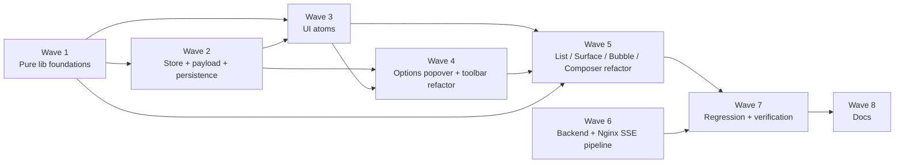

# Implementation Plan: agent-workspace-chat-v4-refine

> 基于 `design.md` 落地 v4 的 7 条反馈。语言 / 约束沿用 v3：TypeScript 严格模式、**不新增 runtime 依赖**、**不改 SSE 事件集合**、`useWorkspaceStore` 仅 additive 扩展。前端改动限定在 `apps/agent-console/`；后端改动（Req 6）限定于 `services/api-server/app/api/agents.py` + `services/api-server/app/main.py` 注释；Nginx 改动限定于 `deploy/nginx/agent-harness.conf`。v1–v3 的 P1–P19 属性测试与所有组件测试必须持续全绿；v4 新增 P20–P24 共 5 条 PBT。

## Task Dependency Graph (waves overview)



波与波之间是强依赖：下一个波启动前，前一波的**非可选**（无 `*` 后缀）leaf 任务必须完成。`*` 后缀任务是可选的（MVP 可跳过），仍然纳入 parallel scheduler 的调度图。

## Tasks

- [x] 1. Wave 1 — Pure lib foundations (parallelizable)

  - [x] 1.1 Rewrite `lib/autoScrollFollow.ts` as an event-driven pure reducer
    - **产出（重写）**: `/Users/luohao/Desktop/agent_workspace/harness/apps/agent-console/src/features/agents/lib/autoScrollFollow.ts`
    - **Requirement**: Req 2.1 / 2.2 / 2.3 / 2.4 / 2.5 / 2.6 / 2.7 / 2.8 / 2.9 / 2.10
    - **实现要点**:
      - 导出常量 `AUTO_FOLLOW_BREAK_THRESHOLD_PX = 200`、`SNAP_TOLERANCE_PX = 4`。
      - 导出类型 `AutoFollowState = { autoFollow: boolean; showJumpButton: boolean }`、`AutoFollowEvent`（discriminated union：`user_submit` / `assistant_delta` / `user_scroll_up` / `user_scroll_to_bottom` / `jump_to_latest_click`；`user_scroll_up` 与 `user_scroll_to_bottom` 携带 `distanceToBottomPx: number`）、`AutoFollowDecision = AutoFollowState & { shouldSnapToBottom: boolean }`。
      - 导出 `reduceAutoFollow(state, event): AutoFollowDecision` 严格实现 design §Auto-follow state-machine architecture 中的状态转移表（含对 `NaN` / `±Infinity` / 负数 `distanceToBottomPx` 的 TOTAL 处理：`NaN` / 非有限 → 视作 `≤ threshold`，不强制中断）。
      - **v3 向后兼容**：保留 `contentSum(activePath): number` 导出；保留 `isCloseToBottom(distance): boolean`（= `distance ≤ SNAP_TOLERANCE_PX`，语义与 v3 一致即可）；导出 `JUMP_TO_LATEST_THRESHOLD_PX = AUTO_FOLLOW_BREAK_THRESHOLD_PX`（别名，保留 v3 调用点）。v3 的 `computeFollowDecision({ autoFollow, prevContentSum, nextContentSum })` 保留（P19 继续绿）。
      - 模块不依赖 DOM；纯函数，可 tree-shake。
    - **验收**: `cd apps/agent-console && npm run lint && npm run build`（类型检查通过）。
    - _Requirements: 2.1, 2.2, 2.3, 2.4, 2.5, 2.6, 2.7, 2.8, 2.9, 2.10_

  - [x]* 1.2 Write property tests P20 / P21 / P22 for `reduceAutoFollow`
    - **产出（新增）**: `/Users/luohao/Desktop/agent_workspace/harness/apps/agent-console/src/features/agents/__tests__/autoScrollFollow.v4.property.test.ts`
    - **依赖**: 1.1
    - **Properties**:
      - **P20 Auto-follow user_submit snap** — Validates: Req 2.2, Req 12.1.
      - **P21 Auto-follow assistant_delta gated** — Validates: Req 2.3, Req 2.4, Req 12.2.
      - **P22 Auto-follow user_scroll_up threshold** — Validates: Req 2.5, Req 2.6, Req 12.3.
    - **实现要点**:
      - 用 `fc.record({ autoFollow: fc.boolean(), showJumpButton: fc.boolean() })` 生成 state。
      - P22 的 distance 生成器：`fc.oneof(fc.integer(), fc.constantFrom(NaN, Infinity, -Infinity), fc.double())`，覆盖非有限与负值。
      - 文件头注释：`// Feature: agent-workspace-chat-v4-refine, Property P20/P21/P22`。
      - `numRuns: 200`（控 CI 时长）。
    - **验收**: `cd apps/agent-console && npm run test -- --run` 该文件 3 个 `it` 全绿。
    - _Requirements: 2.2, 2.3, 2.4, 2.5, 2.6, 12.1, 12.2, 12.3_

  - [x] 1.3 Tighten `lib/composerAutogrow.ts` constants
    - **产出（修改）**: `/Users/luohao/Desktop/agent_workspace/harness/apps/agent-console/src/features/agents/lib/composerAutogrow.ts`
    - **Requirement**: Req 1.1 / 1.2 / 1.3 / 1.4 / 1.5
    - **实现要点**:
      - 导出 `COMPOSER_MIN_HEIGHT_V4 = 24`、`COMPOSER_MAX_HEIGHT = 200`。
      - 导出兼容别名 `MIN_COMPOSER_HEIGHT = COMPOSER_MIN_HEIGHT_V4`、`MAX_COMPOSER_HEIGHT = COMPOSER_MAX_HEIGHT`（v3 调用点 / P18 测试沿用）。
      - `clampAutogrowHeight(scrollHeight: number): number` 保持 v3 契约，仅 lower bound 从 40 收紧到 24。
      - 对 `NaN` / 负数 / `undefined` 仍回退 `COMPOSER_MIN_HEIGHT_V4`（P18 TOTAL 不变）。
    - **验收**: `cd apps/agent-console && npm run lint && npm run build` 通过；`npm run test -- --run composerAutogrow` P18 继续全绿（返回值自然落到 `[24, 200]`，收紧的下界对现有断言 `r ≥ MIN` 天然成立）。
    - _Requirements: 1.1, 1.2, 1.3, 1.4, 1.5_

  - [x] 1.4 Create `lib/contextTokens.ts` (clamp + usage ratio + localStorage)
    - **产出（新增）**: `/Users/luohao/Desktop/agent_workspace/harness/apps/agent-console/src/features/agents/lib/contextTokens.ts`
    - **Requirement**: Req 5.2 / 5.6 / 5.7 / 12.4
    - **实现要点**:
      - 常量：`CONTEXT_MAX_TOKENS_MIN = 2000`、`CONTEXT_MAX_TOKENS_MAX = 200000`、`CONTEXT_MAX_TOKENS_STEP = 1000`、`CONTEXT_MAX_TOKENS_DEFAULT = 8192`。
      - `clampContextMaxTokens(value: unknown): number` — 对非 number / `NaN` / 非有限值返回 `CONTEXT_MAX_TOKENS_DEFAULT` 再经步进取整；数值 → `Math.min(Math.max(x, MIN), MAX)` → `Math.round(x / STEP) * STEP` → 再 clamp 回 `[MIN, MAX]`。TOTAL 不抛。
      - `computeUsageRatio(current: number, limit: number): number` — `limit ≤ 0` 或非有限 → 0；否则 `clamp(current / limit, 0, 1)`。
      - `contextMaxTokensStorageKey(agentId: string): string` — 返回 `` `harness.workspace.v4.${agentId}.contextMaxTokens` ``。
      - `readContextMaxTokens(agentId): number | null` — `try { window.localStorage.getItem(...) }`；读不到 / 解析失败 → `null`；有效数值 → `clampContextMaxTokens(n)`。
      - `saveContextMaxTokens(agentId, value): boolean` — 写 `String(clampContextMaxTokens(value))`；异常（quota / 禁用）返回 `false`。
      - 模块级 `skipWrites` 开关（同 v3 `conversationHistory.ts` 风格）。
    - **验收**: `cd apps/agent-console && npm run lint && npm run build`。
    - _Requirements: 5.2, 5.6, 5.7, 12.4_

  - [x]* 1.5 Write property test P23 for `clampContextMaxTokens`
    - **产出（新增）**: `/Users/luohao/Desktop/agent_workspace/harness/apps/agent-console/src/features/agents/__tests__/contextTokens.property.test.ts`
    - **依赖**: 1.4
    - **Properties**:
      - **P23 Context max tokens clamp idempotent** — Validates: Req 5.2, Req 12.4.
    - **实现要点**:
      - 输入生成器：`fc.oneof(fc.double(), fc.integer({min:-1_000_000_000, max:1_000_000_000}), fc.constantFrom(NaN, Infinity, -Infinity))`，并对 TOTAL 支分 `it` 塞入 `undefined` / `null` / `"abc"` / `{}` / `Symbol()`。
      - 断言：返回值落 `[MIN, MAX]` ∩ `step` 整数倍；`clampContextMaxTokens(clampContextMaxTokens(x)) === clampContextMaxTokens(x)`；不抛异常。
      - 文件头注释：`// Feature: agent-workspace-chat-v4-refine, Property P23`。
    - **验收**: `cd apps/agent-console && npm run test -- --run contextTokens` 全绿。
    - _Requirements: 5.2, 12.4_

  - [x] 1.6 Create `lib/groupByRole.ts` (pure grouping)
    - **产出（新增）**: `/Users/luohao/Desktop/agent_workspace/harness/apps/agent-console/src/features/agents/lib/groupByRole.ts`
    - **Requirement**: Req 7.3.1 / 7.3.2 / 7.3.3 / 12.5
    - **实现要点**:
      - 导出类型 `ConversationNodeGroup = { role: ConversationRole; nodes: ConversationNode[] }`（至少 1 条）。
      - 导出 `groupByRole(activePath: ConversationNode[]): ConversationNodeGroup[]`，按 design §Group-by-role architecture 的单次线性扫描算法实现。
      - 关键不变量：`canExtend` 要求 `current.role === node.role` 且 `!isError` 且 `current.nodes[last].state !== "error"`；若 `isError`，当前节点结成一组后 `current = null` 强制下一个节点开新组。
      - 空输入 → 空输出；未知 role 字符串走默认"新开一组"路径，不抛。
      - 不修改 `ConversationNode` 结构，不从 store import（纯函数）。
    - **验收**: `cd apps/agent-console && npm run lint && npm run build`。
    - _Requirements: 7.3.1, 7.3.2, 7.3.3, 12.5_

  - [x]* 1.7 Write property test P24 for `groupByRole`
    - **产出（新增）**: `/Users/luohao/Desktop/agent_workspace/harness/apps/agent-console/src/features/agents/__tests__/groupByRole.property.test.ts`
    - **依赖**: 1.6
    - **Properties**:
      - **P24 Group-by-role totality & equivalence** — Validates: Req 7.3.1, 7.3.2, 7.3.3, 12.5.
    - **实现要点**:
      - 自定义 `conversationNodeArb`：`fc.record({ id: fc.string({minLength:1}), parent_id: fc.constant(null), children_ids: fc.constant([]), role: fc.constantFrom("user","assistant","system","tool"), content: fc.string(), state: fc.constantFrom("draft","streaming","done","paused","error"), run_id: fc.option(fc.string(), {nil: null}), metadata: fc.constant({}), tool_calls: fc.constant([]), artifacts: fc.constant([]), created_at: fc.constant("2026-01-01T00:00:00Z") })`。
      - `fc.array(nodeArb, {minLength: 0, maxLength: 50})` → 断言：
        1. `groups.flatMap(g => g.nodes)` 元素引用 deep-equals `activePath`；
        2. `∀ g, ∀ n ∈ g.nodes, n.role === g.role`；
        3. 任一 `n.state === "error"` → 所在 group `nodes.length === 1` 且该 group 前后（若存在）均为不同 group；
        4. 空输入 → 空输出。
      - `numRuns: 200`。
      - 文件头注释：`// Feature: agent-workspace-chat-v4-refine, Property P24`。
    - **验收**: `cd apps/agent-console && npm run test -- --run groupByRole` 全绿。
    - _Requirements: 7.3.1, 7.3.2, 7.3.3, 12.5_

  - [x] 1.8 Inject `CodeBlockCopyButton` in `lib/markdown.ts` `code_block` renderer
    - **产出（修改）**: `/Users/luohao/Desktop/agent_workspace/harness/apps/agent-console/src/features/agents/lib/markdown.ts`
    - **依赖**: 3.2（`CodeBlockCopyButton` 组件文件需存在才能 import；本任务可先落下 import 语句与调用位，跨波的编译失败由 Wave 7 的全量 `npm run build` 最终覆盖）
    - **Requirement**: Req 7.1.1 / 7.1.3
    - **实现要点**:
      - `case "code_block"` 从纯 `<pre><code>` 改为：
        ```ts
        return createElement(
          "pre",
          { key, className: "group relative mt-2 overflow-x-auto rounded-lg bg-slate-950 p-3 font-mono text-xs leading-5 text-slate-100" },
          createElement("code", { "data-language": token.language, className: "font-mono" }, token.body),
          createElement(CodeBlockCopyButton, { getCode: () => token.body }),
        );
        ```
      - `import { CodeBlockCopyButton } from "../components/CodeBlockCopyButton";`
      - 不改其他 token 分支；其他 renderer 保持行为。
      - `markdown.property.test.ts` 的 invariant（仅检查 block 类型与 token.body 映射）不应因这次修改断言失败；若失败则调整新增 children 的结构保持测试兼容。
    - **验收**: 与 3.2 同步后 `cd apps/agent-console && npm run lint && npm run build` 通过；`npm run test -- --run markdown` 全绿。
    - _Requirements: 7.1.1, 7.1.3_

- [x] 2. Wave 2 — Store + payload + persistence (additive)

  - [x] 2.1 Extend `stores/workspaceStore.ts` with `contextMaxTokens` + action + persistence
    - **产出（修改）**: `/Users/luohao/Desktop/agent_workspace/harness/apps/agent-console/src/stores/workspaceStore.ts`
    - **依赖**: 1.4
    - **Requirement**: Req 5.1 / 5.2 / 5.6 / 9.3
    - **实现要点**:
      - 在 `WorkspaceState` 类型 additive 增加字段 `contextMaxTokens: number` 与 action `setContextMaxTokens: (value: number) => void`。
      - `create()` 初值：`contextMaxTokens: 8192`（注意：初始默认值按 Req 5.1 为 8192，**不**经 `clampContextMaxTokens` 以免被步进取整为 8000；仅在 `setContextMaxTokens(v)` 时才 clamp + round）。
      - `setContextMaxTokens` 实现：`set({ contextMaxTokens: clampContextMaxTokens(value) })`。
      - **持久化 subscribe**：复用 v3 的 300ms debounce 计时器；新增 token 持久化分支（若上次写出的值相同则跳过），调用 `saveContextMaxTokens(agentId, state.contextMaxTokens)`。`agentId` 从现有 agent-scope snapshot 逻辑复用。
      - **不** 删除 / 重命名 / 更改 v1 / v2 / v3 任何已声明字段的语义（Req 9.3）。
      - 不添加 `optionsPopoverOpen`（Req 4.12 明确走 React local state）。
    - **验收**: `cd apps/agent-console && npm run lint && npm run build && npm run test -- --run workspaceStore`（若有对应测试）全绿；v3 persistence 测试（conversations snapshot）不倒退。
    - _Requirements: 5.1, 5.2, 5.6, 9.3_

  - [x] 2.2 Additive field `context_max_tokens?: number` in `AgentChatStreamPayload`
    - **产出（修改）**: `/Users/luohao/Desktop/agent_workspace/harness/apps/agent-console/src/features/tasks/api.ts`
    - **Requirement**: Req 5.5 / 9.2
    - **实现要点**:
      - 在 `AgentChatStreamPayload` 类型上 additive 追加可选字段 `context_max_tokens?: number`。
      - 不修改其他字段；不改 URL / method / event union。
    - **验收**: `cd apps/agent-console && npm run lint && npm run build`。
    - _Requirements: 5.5, 9.2_

  - [x] 2.3 Pass `context_max_tokens` from store in `hooks/useChatStream.ts`
    - **产出（修改）**: `/Users/luohao/Desktop/agent_workspace/harness/apps/agent-console/src/features/agents/hooks/useChatStream.ts`
    - **依赖**: 2.1, 2.2
    - **Requirement**: Req 5.5
    - **实现要点**:
      - 在 `buildPayload` 里 additive 追加一行 `context_max_tokens: store.contextMaxTokens`（从已有的 `useWorkspaceStore.getState()` 或 selector 读；不新增订阅，避免 re-render）。
      - **不** 修改字节读取路径 / `TextDecoder` / 帧分隔 / `possible_buffering` 诊断（Req 6.6 / 6.7 / 6.11）。
    - **验收**: `cd apps/agent-console && npm run lint && npm run build`。手测：打开 DevTools → Network → chat/stream → Request payload 含 `context_max_tokens`。
    - _Requirements: 5.5_

  - [x] 2.4 Load `contextMaxTokens` from localStorage on agent scope mount
    - **产出（修改）**: `/Users/luohao/Desktop/agent_workspace/harness/apps/agent-console/src/features/agents/pages/AgentWorkspacePage.tsx`
    - **依赖**: 1.4, 2.1
    - **Requirement**: Req 5.7 / 10.1
    - **实现要点**:
      - 在 v3 已存在的 agent-scope effect 内（`setAgentScope(agentId)` + conversations 加载之后），additive 追加：
        ```ts
        const savedTokens = readContextMaxTokens(agentId);
        if (savedTokens !== null) {
          useWorkspaceStore.getState().setContextMaxTokens(savedTokens);
        }
        ```
      - 不存在 / 无效 → 保持 store 默认 8192。
      - 不动 v3 conversations 快照读取路径（Req 10.1）。
    - **验收**: `cd apps/agent-console && npm run lint && npm run build`；手测：调大到 16000 → 刷新页面 → slider 仍显示 16000。
    - _Requirements: 5.7, 10.1_

- [x] 3. Wave 3 — UI atoms

  - [x] 3.1 Create `components/StreamingCaret.tsx` + CSS keyframes
    - **产出（新增）**: `/Users/luohao/Desktop/agent_workspace/harness/apps/agent-console/src/features/agents/components/StreamingCaret.tsx`
    - **产出（修改）**: `/Users/luohao/Desktop/agent_workspace/harness/apps/agent-console/src/styles/global.css`（若该路径不存在则改为 `src/index.css` 或项目已有全局 CSS 入口，由任务执行者 `grep_search "@tailwind"` 定位）
    - **Requirement**: Req 7.2.1 / 7.2.2 / 7.2.3 / 8.5
    - **实现要点**:
      - 组件：无 props，渲染 `<span aria-hidden="true" className="ml-1 inline-block h-[1em] w-[2px] bg-slate-500 align-middle motion-safe:animate-[blink_1s_steps(2,start)_infinite]" />`。
      - 全局 CSS 追加：
        ```css
        @keyframes blink { to { visibility: hidden; } }
        @media (prefers-reduced-motion: reduce) {
          .motion-safe\:animate-\[blink_1s_steps\(2\,start\)_infinite\] { animation: none !important; }
        }
        ```
      - 不引入新 runtime 依赖。
    - **验收**: `cd apps/agent-console && npm run lint && npm run build`。手测：prefer-reduced-motion 下 caret 保持静态可见。
    - _Requirements: 7.2.1, 7.2.2, 7.2.3, 8.5_

  - [x] 3.2 Create `components/CodeBlockCopyButton.tsx`
    - **产出（新增）**: `/Users/luohao/Desktop/agent_workspace/harness/apps/agent-console/src/features/agents/components/CodeBlockCopyButton.tsx`
    - **Requirement**: Req 7.1.1 / 7.1.2 / 7.1.3 / 7.1.4 / 8.4
    - **实现要点**:
      - Props `{ getCode: () => string }`（惰性读取 token.body，避免父 render 阶段就取字符串）。
      - 内部 `useState<boolean> copied`；点击 → `await copyText(getCode())`（复用现有 `apps/agent-console/src/lib/copy.ts` 的 `copyText`，`grep_search "copyText"` 定位）→ 成功 `setCopied(true)` + 1500ms `setTimeout` 翻回。
      - `aria-label={text("复制代码", "Copy code")}`（Req 8.1 / 8.4）。
      - 样式：`absolute top-2 right-2`；`opacity-0 group-hover:opacity-100 focus-within:opacity-100 focus-visible:opacity-100`；`focus-visible:ring-2 ring-slate-400 outline-none`；键盘可达。
      - 图标：`lucide-react` 的 `Copy` / `Check`（已在依赖中）。
      - 非安全上下文下 `copyText` 降级到 `document.execCommand("copy")`（若 `copyText` 已实现该降级，直接用）。
    - **验收**: `cd apps/agent-console && npm run lint && npm run build`；可选 component test：点击后 mock `clipboard.writeText` 被调用 + icon 回切。
    - _Requirements: 7.1.1, 7.1.2, 7.1.3, 7.1.4, 8.4_

  - [x] 3.3 Create `components/ContextMaxTokensSlider.tsx`
    - **产出（新增）**: `/Users/luohao/Desktop/agent_workspace/harness/apps/agent-console/src/features/agents/components/ContextMaxTokensSlider.tsx`
    - **依赖**: 1.4, 2.1
    - **Requirement**: Req 5.3 / 8.3
    - **实现要点**:
      - Props `{ value: number; onChange: (next: number) => void }`。
      - 渲染 `<input type="range" min={CONTEXT_MAX_TOKENS_MIN} max={CONTEXT_MAX_TOKENS_MAX} step={CONTEXT_MAX_TOKENS_STEP} value={value} onChange={e => onChange(clampContextMaxTokens(Number(e.target.value)))} aria-label={text("上下文最大 tokens", "Context max tokens")} />` 与相邻 `<input type="number" min={MIN} max={MAX} step={STEP} value={value} onChange={...} className="w-[96px]" />` + `<span>tokens</span>`。
      - 双语说明行：`<p className="text-[11px] text-slate-500">{text("模型上下文最大长度，越大越耗 token", "Model context window; larger values consume more tokens per request")}</p>`。
      - `aria-valuemin` / `aria-valuemax` / `aria-valuenow` 由 `<input type="range">` 原生提供，无需手写（Req 8.3）。
      - 所有 `onChange` 路径统一走 `clampContextMaxTokens`，外部 store 永远看到合法值。
    - **验收**: `cd apps/agent-console && npm run lint && npm run build`。手测：左右箭头键可调，数字输入非法值（如 `123`）会被 clamp 到最近 1000 倍数。
    - _Requirements: 5.3, 8.3_

  - [x] 3.4 Extract `ContextPopoverContent` / `PinPopoverContent` (headless)
    - **产出（修改）**:
      - `/Users/luohao/Desktop/agent_workspace/harness/apps/agent-console/src/features/agents/components/ContextPopover.tsx`
      - `/Users/luohao/Desktop/agent_workspace/harness/apps/agent-console/src/features/agents/components/PinPopover.tsx`
    - **Requirement**: Req 4.6（infrastructure for embedding inside `ComposerOptionsPopover`）
    - **实现要点**:
      - 在原 `ContextPopover.tsx` 内 additive export 一个 `ContextPopoverContent` 组件：仅包含 `contextWindowTurns` slider + current turns readout，不含 popover 壳（button / positioning / outside click）。保留现有 `ContextPopover` 默认导出不动。
      - 同理对 `PinPopover.tsx` 抽出 `PinPopoverContent`：pinned 节点列表 + 逐条 unpin 按钮，不含 popover 壳。
      - 两个内容组件的 props 明确接收 state 与 callback（不从 store 读取），便于在任意容器中内嵌。
      - 不删除 v3 既有 API，Req 10.* 回归全绿。
    - **验收**: `cd apps/agent-console && npm run lint && npm run build`；v3 组件在老调用点仍工作（若存在 Storybook / snapshot，同步过）。
    - _Requirements: 4.6_

- [x] 4. Wave 4 — Options popover + ComposerToolbar refactor

  - [x] 4.1 Create `components/ComposerOptionsPopover.tsx` (dialog + focus trap + ESC close)
    - **产出（新增）**: `/Users/luohao/Desktop/agent_workspace/harness/apps/agent-console/src/features/agents/components/ComposerOptionsPopover.tsx`
    - **依赖**: 3.3, 3.4
    - **Requirement**: Req 4.1 / 4.2 / 4.3 / 4.4 / 4.5 / 4.6 / 4.9 / 4.10 / 4.11 / 8.2
    - **实现要点**:
      - Props 按 design §Composer Options popover architecture 实现（`open / onClose / anchorRef / contextWindowTurns / onContextWindowTurnsChange / contextMaxTokens / onContextMaxTokensChange / pinnedNodes / onUnpin / tools / onInsertMention / providers / selectedProviderId / selectedModelId / onModelChange / modelLabelFallback`）。
      - `role="dialog"` + `aria-modal="false"` + `aria-labelledby="composer-options-title"`；内部 `<h2 id="composer-options-title">{text("选项", "Options")}</h2>`。
      - 4 分区（按顺序）Context / Pinned / Tools / Model：
        - Context 分区：`<ContextPopoverContent/>` + `<ContextMaxTokensSlider/>`。
        - Pinned：`<PinPopoverContent/>`。
        - Tools：`<ToolMentionChips/>`（选中 tool → `onInsertMention(name)` + `onClose()`）。
        - Model：`<ModelPicker/>`（现有组件）。
      - 分区标题双语：「上下文 / Context」「已固定 / Pinned」「工具 / Tools」「模型 / Model」。
      - `useEffect(open)` 打开时：
        - `previousFocus = document.activeElement`；
        - `containerRef.current?.querySelector<HTMLElement>('[data-tabbable="first"]')?.focus()`（Context 分区第一个控件添加 `data-tabbable="first"` 属性）；
        - 注册 `keydown`（ESC + Tab trap）+ `mousedown`（outside click）监听。
      - 关闭：清监听 + `previousFocus?.focus()`（归还焦点到触发按钮）。
      - `Tab` trap：通过 `querySelectorAll('a[href], button:not([disabled]), textarea, input, select, [tabindex]:not([tabindex="-1"])')` 得到 focusables，首尾循环。
      - `Escape`：`ev.preventDefault(); onClose()`。
      - 容器样式：`absolute ... rounded-2xl bg-white shadow-xl p-4 max-h-[70vh] overflow-y-auto`（Req 4.10 移动端）。
      - textarea 的 Enter 发送不因 popover 打开而被拦截（Req 4.11）—— popover 打开期间不抢 textarea 焦点，trap 只作用于 popover 自身 focusables。
    - **验收**: `cd apps/agent-console && npm run lint && npm run build`；可选 `ComposerOptionsPopover.test.tsx`：打开 → 首焦点在 Context 第一个 tabbable；Tab 循环；ESC 关闭 + 焦点回 anchor；outside click 关闭。
    - _Requirements: 4.1, 4.2, 4.3, 4.4, 4.5, 4.6, 4.9, 4.10, 4.11, 8.2_

  - [x] 4.2 Refactor `components/ComposerToolbar.tsx` (remove chips, add Options trigger)
    - **产出（修改）**: `/Users/luohao/Desktop/agent_workspace/harness/apps/agent-console/src/features/agents/components/ComposerToolbar.tsx`
    - **依赖**: 4.1
    - **Requirement**: Req 4.1 / 4.7 / 4.8
    - **实现要点**:
      - **删除**主行渲染的 `<ContextPopover/>` / `<PinPopover/>` / `<ToolMentionChips/>` / `<ModelPicker/>` 四个 chip（保留其 props 透传给 `ComposerOptionsPopover` 的父级 `ChatSurface`，不在 toolbar 内渲染壳）。
      - **新增** `Composer_Options_Popover_Trigger`：
        ```tsx
        <button
          ref={optionsTriggerRef}
          type="button"
          onClick={() => setOptionsOpen(o => !o)}
          aria-haspopup="dialog"
          aria-expanded={optionsOpen}
          aria-label={text("选项", "Options")}
          className="inline-flex items-center gap-1 rounded-full border border-slate-200 bg-white px-2.5 py-1 text-xs text-slate-600 hover:bg-slate-50"
        >
          <SlidersHorizontal className="h-3 w-3" />
          {text("选项", "Options")}
          <ChevronDown className="h-3 w-3" />
        </button>
        ```
      - optionsOpen 状态与 `optionsTriggerRef` 由父 `ChatSurface` 注入（见 5.4）。
      - **保留**主行右侧：`<ContextUsageBar inline />`（Req 4.7）、`<ExportMenu/>`、Clear Conversation 垃圾桶按钮（Req 4.8）。
      - 移除 v3 的 `modelPickerOpenSeq` 在 toolbar 内的透传（由 Options popover 内的 ModelPicker 直接消费；`ChatSurface` 继续维护 seq，但传入 popover，不再传入 toolbar；保留 seq 数字语义向后兼容）。
    - **验收**: `cd apps/agent-console && npm run lint && npm run build`；视觉：toolbar 主行只剩 Options + UsageBar + Export + Clear。
    - _Requirements: 4.1, 4.7, 4.8_

  - [x] 4.3 Modify `components/ContextUsageBar.tsx` limit source
    - **产出（修改）**: `/Users/luohao/Desktop/agent_workspace/harness/apps/agent-console/src/features/agents/components/ContextUsageBar.tsx`
    - **产出（修改）**: `/Users/luohao/Desktop/agent_workspace/harness/apps/agent-console/src/features/agents/lib/contextUsage.ts`
    - **依赖**: 2.1
    - **Requirement**: Req 5.4
    - **实现要点**:
      - `contextUsage.ts`：`computeContextUsage(activePath, turns, limitOverride?: number)` — 第三参数 additive 可选，未传时沿用硬编码 `DEFAULT_CONTEXT_WINDOW = 8192`（保持 v3 调用点兼容）；传入时 `limit = limitOverride`。
      - `ContextUsageBar.tsx`：通过 store selector 读 `contextMaxTokens`，调用 `computeContextUsage(activePath, turns, contextMaxTokens)` 得到 `ratio` 与文案；显示「{current} / {limit} · NN%」。
      - **不** 修改 `DEFAULT_CONTEXT_WINDOW` 常量值（保持 8192，以免其他调用点行为漂移）。
    - **验收**: `cd apps/agent-console && npm run lint && npm run build`；手测：拖 slider 到 16000 → usage bar 分母变为 16000，百分比实时更新。
    - _Requirements: 5.4_

- [x] 5. Wave 5 — ChatMessageList + ChatSurface + ChatMessageBubble + ChatComposer refactors

  - [x] 5.1 Refactor `components/ChatMessageList.tsx` (reducer + group-by-role + imperative notifyUserSubmit)
    - **产出（修改）**: `/Users/luohao/Desktop/agent_workspace/harness/apps/agent-console/src/features/agents/components/ChatMessageList.tsx`
    - **依赖**: 1.1, 1.6
    - **Requirement**: Req 2.1 / 2.2 / 2.3 / 2.4 / 2.5 / 2.6 / 2.7 / 2.8 / 2.9 / 2.10, Req 7.3.1 / 7.3.2 / 7.3.4 / 7.3.5
    - **实现要点**:
      - 用 `useReducer(reduceAutoFollow, {autoFollow: true, showJumpButton: false})` 取代 v3 的 `shouldAutoScroll` 临时量（v3 的 `shouldAutoScroll` 模块与 P11 相关测试继续保留，不动其文件）。
      - `forwardRef` + `useImperativeHandle` 暴露 `notifyUserSubmit(): void`，内部 `dispatch({type:"user_submit"})`。
      - `useEffect(mount)`：若 `typeof IntersectionObserver !== "undefined"` → 新建 observer 观察 `sentinelRef`，回调 translate entry 到事件：
        ```
        const distance = container.scrollHeight - container.scrollTop - container.clientHeight
        if (entry.isIntersecting || distance <= SNAP_TOLERANCE_PX) dispatch({type:"user_scroll_to_bottom", distanceToBottomPx: distance})
        else dispatch({type:"user_scroll_up", distanceToBottomPx: distance})
        ```
      - 否则（JSDOM 降级，Req 2.10）：state 保持 `{autoFollow: true, showJumpButton: false}`，`useLayoutEffect` 继续贴底（无 observer）。
      - `useLayoutEffect([contentSum(activePath)])`：当 `contentSum` 增长（新 delta）→ `dispatch({type:"assistant_delta"})`，再读取返回的 decision 执行 `if (decision.shouldSnapToBottom) container.scrollTop = container.scrollHeight - container.clientHeight`。**注意**：`useReducer` 的 dispatch 不会立刻返回结果，需要用"读当前 state 再在下一次 effect 中比较"或者重构为 `useState + 手动调用 reduceAutoFollow` 模式；推荐后者（直接调用 reducer，同步拿到 decision 后 setState + 贴底），以便 layout 同帧完成。
      - **渲染**：`const groups = useMemo(() => groupByRole(activePath), [activePath])`；每组外包 `<section role="group">`；组内首条渲染角色头像 / 名称条，其后共享更薄分隔线（`border-t border-slate-100`）。不改 `ConversationNode` 结构。
      - **JumpToLatest**：`if (!state.autoFollow && state.showJumpButton) <JumpToLatestButton onClick={handleJumpClick}/>`；`handleJumpClick` → `dispatch({type:"jump_to_latest_click"})` + `container.scrollTo({top: scrollHeight, behavior: "smooth"})`。
      - tail = `activePath[activePath.length - 1]` 未改；P8 MetadataStrip 绑定不变（Req 7.3.4）。
      - Edit / Copy / Regenerate 按钮仍挂在每条 `ChatMessageBubble` 上（Req 7.3.5）。
    - **验收**: `cd apps/agent-console && npm run lint && npm run build`；P19 继续全绿；v3 `shouldAutoScroll.property.test.ts` 不受影响；新增 P20–P22 在 1.2 绿。
    - _Requirements: 2.1, 2.2, 2.3, 2.4, 2.5, 2.6, 2.7, 2.8, 2.9, 2.10, 7.3.1, 7.3.2, 7.3.4, 7.3.5_

  - [x] 5.2 Tighten `components/ChatComposer.tsx` (min 24 / line-height 20 / py-0.5 / hint font size)
    - **产出（修改）**: `/Users/luohao/Desktop/agent_workspace/harness/apps/agent-console/src/features/agents/components/ChatComposer.tsx`
    - **依赖**: 1.3
    - **Requirement**: Req 1.1 / 1.2 / 1.6 / 1.7 / 1.8
    - **实现要点**:
      - textarea 样式：
        ```tsx
        <textarea
          style={{
            minHeight: `${COMPOSER_MIN_HEIGHT_V4}px`,
            maxHeight: `${COMPOSER_MAX_HEIGHT}px`,
            lineHeight: "20px",
          }}
          className="w-full resize-none overflow-hidden border-0 bg-transparent px-2 py-0.5 text-sm text-slate-800 ..."
          rows={1}
        />
        ```
        `py-0.5` = 2px 上下 + 20px 行高 = 24px 精确命中 MIN。
      - 保留 `useLayoutEffect([draft])` 的 autogrow 逻辑（v3）：`el.style.height = 'auto'; next = clampAutogrowHeight(el.scrollHeight); el.style.height = next + 'px'; el.style.overflowY = el.scrollHeight > MAX ? 'auto' : 'hidden'`。
      - 双语提示文案「Enter 发送 · Shift+Enter 换行 · 输入 / 查看命令」字号改 `text-[10px]`（从 `text-[11px]`），颜色 `text-slate-400`（轻微缩小，符合 Req 1.8）。
      - **保留** v3 Slash_Menu 开合契约（P12–P14 继续全绿，Req 1.9）。
      - **保留** `onSlashDispatch` / `onSubmit` / `mode` props 签名向后兼容。
    - **验收**: `cd apps/agent-console && npm run lint && npm run build`；P18 继续全绿（MIN = 24 收紧）；手测：单行起步高 24px。
    - _Requirements: 1.1, 1.2, 1.6, 1.7, 1.8_

  - [x] 5.3 Modify `components/ChatMessageBubble.tsx` to render `StreamingCaret` (assistant + streaming only)
    - **产出（修改）**: `/Users/luohao/Desktop/agent_workspace/harness/apps/agent-console/src/features/agents/components/ChatMessageBubble.tsx`
    - **依赖**: 3.1
    - **Requirement**: Req 7.2.1 / 7.2.2 / 7.2.4
    - **实现要点**:
      - 替换既有 `{isNodeStreaming && <span className="... animate-pulse"/>}`（或等价的 pulse 占位）为：
        ```tsx
        {isNodeStreaming && node.role === "assistant" && <StreamingCaret />}
        ```
      - user / system / tool 角色气泡永远不渲染 caret（Req 7.2.4）。
      - 节点 `state` 变更为 `"done" / "paused" / "error"` 时，由于 `isNodeStreaming` 变 false，caret 自然移除（Req 7.2.2）。
      - 气泡结构本体不变（Edit / Copy / Regenerate 按钮保留）；group-by-role 由 `ChatMessageList` 在外层派生，bubble 无感。
    - **验收**: `cd apps/agent-console && npm run lint && npm run build`；手测：流式 assistant 回复时尾部有 blinking caret；user 发送中无 caret。
    - _Requirements: 7.2.1, 7.2.2, 7.2.4_

  - [x] 5.4 Modify `components/ChatSurface.tsx` (TopMetaBar cleanup + optionsOpen + notifyUserSubmit + popover mount)
    - **产出（修改）**: `/Users/luohao/Desktop/agent_workspace/harness/apps/agent-console/src/features/agents/components/ChatSurface.tsx`
    - **依赖**: 4.1, 4.2, 5.1
    - **Requirement**: Req 3.1 / 3.2 / 3.3 / 3.4 / 3.5 / 3.6 / 3.7 / 3.8 / 3.9, Req 4.2 / 4.12, Req 2.2 (imperative notifyUserSubmit)
    - **实现要点**:
      - **TopMetaBar 清理**：在 `TopMetaBar` 渲染路径内删除 `modelLabel` 文本 pill、`modelLabelIsFallback` Badge、`Workspace_Mode` Badge 三个 JSX 块。保留 `agentName`、streaming Badge、Stop 按钮、`InspectorMenu`、Run Detail 入口（Req 3.3 / 3.4 / 3.5 / 3.6）。`modelLabel` / `modelLabelIsFallback` / `workspaceMode` props 保留在 TypeScript 类型（不 break 调用方，Req 9.3），不再渲染。
      - **Options popover 状态**：`const [optionsOpen, setOptionsOpen] = useState(false)`；`const optionsTriggerRef = useRef<HTMLButtonElement>(null)`；传递 `optionsOpen` / `setOptionsOpen` / `optionsTriggerRef` 到 `<ComposerToolbar/>`（其中 trigger 按钮挂 ref、设置 `aria-expanded`）。
      - **渲染 popover**：在 footer 靠近 ComposerToolbar 的位置挂 `<ComposerOptionsPopover open={optionsOpen} onClose={() => setOptionsOpen(false)} anchorRef={optionsTriggerRef} {...allSectionProps} />`。
      - **chatMessageListRef**：`const chatListRef = useRef<{notifyUserSubmit: () => void}>(null)`；传给 `<ChatMessageList ref={chatListRef} ... />`；在 `handleSubmit` 内（即 `store.appendNode × 2 / stream.start` 之前）调用 `chatListRef.current?.notifyUserSubmit()`。
      - **MetadataStrip** 保留 v3 位置（footer 次要行）不动（Req 3.8）。
      - **Slash dispatcher** / search / shortcut / model picker open seq 透传全部保留（v3 行为）。
      - `optionsPopoverOpen` 不写入 store（Req 4.12 确认：React local state only）。
    - **验收**: `cd apps/agent-console && npm run lint && npm run build`；手测：顶栏只剩 `agentName / streaming / Stop / Inspector / Run Detail`；点 Options 打开 popover，4 分区可用；发送消息时列表瞬间贴底。
    - _Requirements: 2.2, 3.1, 3.2, 3.3, 3.4, 3.5, 3.6, 3.7, 3.8, 3.9, 4.2, 4.12_

- [x] 6. Wave 6 — Backend + Nginx SSE pipeline

  - [x] 6.1 Add `_SSE_HEADERS` + `context_max_tokens` to `services/api-server/app/api/agents.py`
    - **产出（修改）**: `/Users/luohao/Desktop/agent_workspace/harness/services/api-server/app/api/agents.py`
    - **产出（新增 test）**: `/Users/luohao/Desktop/agent_workspace/harness/services/api-server/tests/test_agents.py`（如已存在则 additive append 新的 `test_chat_stream_headers_sse_safe`）
    - **Requirement**: Req 6.1 / 6.2 / 6.12, Req 9.2
    - **实现要点**:
      - 模块级常量：
        ```python
        _SSE_HEADERS = {
            "Cache-Control": "no-cache, no-transform",
            "Connection": "keep-alive",
            "X-Accel-Buffering": "no",
        }
        ```
      - `/agents/{agent_id}/runs/chat/stream` 与 `/agents/{agent_id}/runs/plan/stream` 两个 endpoint 的 `StreamingResponse(...)` 调用 additive 增加 `headers=_SSE_HEADERS`（`media_type="text/event-stream"` 保持不变）。
      - Pydantic `AgentChatStreamRequest` additive 增加字段 `context_max_tokens: int | None = None` + `model_config = ConfigDict(extra="ignore")`（defence-in-depth）。字段不被业务代码读取，纯 additive。
      - `iterator()` 事件生成器 `yield sse(...)` 逐事件产出 / 每帧 `\n\n` 结尾保持不变（Req 6.2 已满足）。
      - 新增 pytest：
        ```python
        def test_chat_stream_headers_sse_safe(client):
            response = client.post(
                "/api/agents/default/runs/chat/stream",
                headers=AUTH_HEADERS,
                json={...minimum valid payload...},
            )
            assert response.status_code == 200
            assert response.headers["content-type"].startswith("text/event-stream")
            assert "no-cache" in response.headers["cache-control"]
            assert "no-transform" in response.headers["cache-control"]
            assert response.headers["connection"].lower() == "keep-alive"
            assert response.headers["x-accel-buffering"] == "no"
            assert response.headers.get("content-encoding") is None
        ```
        `AUTH_HEADERS` / `client` 从 `services/api-server/tests/conftest.py` 或兄弟测试文件复用。最小 payload 以现有 endpoint 的 existing tests 为准（`grep_search "chat/stream" services/api-server/tests`）。
    - **验收**: `cd services/api-server && python -m pytest tests/test_agents.py::test_chat_stream_headers_sse_safe -q` 绿（若环境可用）；否则在 Wave 7 用 docker 启动后 curl 验证。
    - _Requirements: 6.1, 6.2, 6.12, 9.2_

  - [x] 6.2 Comment `services/api-server/app/main.py` with GZip + SSE guidance
    - **产出（修改）**: `/Users/luohao/Desktop/agent_workspace/harness/services/api-server/app/main.py`
    - **Requirement**: Req 6.3
    - **实现要点**:
      - 在 `add_middleware` 调用块顶 additive 添加一条注释（代码不变）：
        ```python
        # NOTE (v4 agent-workspace-chat-v4-refine, Req 6.3):
        # Do NOT enable GZipMiddleware (or any Content-Encoding middleware) on routes
        # matching "*/runs/chat/stream" or "*/runs/plan/stream". Compressing SSE
        # bodies breaks incremental delivery and will trigger the frontend's
        # "streaming_diagnostic: possible_buffering" fallback. If GZip is ever
        # required, skip SSE routes via a scope["path"] check (see design doc).
        ```
      - 不实际添加 / 删除中间件（当前未挂 GZip，Req 6.3 天然满足）。
    - **验收**: `cd services/api-server && python -c "import app.main"` 无语法错误；`python -m pytest` 既有测试绿。
    - _Requirements: 6.3_

  - [x] 6.3 Add dedicated SSE location block in `deploy/nginx/agent-harness.conf`
    - **产出（修改）**: `/Users/luohao/Desktop/agent_workspace/harness/deploy/nginx/agent-harness.conf`
    - **Requirement**: Req 6.4 / 6.5
    - **实现要点**:
      - 在现有 `location ~ ^/api/tasks/.*/events/stream$ { ... }` 块之后、通用 `location /api/ { ... }` 块之前 additive 插入：
        ```nginx
        location ~ ^/api/agents/.*/runs/chat/stream$ {
            proxy_pass $agent_api;
            proxy_http_version 1.1;
            proxy_set_header Connection "";
            proxy_set_header Host $http_host;
            proxy_set_header X-Real-IP $remote_addr;
            proxy_set_header X-Forwarded-For $proxy_add_x_forwarded_for;
            proxy_set_header X-Forwarded-Proto $scheme;
            proxy_buffering off;
            proxy_cache off;
            proxy_read_timeout 3600s;
            chunked_transfer_encoding off;
            add_header X-Accel-Buffering no always;
        }
        ```
      - `$agent_api` 变量沿用文件顶部 `set $agent_api http://api-server:8000;`（保持现有风格，不改全局）。
      - `location ~` 按出现先后匹配；确保放在通用 `/api/` 之前。
      - 不改 upstream / gzip 全局指令（默认 `gzip off` 不压缩 SSE，Req 6.3 天然成立）。
    - **验收**: `nginx -t -c deploy/nginx/agent-harness.conf`（或在容器中 `docker compose exec nginx nginx -t`）语法绿；Wave 7 的 docker rebuild 后 `curl -N -X POST http://localhost/api/agents/default/runs/chat/stream ...` 观察到逐事件到达，响应头含 `x-accel-buffering: no`。
    - _Requirements: 6.4, 6.5_

- [x] 7. Wave 7 — Regression + verification

  - [x] 7.1 Frontend gate — lint + build + test
    - **产出**: 无代码变更（只跑命令）
    - **依赖**: 1.1–1.8, 2.1–2.4, 3.1–3.4, 4.1–4.3, 5.1–5.4
    - **Requirement**: Req 9.4 / 9.5 / 9.6
    - **命令**:
      - `cd /Users/luohao/Desktop/agent_workspace/harness/apps/agent-console && npm run lint`
      - `cd /Users/luohao/Desktop/agent_workspace/harness/apps/agent-console && npm run build`
      - `cd /Users/luohao/Desktop/agent_workspace/harness/apps/agent-console && npm run test -- --run`
    - **修复准则**: 若 `build` 报类型错误（例如 1.8 的 markdown.ts 引用 CodeBlockCopyButton 在 3.2 落地前会临时失败），先确认 Wave 3 全部 merge；若仍有错则在对应文件补签名。不允许添加 `any` / `as any` / `@ts-ignore`（Req 9.4）。
    - **验收**: 三条命令退出码均为 0；v1–v3 的 P1–P19 + v4 新增 P20–P24 合计 ≥ 24 条属性测试全绿（Req 9.5）。
    - _Requirements: 9.4, 9.5, 9.6_

  - [x]* 7.2 Backend gate — pytest SSE headers test
    - **产出**: 无代码变更
    - **依赖**: 6.1
    - **Requirement**: Req 6.1 / 6.12
    - **命令**:
      - `cd /Users/luohao/Desktop/agent_workspace/harness/services/api-server && python -m pytest tests/test_agents.py::test_chat_stream_headers_sse_safe -q`
      - 若还需跑全量：`python -m pytest -q`
    - **降级**: 若本地 Python 环境 / 依赖不可用 → 跳过并在 PR 描述中登记为"手动 curl 验证"（见 7.3 docker 后），不算阻塞（`*` 标记）。
    - **验收**: test 绿；或 docker 启动后 `curl -i -N -X POST http://localhost/api/agents/default/runs/chat/stream -H "Content-Type: application/json" -d '<minimal>'` 响应头符合 Req 6.8 清单。
    - _Requirements: 6.1, 6.12_

  - [x] 7.3 Docker rebuild + smoke verification
    - **产出**: 无代码变更（运行部署命令）
    - **依赖**: 6.1, 6.2, 6.3, 7.1
    - **Requirement**: Req 9.7
    - **命令**:
      - `cd /Users/luohao/Desktop/agent_workspace/harness && docker compose -f deploy/docker-compose/docker-compose.yml build agent-console api-server nginx`
      - `cd /Users/luohao/Desktop/agent_workspace/harness && docker compose -f deploy/docker-compose/docker-compose.yml up -d --no-deps agent-console api-server nginx`
      - `curl -fsS -o /dev/null -w "%{http_code}\n" http://localhost/agents/default/workspace`（期望 `200`）。
      - 可选：`curl -i -N -X POST http://localhost/api/agents/default/runs/chat/stream ...` 观察响应头含 `x-accel-buffering: no` / `cache-control: no-cache, no-transform` / 无 `content-encoding` / 无 `content-length`。
    - **验收**: 所有 curl 退出码为 0；页面可访问；Chrome DevTools → Network → EventStream 能看到 delta 事件逐条到达（Req 6.9，手测项）。
    - _Requirements: 9.7_

- [x] 8. Wave 8 — Docs

  - [x] 8.1 Append "Streaming smoke" section to `apps/agent-console/README.md`
    - **产出（修改）**: `/Users/luohao/Desktop/agent_workspace/harness/apps/agent-console/README.md`
    - **依赖**: 6.3, 7.3
    - **Requirement**: Req 6.9
    - **实现要点**:
      - 在 README 末尾 additive 追加一个小节 `## Streaming smoke`：
        - 步骤 1：本地 / 预发启动 Workspace（给出 docker compose 命令参考）；
        - 步骤 2：打开 `http://localhost/agents/default/workspace`；
        - 步骤 3：发送一条消息；
        - 步骤 4：Chrome DevTools → Network → 选中 `chat/stream` 请求 → Response Headers 校验清单：
          - `content-type: text/event-stream; charset=utf-8`
          - `cache-control: no-cache, no-transform`
          - `x-accel-buffering: no`
          - **不** 出现 `content-encoding: gzip|br|deflate`
          - **不** 出现 `content-length`（应为 `transfer-encoding: chunked`）
        - 步骤 5：切 EventStream 标签 → 观察 N 条独立 delta 逐条到达；
        - 步骤 6：向上滚动 ≥ 200px → JumpToLatest 按钮出现；点击 → 平滑贴底并恢复 autoFollow。
      - 文案双语（README 已有双语风格）。
    - **验收**: `cd apps/agent-console && npm run lint` 不报 markdown 错（若项目配置 markdownlint）；视觉 review README 新增小节可读。
    - _Requirements: 6.9_

## Notes

- 带 `*` 的子任务（1.2 / 1.5 / 1.7 / 7.2）为可选（MVP 可跳过），但强烈建议执行以保证 P20–P24 / SSE 头的回归保护。
- 每个任务引用的 requirement IDs 来自 `requirements.md` §Requirements 的子条款（例如 `Req 2.2` = Requirement 2 Acceptance Criteria #2）。
- Property IDs（P20–P24）定义见 `design.md` §Correctness Properties；与 requirements.md §Requirement 12 Acceptance Criteria 一一对应。
- 所有前端改动限定在 `apps/agent-console/`；后端改动 additive（`agents.py` + `main.py` 注释 + Nginx conf）；`useWorkspaceStore` 仅 additive 新增 `contextMaxTokens` 与 `setContextMaxTokens`，不删除 / 重命名 / 改动 v1–v3 任何字段（Req 9.3 / 10.*）。
- v1–v3 的 P1–P19 属性测试必须全绿，v4 新增 P20–P24 合计 ≥ 24 条（Req 9.5）。

## Property-to-Task Map

| Property | Invariant | Primary impl | PBT |
| -------- | --------- | ------------ | --- |
| P20 | `reduceAutoFollow(state, user_submit)` snap 恒真 | 1.1 | 1.2 |
| P21 | `reduceAutoFollow(state, assistant_delta)` 由 `state.autoFollow` gated | 1.1 | 1.2 |
| P22 | `user_scroll_up` 以 200px 为阈值分支 | 1.1 | 1.2 |
| P23 | `clampContextMaxTokens` 边界 + 步进 + 幂等 + TOTAL | 1.4 | 1.5 |
| P24 | `groupByRole` 保序 + 同组同角色 + error 独占 + 空输入安全 | 1.6 | 1.7 |

## Task Dependency Graph

```json
{
  "waves": [
    { "id": 0, "tasks": ["1.1", "1.3", "1.4", "1.6"] },
    { "id": 1, "tasks": ["1.2", "1.5", "1.7", "2.1", "2.2"] },
    { "id": 2, "tasks": ["2.3", "2.4", "3.1", "3.2", "3.3", "3.4"] },
    { "id": 3, "tasks": ["1.8", "4.1", "4.3"] },
    { "id": 4, "tasks": ["4.2", "5.2", "5.3"] },
    { "id": 5, "tasks": ["5.1"] },
    { "id": 6, "tasks": ["5.4"] },
    { "id": 7, "tasks": ["6.1", "6.2", "6.3"] },
    { "id": 8, "tasks": ["7.1", "7.2"] },
    { "id": 9, "tasks": ["7.3"] },
    { "id": 10, "tasks": ["8.1"] }
  ]
}
```

注：用户可见的「Wave 1–8」是逻辑分组；上面 JSON 的 `waves` 是 parallel scheduler 用的 dependency-safe 切分（按文件写入冲突与跨文件 import 依赖细化），两者不冲突。JSON 中：

- Wave 0（pure libs w/o import deps）→ Wave 1（PBT 依赖对应 lib；store / payload 依赖 `contextTokens.ts`）→ Wave 2（UI atoms 依赖 store + contextTokens；`useChatStream` / `AgentWorkspacePage` 依赖 store）→ Wave 3（`markdown.ts` 依赖 `CodeBlockCopyButton`；`ComposerOptionsPopover` 依赖 `ContextMaxTokensSlider` + `ContextPopoverContent` / `PinPopoverContent`；`ContextUsageBar` 依赖 store）→ Wave 4（`ComposerToolbar` 依赖 popover；`ChatComposer` / `ChatMessageBubble` 各自独立）→ Wave 5（`ChatMessageList` 依赖 `autoScrollFollow` / `groupByRole`）→ Wave 6（`ChatSurface` 依赖 popover + toolbar + messageList）→ Wave 7（后端 + Nginx 独立，可与前端并行但此处顺序化以便 smoke）→ Wave 8（前端验收依赖全部前端任务）→ Wave 9（docker smoke 依赖前后端）→ Wave 10（docs 最后）。
