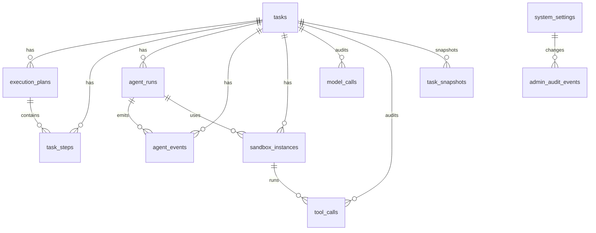

# Database ERD And Migration Rules

本文件只保留数据库关系、迁移和归档规则。字段、索引、外键和事件表约束以 [database-schema.yaml](./database-schema.yaml) 为唯一机器契约。

## Entity Relationship



## Migration Naming

Alembic revision message format:

```text
create_<domain>_tables
add_<field>_to_<table>
create_<table>_<column>_index
alter_<table>_<field>_<change>
```

Examples:

```text
create_task_event_tables
add_trace_id_to_agent_events
create_agent_events_task_sequence_index
```

## Migration Rules

- Migrations must be deterministic.
- Each migration must contain upgrade and downgrade.
- Destructive migrations require release note entry.
- Event tables must not drop historical event data.
- Enum-like fields use text plus application validation.
- JSONB fields require schema validation in application code.
- Large payloads use object storage reference, not raw database blob.

## Event Store Mutation Rules

```text
insert: allowed
update: forbidden
delete: forbidden
archive: allowed through archive job
```

## Snapshot Rules

```text
snapshot_frequency_events: 100
snapshot_table: task_snapshots
snapshot_source: replayed task state
```

## Archive Rules

```text
hot_events_retention_days: 90
archive_storage: object storage
archive_format: jsonl.gz
archive_index: task_id, date range, organization_id
```
