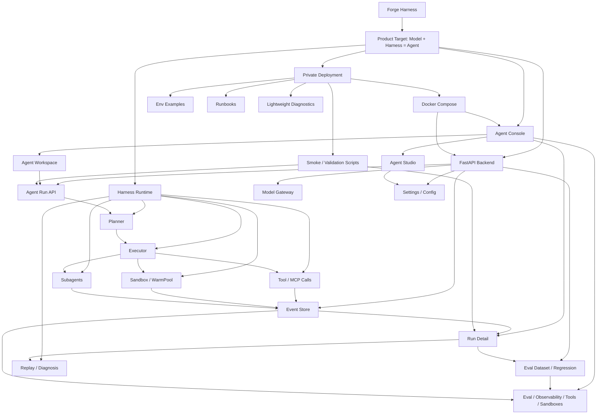
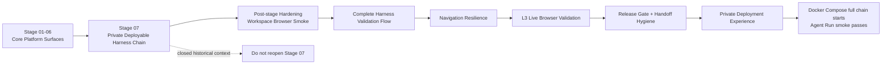
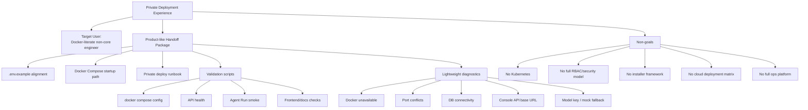

# System Architecture

## Architecture Summary

Forge Harness is a control plane and runtime for production Agents.

```text
Agent Studio
-> Agent configuration
-> Agent Workspace
-> Conversation Tree / Context Controls
-> Agent Run
-> Planner
-> Executor / Subagent / Multi-Agent Orchestrator
-> Tool / MCP Runtime
-> Guardrail / Sandbox / WarmPool
-> Event Store
-> Projections
-> Observability / Replay / Eval
```

## Architecture Direction

The active project direction is not a generic chat UI. The product target is:

```text
Model + Harness = Agent
```

The Harness proves and productizes the full execution chain: Agent configuration, Workspace goal intake, Agent Run, planning, execution, tools/MCP, sandbox isolation, subagents, event audit, replay, eval, observability, and private deployment.



## Stage And Productization Flow

Stage 07 is closed historical context. It proved the private-deployable Harness chain. Current post-stage work should harden, package, and make that chain easier to operate without reopening Stage 07 as active product scope.



## Private Deployment Experience Lane

This completed productization lane is a private deployment handoff package for a Docker-literate internal tester who does not already know this repository. The first-pass acceptance signal is concrete: Docker Compose starts the full chain and the Agent Run smoke passes.



## Services

| Service | Boundary |
|---|---|
| `agent-console` | React console for Studio, Workspace, Runs, Tools, Observability, Eval, Sandboxes, Settings |
| `api-server` | FastAPI control plane for Agents, Runs, Events, Tools, Policies, Evals, Settings |
| `assignment-worker` | Async multi-Agent assignment execution |
| `subagent-worker` | Async Subagent execution and recovery |
| `warm-pool-service` | Sandbox prewarm and lifecycle management |
| `postgres` | Durable state, append-only events, audit, settings, eval records |
| `redis` | Queue and coordination layer |
| `prometheus/grafana/loki` | Metrics, dashboards, logs |
| `web-site` | Public information shell retained outside console core |

## API Boundary

Primary product API uses Agent and Run semantics.

| API | Purpose |
|---|---|
| `POST /api/agents/{agent_id}/runs` | Create an Agent Run from Workspace |
| `POST /api/agents/{agent_id}/runs/chat/stream` | Stream Workspace Pro output |
| `GET /api/agents/runs` | List Agent Run history |
| `GET /api/agents/runs/{run_id}/workspace` | Aggregate Workspace projection |
| `POST /api/agents/runs/{run_id}/execute` | Execute existing Plan |
| `POST /api/agents/runs/{run_id}/orchestrate` | Create multi-Agent assignments |
| `POST /api/agents/runs/{run_id}/orchestrate/execute` | Execute assignments and reduce |

Legacy `/api/tasks/*` endpoints remain internal compatibility until migration completes. OpenAPI descriptions mark them as compatibility surfaces rather than the product entry.

## State Machines

### Conversation Node

```text
draft -> streaming -> done
                  -> paused -> streaming -> done
                  -> error
```

Historical edit creates a new child branch under the edited node parent. The previous
branch stays addressable through its leaf node.

### Agent Run

```text
CREATED -> PLANNING -> PLANNED -> RUNNING -> COMPLETED
                                      -> FAILED
                                      -> CANCELLED
PLANNED -> WAITING_APPROVAL -> RUNNING
FAILED -> RUNNING
```

### Subagent

```text
PENDING -> QUEUED -> RUNNING -> SUCCESS
                            -> FAILED
                            -> TIMEOUT
                            -> CANCELLED
```

### Assignment

```text
PENDING -> QUEUED -> RUNNING -> SUCCESS
                            -> FAILED
```

### Tool Call

```text
REQUESTED -> APPROVED -> RUNNING -> SUCCESS
          -> BLOCKED
          -> PENDING_APPROVAL -> APPROVED -> RUNNING -> SUCCESS
                              -> MODIFIED -> APPROVED -> RUNNING -> SUCCESS
                              -> REJECTED
          -> FAILED
          -> TIMEOUT
```

## Event Sourcing

Every meaningful state transition appends an event.

Required event categories:

- Run lifecycle
- Plan requested/generated/rejected
- Step started/completed/failed
- Model called/response/failure
- Tool policy checked/called/result/failed/approval
- Workspace stream delta, usage, artifact, and tool preview events when persisted
- Subagent spawned/heartbeat/success/failure/timeout
- Assignment selected/created/started/completed/failed/reduced
- Sandbox requested/allocated/released/destroyed
- Eval case/run/grader result
- Replay and recovery actions

Projection APIs read current SQL state plus event history. Replay reconstructs Run state to a sequence number.

## Runtime Execution

- Planner emits Plan DAG and does not execute tools.
- Workspace Pro streams workspace output over SSE and creates durable Agent Runs.
- Conversation Tree, active path, pinned nodes, and context window assemble request context.
- Executor runs short synchronous ReAct steps.
- Subagent handles long-running async branches.
- Multi-Agent Orchestrator assigns branches to named Agents and performs reduce.
- Tool Runner enforces registry, permissions, policy, sandbox, approval, audit, and trace.
- Tool Approval supports approve, reject, and modify-input approval decisions.
- WarmPool supplies sandbox instances for low-latency execution.

## Frontend State

Workspace Pro keeps UI-only conversation graph state in Zustand:

```text
nodesById
rootNodeId
activeLeafId
pinnedNodeIds
contextWindowTurns
activeStream
```

This state drives branch navigation and request assembly. Durable execution truth remains in
Agent Run, Event Store, ModelCall, ToolCall, ToolApproval, and Artifact projections.

## Frontend Data Rule

Frontend pages call API projections. No console metric or run status may be hard-coded. Disabled future modules must be visibly disabled and must not fabricate data.
