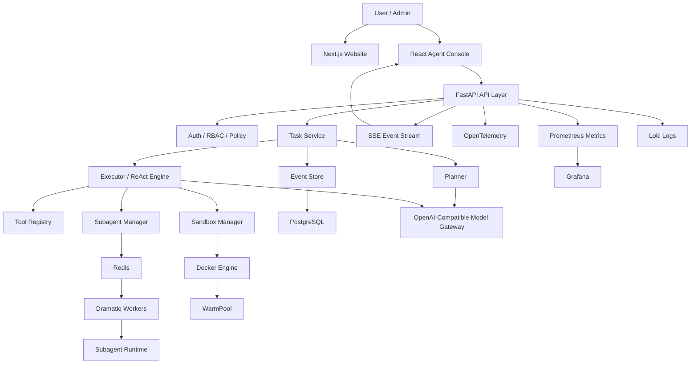
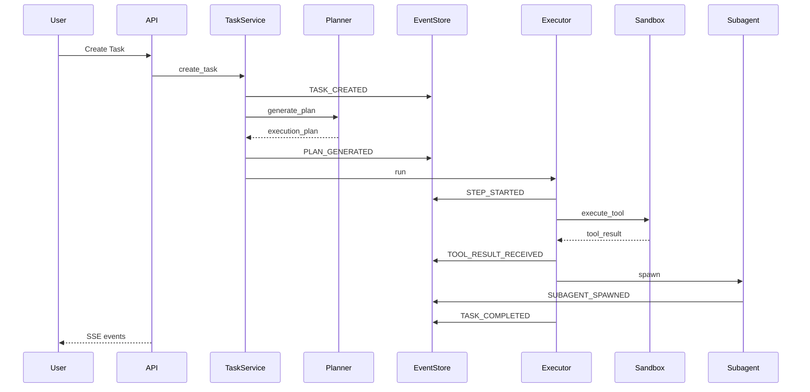

# 03 总体架构

## 架构原则

- Python 作为后端唯一开发语言。
- Harness 层作为平台核心。
- 事件流作为任务状态事实源。
- Docker 作为工具执行隔离边界。
- Dramatiq 作为异步任务系统。
- PostgreSQL 作为业务数据和事件数据存储。
- Redis 作为队列、缓存和锁。
- Prometheus、Grafana、Loki、OpenTelemetry 作为观测体系。

## 总体架构图



## 模块边界

### Website

官网项目使用 Next.js + TypeScript + Tailwind CSS。官网负责产品介绍、架构说明、场景展示、文档入口和联系入口。

### Agent Console

控制台使用 React + Vite + TypeScript + Tailwind CSS + shadcn/ui。控制台负责任务创建、计划查看、事件流展示、Subagent 状态、沙箱状态和监控入口。

### API Layer

API Layer 使用 FastAPI。职责包括 HTTP API、SSE 事件流、认证、RBAC、策略校验和管理接口。

### Agent Harness Core

Agent Harness Core 是平台核心，包含：

- Planner
- Executor
- ReAct Engine
- Subagent Manager
- Tool Registry
- Event Service
- Sandbox Manager
- WarmPool Manager
- Policy Engine
- Model Gateway

### Runtime Infrastructure

运行基础设施固定为：

```text
PostgreSQL 16
Redis 7
Docker Engine
Prometheus
Grafana
Loki
OpenTelemetry Collector
Nginx
systemd
```

## 任务执行流程



## 状态机

任务状态：

```text
CREATED
PLANNING
RUNNING
WAITING_SUBAGENTS
FAILED
COMPLETED
CANCELLED
```

Subagent 状态：

```text
PENDING
RUNNING
SUCCESS
FAILED
TIMEOUT
CANCELLED
```

Sandbox 状态：

```text
CREATING
IDLE
BUSY
RELEASING
DESTROYED
FAILED
```

## 演进边界

首个交付版使用模块化单体：

```text
services/api-server
```

首个交付版内部按模块拆分。集成演示版增加：

```text
services/sandbox-worker
```

企业版拆分为：

```text
task-service
agent-orchestrator
sandbox-service
event-service
model-gateway
policy-service
```
