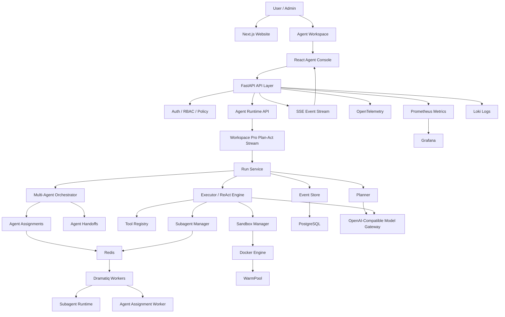
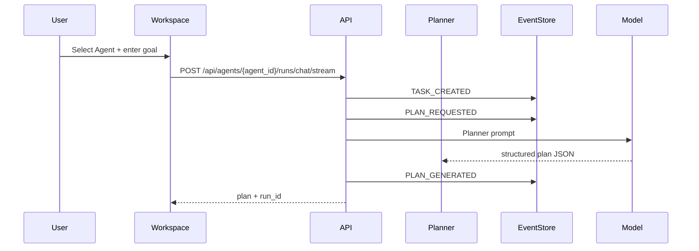
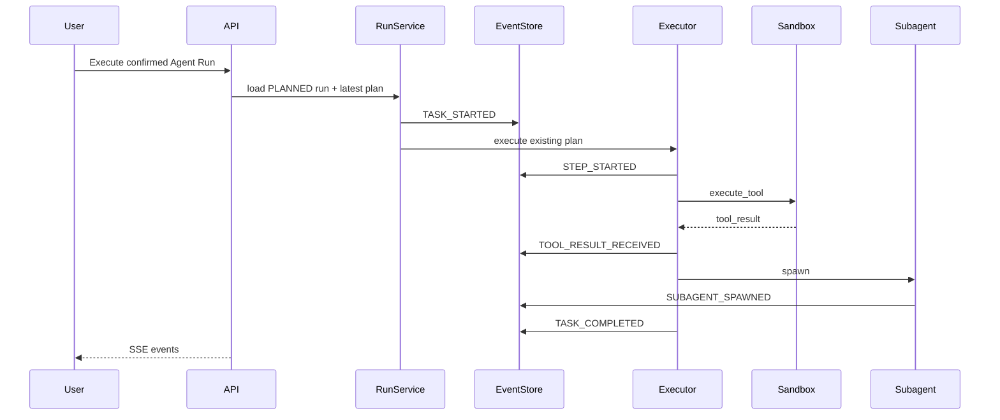

# 03 总体架构

## 架构原则

- Python 作为后端唯一开发语言。
- Harness 层作为平台核心。
- 事件流作为任务状态事实源。
- Docker 作为工具执行隔离边界。
- Dramatiq 作为异步任务系统。
- PostgreSQL 作为业务数据和事件数据存储。
- Redis 作为队列、缓存和锁。
- Prometheus、Grafana、Loki、OpenTelemetry 作为观测体系。

## 总体架构图

生产级 AI Agent 平台采用六层架构。外部入口、渠道路由、认知执行核心、记忆协同、安全隔离和基础设施必须分层明确，避免把 Agent 做成只有 API Harness、没有对话与执行主体的后台系统。

```text
Layer 1: External Access 外部接入层
├─ CLI Console
├─ FastAPI Server
├─ Event Bus
└─ Webhook Endpoints

Layer 2: Channels & Routing 渠道与路由层
├─ Feishu Adapter
├─ WeCom Adapter
├─ Agent Router
└─ Policy Manager

Layer 3: Cognitive & Execution Core 认知与执行核心
├─ Planner：任务分解规划
├─ ReAct Engine：同步推理与工具执行
├─ DeepAgents Wrapper / LangGraph：复杂 Agent 图编排
├─ Tool Registry：工具注册表
└─ Agent Runner：生命周期管理

Layer 4: Memory & Coordination 记忆与协同层
├─ Memory Manager
├─ Subagent Spawner：子 Agent 派生
├─ Session Manager
└─ Todos Manager

Layer 5: Isolation Sandbox 隔离沙箱层
├─ Firecracker / microVM：强隔离升级方向
├─ Docker Secure：默认容器隔离
├─ Warm Pool：预热池管理
├─ Snapshot Manager：快照恢复
└─ Secure Executor：受控执行器

Layer 6: Infrastructure 基础设施层
├─ LLM Providers / OpenAI-compatible
├─ PostgreSQL Storage：生产主存储
├─ SQLite Storage：本地开发或嵌入式场景可选
├─ Monitoring
├─ Config System
└─ KVM Support
```



## 模块边界

### Website

官网项目使用 Next.js + TypeScript + Tailwind CSS。官网负责产品介绍、架构说明、场景展示、文档入口和联系入口。

### Agent Console

控制台使用 React + Vite + TypeScript + Tailwind CSS 和本地 UI primitives。控制台主入口是 Agent Workspace Pro：用户选择 Agent 后进入 `/agents/:agentId/workspace`，在 chat-first workspace 中输入目标、查看真实模型回复、规划、工具审批、Artifacts 和 Run 投影。任务列表只作为 deprecated `/tasks` 兼容层；产品视图使用 Agent Run 历史与审计。

### API Layer

API Layer 使用 FastAPI。职责包括 HTTP API、SSE 事件流、认证、RBAC、策略校验和管理接口。

### Agent Harness Core

Agent Harness Core 是平台核心，包含：

- Planner
- Executor
- ReAct Engine
- Subagent Manager
- Tool Registry
- Event Service
- Sandbox Manager
- WarmPool Manager
- Policy Engine
- Model Gateway

### Runtime Infrastructure

运行基础设施固定为：

```text
PostgreSQL 16
Redis 7
Docker Engine
Prometheus
Grafana
Loki
OpenTelemetry Collector
Nginx
systemd
```

## Agent Plan 流程



## Agent Execute 流程



## 状态机

任务状态：

```text
CREATED
PLANNING
RUNNING
WAITING_SUBAGENTS
FAILED
COMPLETED
CANCELLED
```

Subagent 状态：

```text
PENDING
RUNNING
SUCCESS
FAILED
TIMEOUT
CANCELLED
```

Sandbox 状态：

```text
IDLE
BUSY
DESTROYED
FAILED
```

## 演进边界

首个交付版使用模块化单体：

```text
services/api-server
```

首个交付版内部按模块拆分。集成演示版增加：

```text
services/sandbox-worker
```

企业版拆分为：

```text
task-service
agent-orchestrator
sandbox-service
event-service
model-gateway
policy-service
```
