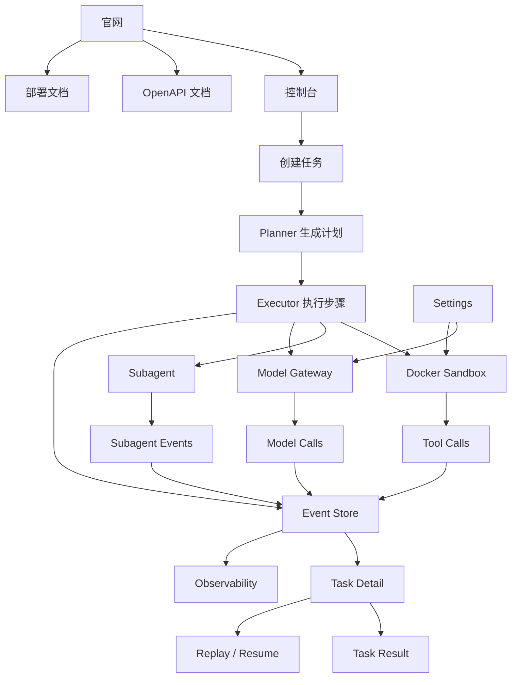

# 11 网站使用流程

本文件说明平台怎么用、核心功能是什么、功能之间怎样联动。读完本页即可理解官网、控制台、后端和观测面的关系。

## 三个入口

| 入口 | 作用 | 使用者 |
|---|---|---|
| 官网 | 看产品定位、架构、部署、文档入口 | 业务方、管理者、售前、交付 |
| 控制台 | 创建任务、执行任务、查看事件、查看结果 | 研发、DevOps、SRE、AI 平台团队 |
| OpenAPI | 导入接口、调试 API、集成系统 | 后端研发、平台集成方 |

## 核心功能

| 功能 | 解决什么问题 |
|---|---|
| Planner | 把用户目标拆成结构化执行计划 |
| Executor | 按计划执行同步步骤，驱动 ReAct 循环 |
| Subagent | 承接长耗时、并发、探索型子任务 |
| Event Store | 记录每个关键动作，支撑审计、恢复、Replay |
| Docker Sandbox | 隔离高风险工具，限制 CPU、内存、网络和文件系统 |
| WarmPool | 预热容器，降低沙箱启动耗时 |
| Task Result | 汇总最终输出、产物、摘要和状态 |
| Replay / Resume | 回放现场并从故障点恢复 |
| Observability | 查看任务、模型、工具、沙箱和队列指标 |
| Settings | 管理模型网关、工具策略和沙箱策略 |

## 最短使用路径

```text
1. 打开官网，了解产品和架构。
2. 从官网进入控制台。
3. 在 /tasks/new 创建任务。
4. Planner 生成执行计划。
5. Executor 按步骤执行。
6. 高风险工具进入 Docker Sandbox。
7. 长耗时任务派生 Subagent。
8. 所有关键动作写入 Event Store。
9. 在 /tasks/:taskId 查看计划、事件、结果、Subagent、Sandbox、模型调用和工具调用。
10. 任务失败时进入 Replay 查看现场，再用 Resume 继续。
11. 在 /observability 查看整体运行状态。
12. 在 /settings/models 和 /settings/policies 调整模型与策略。
```

## 功能联动图



## 页面与功能对应

| 页面 | 主要动作 |
|---|---|
| `/` 官网首页 | 看产品定位和核心能力 |
| `/product` 官网产品页 | 看 Planner、Executor、Subagent、Sandbox、WarmPool |
| `/architecture` 官网架构页 | 看 Model + Harness = Agent 和运行链路 |
| `/deployment` 官网部署页 | 看 Docker Compose、systemd、Nginx、监控 |
| `/docs` 官网文档页 | 进入文档、OpenAPI、Runbook |
| `/tasks` 控制台任务列表 | 筛选任务、进入详情、创建任务 |
| `/tasks/new` 控制台创建页 | 输入目标、模型、策略、沙箱约束 |
| `/tasks/:taskId` 控制台详情页 | 看计划、事件、结果、Subagent、Sandbox、审计 |
| `/tasks/:taskId/events` 控制台事件页 | 查看事件流、定位 sequence、Replay |
| `/observability` 控制台观测页 | 看任务、模型、工具、资源指标 |
| `/settings/models` 控制台模型设置 | 管理模型网关和供应商 |
| `/settings/policies` 控制台策略设置 | 管理工具风险、审批和沙箱策略 |

## 一句话流程

```text
官网了解能力 -> 控制台创建任务 -> Planner 拆解 -> Executor 执行 -> Sandbox/Subagent 承接风险与并发 -> Event Store 记录全程 -> Result 输出结果 -> Replay/Resume 处理故障 -> Observability/Settings 管运行面
```
